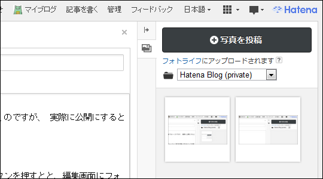

<blockquote><blockquote>記事に画像が埋め込めないです。 ドラッグ&ドロップで画像を埋め込むところまではいくのですが、 実際に公開にすると画像が消えます。 
<a href="http://blog.hatena.ne.jp/logown/">id:logown</a>様 
</blockquote>写真投稿機能をリリースしました。ご利用ください。

<a href="http://blog.hatena.ne.jp/-/feedback/13208692334729902319">はてなブログ (beta)</a> 
</blockquote>

右サイドバーに画像ファイルをドラッグ＆ドロップしてアップロード、続けて画像を選択→［選択した写真を貼り付け］ボタンを押すと、エディタのキャレット位置に<a class="keyword" href="http://d.hatena.ne.jp/keyword/%A5%D5%A5%A9%A5%C8%A5%E9%A5%A4%A5%D5">フォトライフ</a>記法が挿入されるという仕組みみたい。これはなかなか便利。なぜかボタンを押さなくても挿入される場合もあったけど、まぁ、いいや。

<a class="keyword" href="http://d.hatena.ne.jp/keyword/WordPress">WordPress</a>もv3.3がでてドラッグ＆ドロップでアップロードできるようになったけど、画面遷移の少ない<a class="keyword" href="http://d.hatena.ne.jp/keyword/%A4%CF%A4%C6%A4%CA%A5%D6%A5%ED%A5%B0">はてなブログ</a>のほうが面倒が少ないな！

<h3></h3>

なんかいろいろ試しているうちに<a class="keyword" href="http://d.hatena.ne.jp/keyword/%A5%D5%A5%A9%A5%C8%A5%E9%A5%A4%A5%D5">フォトライフ</a>が重くなったけど気にしない

