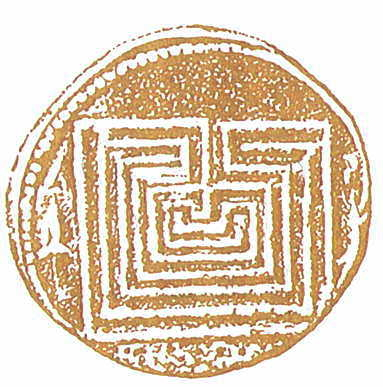

<blockquote>

彼（<a class="keyword" href="http://d.hatena.ne.jp/keyword/%A5%C6%A5%BB%A5%A6%A5%B9">テセウス</a>）はまた貨幣を鋳造したが、その貨幣には牛が刻まれている。

これは<a class="keyword" href="http://d.hatena.ne.jp/keyword/%A5%DE%A5%E9%A5%C8%A5%F3">マラトン</a>の牝牛にちなんだのか、 
ミノスの将軍にちなんだのか、 
それとも市民に農業を勧めるためなのか、 
そのいずれかであろう。

物の価値を表す言い方として、「牛百頭分」とか「牛十頭分」とかいうのがあるが、それはこの貨幣から始まったのだという。

<a class="keyword" href="http://d.hatena.ne.jp/keyword/%A5%D7%A5%EB%A5%BF%A5%EB%A5%B3%A5%B9">プルタルコス</a>『英雄伝』

</blockquote>

<a class="keyword" href="http://d.hatena.ne.jp/keyword/%A5%C6%A5%BB%A5%A6%A5%B9">テセウス</a>はギリシアではじめて貨幣を鋳造した。（→<a class="keyword" href="http://d.hatena.ne.jp/keyword/%A5%ED%A5%E0%A5%EB%A5%B9">ロムルス</a>は？）

<a class="keyword" href="http://d.hatena.ne.jp/keyword/%A5%DE%A5%E9%A5%C8%A5%F3">マラトン</a>の牝牛: <a class="keyword" href="http://d.hatena.ne.jp/keyword/%A5%C6%A5%BB%A5%A6%A5%B9">テセウス</a>はテトラポリスの住民を悩ませていた<a class="keyword" href="http://d.hatena.ne.jp/keyword/%A5%DE%A5%E9%A5%C8%A5%F3">マラトン</a>の牝牛を退治して<a class="keyword" href="http://d.hatena.ne.jp/keyword/%A5%A2%A5%C6%A5%CA%A5%A4">アテナイ</a>で頭角を表した。

ミノスの将軍: タウロス。ミノスでは「威勢があったがその性格ゆえに疎まれ」ていた。体格に恵まれ、競技会での活躍が確実視されていたが、それを快く思わない人が<a class="keyword" href="http://d.hatena.ne.jp/keyword/%A5%C6%A5%BB%A5%A6%A5%B9">テセウス</a>に参加を要請し、彼に<a class="keyword" href="http://d.hatena.ne.jp/keyword/%A5%EC%A5%B9%A5%EA%A5%F3">レスリン</a>グで敗北することになる。また、<a class="keyword" href="http://d.hatena.ne.jp/keyword/%A5%C6%A5%BB%A5%A6%A5%B9">テセウス</a>がミノスを脱出する際に阻止しようと港で戦って討ち死した。

これまでは「牛百頭分」とか「牛十頭分」とかいう物の価値を表す言い方 → 貨幣 という発想しかなかったけど、その逆もありうるか。むしろ、双方が相互作用的に発達してきたと見るほうがいいのかもしれない。

<blockquote cite="http://my.noevirstyle.jp/00005512/daily/200812/12">

画像は、クノッソスの貨幣で、迷宮の地図がモチーフになっている。前２世紀に造られたものだそうです。

<cite><a href="http://my.noevirstyle.jp/00005512/daily/200812/12">http://my.noevirstyle.jp/00005512/daily/200812/12</a></cite>
</blockquote>
