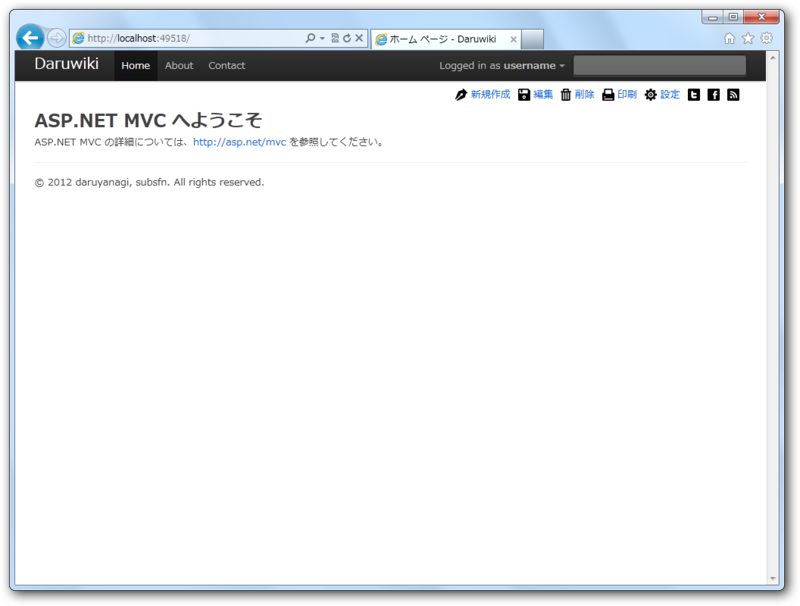
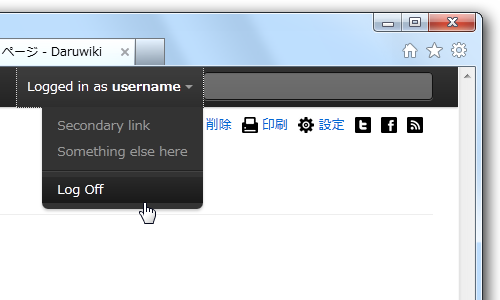
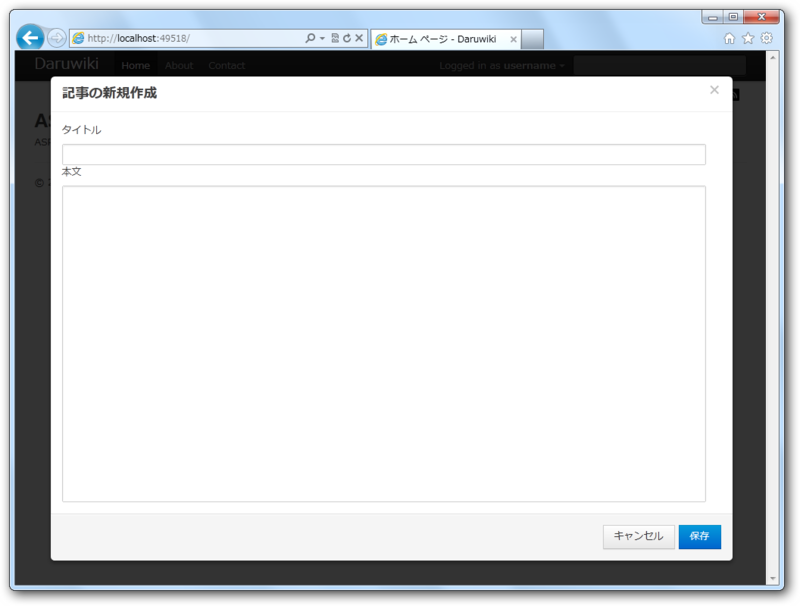

しばやんの記事を読んで、わしもやってみようかなと思った。

<ul>
<li><a href="http://d.hatena.ne.jp/shiba-yan/20120107/1325872372">ASP.NET MVC &#x3067; Twitter Bootstrap &#x3092;&#x4F7F;&#x3063;&#x3066;&#x307F;&#x305F; (1) - &#x307E;&#x3081;&#x3057;&#x3070;&#x96D1;&#x8A18;</a></li>
<li><a href="http://d.hatena.ne.jp/shiba-yan/20120107/1325917344">ASP.NET MVC &#x3067; Twitter Bootstrap &#x3092;&#x4F7F;&#x3063;&#x3066;&#x307F;&#x305F; (2) - &#x307E;&#x3081;&#x3057;&#x3070;&#x96D1;&#x8A18;</a></li>
<li><a href="http://d.hatena.ne.jp/shiba-yan/20120107/1325945340">ASP.NET MVC &#x3067; Twitter Bootstrap &#x3092;&#x4F7F;&#x3063;&#x3066;&#x307F;&#x305F; (3) - &#x307E;&#x3081;&#x3057;&#x3070;&#x96D1;&#x8A18;</a></li>
<li><a href="http://d.hatena.ne.jp/shiba-yan/20120107/1325948312">ASP.NET MVC &#x3067; Twitter Bootstrap &#x3092;&#x4F7F;&#x3063;&#x3066;&#x307F;&#x305F; (4) - &#x307E;&#x3081;&#x3057;&#x3070;&#x96D1;&#x8A18;</a></li>
</ul>
むっちゃカンタンだった。

追加のプラグインを読みこめば、プルダウンリストなんかもできるみたい。

もう一つプラグインを追加してモーダルなダイアログも作ってみた。デフォルトではちょっと小さめなので、<a class="keyword" href="http://d.hatena.ne.jp/keyword/CSS">CSS</a>で少しデカくしてみた。

ダイアログを画面の真ん中に表示するのは、top: 50%; left: 50% にして、縦横の半分を負のマージンで調整してるっぽい。だから、900x640に拡大するには、

<pre class="code lang-css" data-lang="css">.modal
{
height: 640px;
width: 900px;
margin-top: -320px;
margin-left: -450px;
}</pre>

とでもすればOK。

デザインのできない子にとってはありがたい存在。デザインがカッコいいと、ロジックを書くのも楽しくなるよね！

