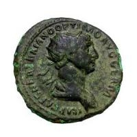

<blockquote>

かくてカミルスは、あの<a class="keyword" href="http://d.hatena.ne.jp/keyword/%A5%DB%A5%E1%A5%ED%A5%B9">ホメロス</a>に出てくる<a class="keyword" href="http://d.hatena.ne.jp/keyword/%A5%A2%A5%AD%A5%EC%A5%A6%A5%B9">アキレウス</a>のように、市民に呪いをかけて立ち去り、欠席裁判で15,000アスの罰金を課せられた。これを我々（ギリシャ人）の貨幣で言えば1500ドラクマになる。アスというのは、当時のローマで流通していた銅貨で、この銅貨10枚で銀貨1枚分になり、それはデナリウスと呼ばれ、これが我々のドラクマに相当するのである。

</blockquote>

<a class="keyword" href="http://d.hatena.ne.jp/keyword/%B8%DE%B8%AD%C4%EB">五賢帝</a>時代の話だと思うが、1デナリウス＝1ドラクマだったらしい。同じ物をラテンではデナリウス、ギリシャではドラクマと言っただけかもしれない。

<blockquote cite="http://ja.wikipedia.org/wiki/%E3%83%89%E3%83%A9%E3%82%AF%E3%83%9E">

ドラクマは紀元前3世紀以降ローマ領の地域でも流通した。ドラクマは長期にわたって広大な地域に流通したため、現代の貨幣価値への換算は難しいが、紀元前5世紀の1ドラクマは1990年の25ドルに相当するという研究がある。研究者たちは<a class="keyword" href="http://d.hatena.ne.jp/keyword/%A5%ED%A1%BC%A5%DE%C4%EB%B9%F1">ローマ帝国</a>の初期には1ドラクマは労働者の一日の賃金であったという。

<cite><a href="http://ja.wikipedia.org/wiki/%E3%83%89%E3%83%A9%E3%82%AF%E3%83%9E">http://ja.wikipedia.org/wiki/%E3%83%89%E3%83%A9%E3%82%AF%E3%83%9E</a></cite>
</blockquote>

<ul>
<li><a href="http://daruyanagi.hatenablog.com/entry/2012/01/09/190516">&#x7F8A;&#x4E00;&#x982D;&#x306E;&#x4FA1;&#x683C;&#x306F;10&#x30AA;&#x30ED;&#x30DC;&#x30B9;&#x3001;&#x725B;&#x306F;100&#x30AA;&#x30ED;&#x30DC;&#x30B9; - &#x3060;&#x308B;&#x3060;&#x308B;&#x3057;&#x305F;&#x65E5;&#x8A18;</a></li>
<li><a href="http://daruyanagi.hatenablog.com/entry/2012/01/03/205939">&#x305D;&#x306E;&#x8CA8;&#x5E63;&#x306B;&#x306F;&#x725B;&#x304C;&#x523B;&#x307E;&#x308C;&#x3066;&#x3044;&#x308B; - &#x3060;&#x308B;&#x3060;&#x308B;&#x3057;&#x305F;&#x65E5;&#x8A18;</a></li>
</ul>