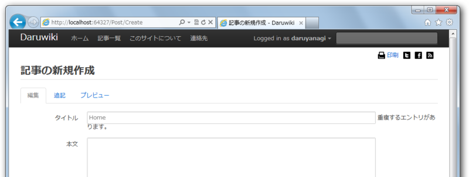

[Url]という属性を作成。 \"'|*`^><)(}{][#%;/?:@&=+$,. が含まれていたら IsValid() => false を返す。

<pre class="code lang-C" data-lang="C">[AttributeUsage(AttributeTargets.Property, AllowMultiple = false)]
public sealed class UrlAttribute
: ValidationAttribute, IClientValidatable
{
public UrlAttribute()
{
ErrorMessage = &#34;URLに利用できない文字が含まれています。&#34;;
}

private readonly char[] INVALID_CHARS =
&#34;\\\&#34;&#39;|*`^&gt;&lt;)(}{][#%;/?:@&amp;=+$,.&#34;.ToCharArray();

public IEnumerable&lt;ModelClientValidationRule&gt;
GetClientValidationRules(
ModelMetadata metadata, ControllerContext context)
{
var rule = new ModelClientValidationRule
{
ValidationType = &#34;url&#34;,
ErrorMessage = FormatErrorMessage(
metadata.GetDisplayName()),
};

yield return rule;
}

public override bool IsValid(object value)
{
if (value == null || value.GetType() != typeof(string))
{
return true;
}

return !(INVALID_CHARS.Any(
c =&gt; ((string)value).Contains(c)));
}
}</pre>

モデル側で適当なメンバーに[Url]を付与する。

<pre class="code lang-C#" data-lang="C#">public class Post
{
[Required]
public int PostId { get; set; }

[Required]
[Url]
[DisplayName(&#34;タイトル&#34;)]
public string Title { get; set; }
:
:</pre>

