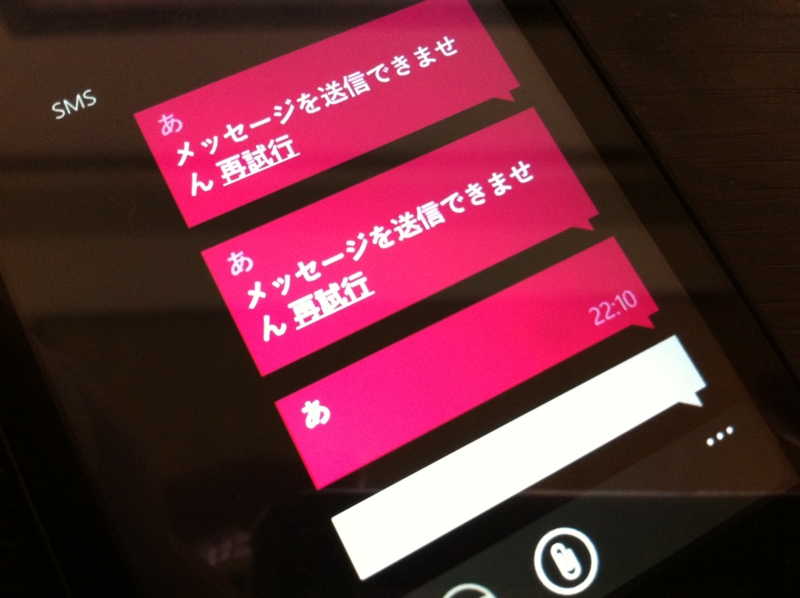
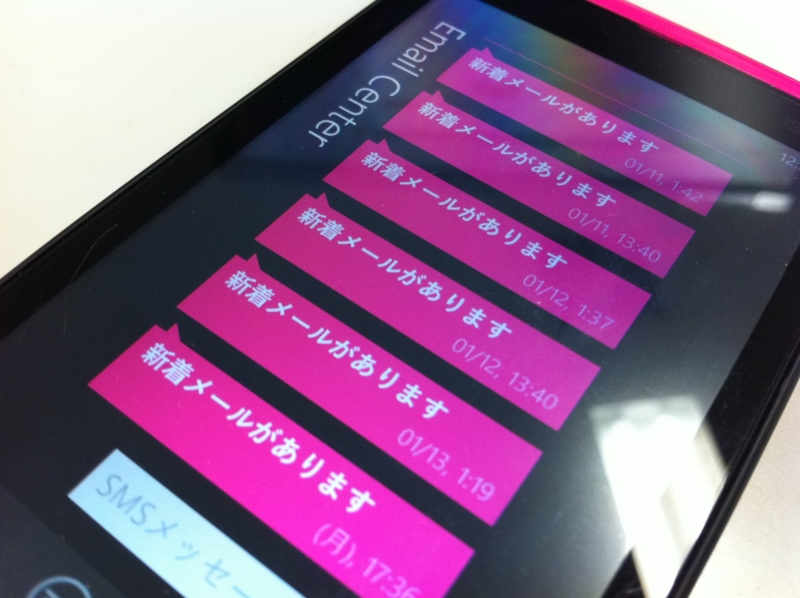

<blockquote cite="http://k-tai.impress.co.jp/docs/news/20120119_505783.html">

今回のアップデートにより、「Windows Phone IS12T」にはSMS（<a class="keyword" href="http://d.hatena.ne.jp/keyword/C%A5%E1%A1%BC%A5%EB">Cメール</a>）の送信に対応、また、緊急通報メール機能の「災害・避難情報」および「津波警報」をサポートする。

<cite><a href="http://k-tai.impress.co.jp/docs/news/20120119_505783.html">&#x300C;Windows Phone IS12T&#x300D;&#x306E;&#x30BD;&#x30D5;&#x30C8;&#x66F4;&#x65B0;&#x3001;C&#x30E1;&#x30FC;&#x30EB;&#x9001;&#x4FE1;&#x306A;&#x3069;&#x306B;&#x5BFE;&#x5FDC; - &#x30B1;&#x30FC;&#x30BF;&#x30A4; Watch</a></cite>
</blockquote>

やっとこさウチのIS12Tにもアップデートが来て、SMSの送信が可能になった。やったね！　これで「まともなケータイ」に一歩近づいたよ。

あとはこれを何とかするだけだね！

それにしても、この記事。

<blockquote cite="http://www.computerworld.jp/topics/573/%E3%83%A2%E3%83%90%E3%82%A4%E3%83%AB%E3%83%BB%E3%83%87%E3%83%90%E3%82%A4%E3%82%B9/201525/Windows+Phone%E3%80%812015%E5%B9%B4%E3%81%BE%E3%81%A7%E3%81%AB%E3%80%8CiOS%E3%80%8D%E3%82%92%E2%80%9C%E8%B2%A0%E3%81%8B%E3%81%99%E2%80%9D">

　2015年までに、Microsoftの「Windows Phone」が<a class="keyword" href="http://d.hatena.ne.jp/keyword/%A5%B9%A5%DE%A1%BC%A5%C8%A5%D5%A5%A9%A5%F3">スマートフォン</a>用オペレーティング・システム（OS）市場で、<a class="keyword" href="http://d.hatena.ne.jp/keyword/Apple">Apple</a>の「iOS」から第2位の座を奪うだろうと、リサーチ企業IHSが予想している。

　同社は、Microsoftの最新モバイルOSが市場に何らかの影響を及ぼすようになるまでは時間がかかるものの、Microsoftと<a class="keyword" href="http://d.hatena.ne.jp/keyword/Nokia">Nokia</a>の提携が今後数年間にわたる両社の成功のカギとなり、<a class="keyword" href="http://d.hatena.ne.jp/keyword/Apple">Apple</a>はもちろん「<a class="keyword" href="http://d.hatena.ne.jp/keyword/Android">Android</a>」端末メーカーも事態を注意深く見守る必要があると語った。

<cite><a href="http://www.computerworld.jp/topics/573/%E3%83%A2%E3%83%90%E3%82%A4%E3%83%AB%E3%83%BB%E3%83%87%E3%83%90%E3%82%A4%E3%82%B9/201525/Windows+Phone%E3%80%812015%E5%B9%B4%E3%81%BE%E3%81%A7%E3%81%AB%E3%80%8CiOS%E3%80%8D%E3%82%92%E2%80%9C%E8%B2%A0%E3%81%8B%E3%81%99%E2%80%9D">Windows Phone&#x3001;2015&#x5E74;&#x307E;&#x3067;&#x306B;&#x300C;iOS&#x300D;&#x3092;&ldquo;&#x8CA0;&#x304B;&#x3059;&rdquo;|&#x30E2;&#x30D0;&#x30A4;&#x30EB;&#x30FB;&#x30C7;&#x30D0;&#x30A4;&#x30B9;|&#x30C8;&#x30D4;&#x30C3;&#x30AF;&#x30B9;|Computerworld</a></cite>
</blockquote>

Windows Phone OS 自体に魅力は感じるけど、日本では多分3年経ってもそんなに売れないだろうな、と思う。個人的な感触だけどね。<a class="keyword" href="http://d.hatena.ne.jp/keyword/iPhone">iPhone</a> ですら「<a class="keyword" href="http://d.hatena.ne.jp/keyword/%A4%AA%A5%B5%A5%A4%A5%D5%A5%B1%A1%BC%A5%BF%A5%A4">おサイフケータイ</a>がない、ワンセグが見れない」と言われるのに、ましてや Windows Phone なんてできないことばかりで。Windows Phone が得意なことは（ソーシャル系などはその最たるものだろう）多くの日本人にとって要らないし、そのうち <a class="keyword" href="http://d.hatena.ne.jp/keyword/iPhone">iPhone</a> にも追いつかれていく。

ともかく売れないことにはよいアプリも生まれないし、よいアプリが生まれないなら先行する iOS/<a class="keyword" href="http://d.hatena.ne.jp/keyword/Android">Android</a> との差は開いていくばかりだし。とりあえず、MMS ぐらいは満足に使えないと、友人・家族に勧める気にもなれない。「絵文字使えるの？」って言われただけで撃沈してしまう。 <a class="keyword" href="http://d.hatena.ne.jp/keyword/iPhone">iPhone</a> はこれまたできるんだ！　孫さんのお陰でね。でも、 au のエライ人にはそれがまったく期待できない。とりあえず、ほかのキャリアからも出てほしいよ。できれば、<a class="keyword" href="http://d.hatena.ne.jp/keyword/%A5%CE%A5%AD%A5%A2">ノキア</a>製がいいな。

「海外から輸入すれば？」ってのもその通りだけど、電波法とか気にしながら暮らしたくないしね。

