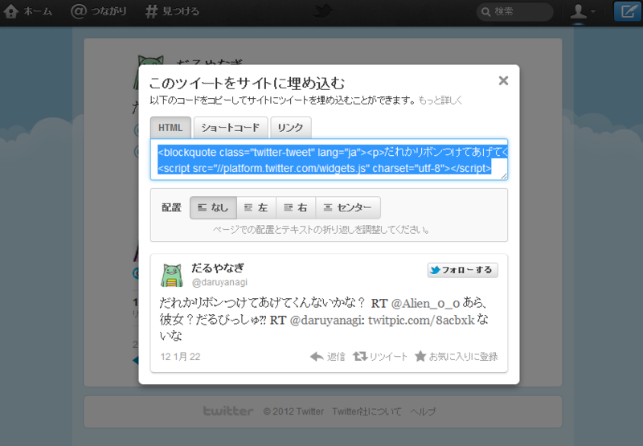
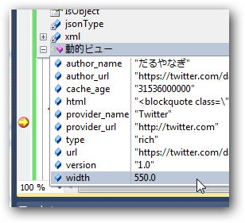
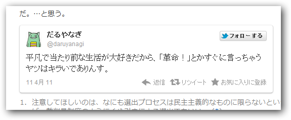

最近の<a class="keyword" href="http://d.hatena.ne.jp/keyword/Twitter">Twitter</a>では、ツイートの埋め込み用のタグが、<a class="keyword" href="http://d.hatena.ne.jp/keyword/%A5%D1%A1%BC%A5%DE%A5%EA%A5%F3%A5%AF">パーマリンク</a>から簡単に取得できるらしい。

これをコードからもやってみたくて、 <a href="https://dev.twitter.com/docs/embedded-tweets">Embedded Tweets | Twitter Developers</a> を参考にちょっとやってみた。

<pre class="code lang-?" data-lang="?">var tweet_url = url;
// 例: <a class="keyword" href="http://d.hatena.ne.jp/keyword/https">https</a>://<a class="keyword" href="http://d.hatena.ne.jp/keyword/twitter">twitter</a>.com/#!/daruyanagi/statuses/57438593853034497

var tweet_id = new <a class="keyword" href="http://d.hatena.ne.jp/keyword/Regex">Regex</a>(@&#34;status/(?&lt;id&gt;\d+)&#34;)
.Match(tweet_url).Groups[&#34;id&#34;].ToString();

var tweet = new System.Net.WebClient()
.DownloadString(string.Format(
&#34;<a class="keyword" href="http://d.hatena.ne.jp/keyword/https">https</a>://<a class="keyword" href="http://d.hatena.ne.jp/keyword/api">api</a>.<a class="keyword" href="http://d.hatena.ne.jp/keyword/twitter">twitter</a>.com/1/statuses/oembed.json?id={0}&#34;,
tweet_id));

return <a class="keyword" href="http://d.hatena.ne.jp/keyword/Codeplex">Codeplex</a>.Data.DynamicJson.Parse(tweet).html;</pre>

<a class="keyword" href="http://d.hatena.ne.jp/keyword/API">API</a>を叩くとJSONデータが返ってくるので、そこから"html"の値を取得。このあたりの処理は DynamicJson (NuGetでインストールできる)で楽をさせてもらいました。

<a href="https://platform.twitter.com/widgets.js">https://platform.twitter.com/widgets.js</a> を読み込んでおけば、勝手に整形もしてくれるみたい。ちょっと日付周りの表記がおかしいけれど、まぁ、これぐらいはしょうがないかな。

