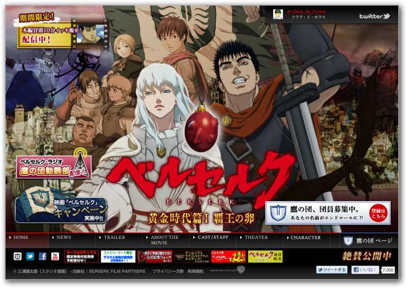
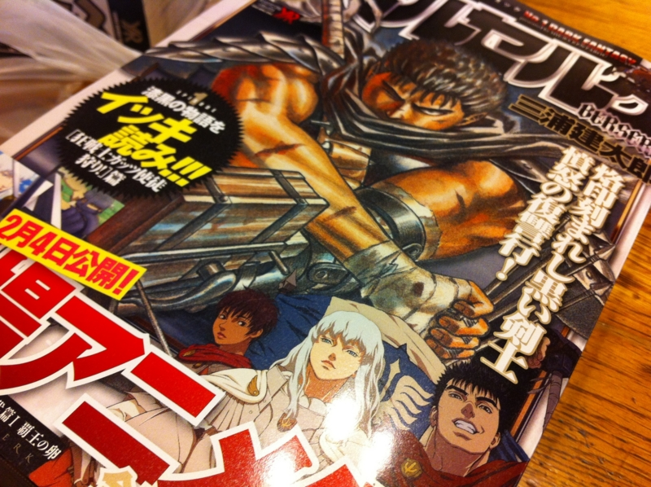
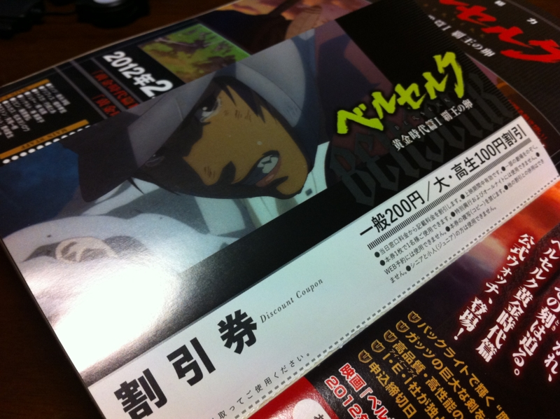

<a href="http://www.berserkfilm.com/index.php">&#x6620;&#x753B;&#x300E;&#x30D9;&#x30EB;&#x30BB;&#x30EB;&#x30AF; &#x9EC4;&#x91D1;&#x6642;&#x4EE3;&#x7BC7;&#x2160; &#x8987;&#x738B;&#x306E;&#x5375;&#x300F;2012&#x5E74;2&#x6708;4&#x65E5;&#x30ED;&#x30FC;&#x30C9;&#x30B7;&#x30E7;&#x30FC;(c)&#xFF1A;2011 &#x4E09;&#x6D66;&#x5EFA;&#x592A;&#x90CE;&#xFF08;&#x30B9;&#x30BF;&#x30B8;&#x30AA;&#x6211;&#x753B;&#xFF09;&#x30FB;&#x767D;&#x6CC9;&#x793E;&#xFF0F;BERSERK FILM PARTNERS</a>

弟1号が観に行こうというので、一緒に千葉まで観に行った。正直、ほとんど期待してなかったのだけど、なかなかの作画・音響で、迫力がある。なんだかんだいって、結構楽しんでしまった。こいつは三部作らしいので、あと二部ある。次も観に行こうと思う。

そんなこんなで、映画がなかなか面白かったこともあり、帰りにふと<a class="keyword" href="http://d.hatena.ne.jp/keyword/%A5%D9%A5%EB%A5%BB%A5%EB%A5%AF">ベルセルク</a>が読みたくなった。実家の近くのコンビニで一気読みのを三巻購入。

そしたら、巻末に映画の割引券が入ってた。ちょっと損した気分だ。

