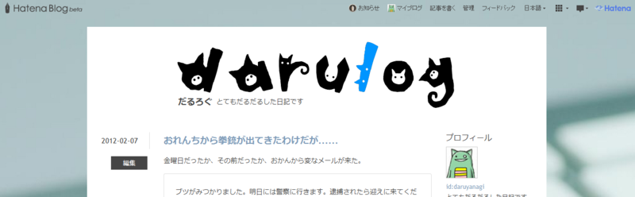

<a href="http://www.forest.impress.co.jp/docs/review/20120207_510052.html">&#x7A93;&#x306E;&#x675C; - &#x3010;REVIEW&#x3011;&#x732B;&#x306E;&#x30B7;&#x30EB;&#x30A8;&#x30C3;&#x30C8;&#x3092;&#x3042;&#x3057;&#x3089;&#x3063;&#x305F;&#x82F1;&#x5B57;&#x30D5;&#x30A9;&#x30F3;&#x30C8;&#x300C;NekoNeco&#xFF08;&#x306D;&#x3053;&#x30CD;&#x30B3;&#xFF09;&#x300D;</a> が気に入ったので、ちょっと<a class="keyword" href="http://d.hatena.ne.jp/keyword/%A4%CF%A4%C6%A4%CA%A5%D6%A5%ED%A5%B0">はてなブログ</a>のヘッダーだけいじってみた。ちょっと強引な<a class="keyword" href="http://d.hatena.ne.jp/keyword/CSS">CSS</a>（Position で絶対指定した）になったので、ブラウザーによっては崩れると思うけど、まぁ、検証はめんどくさいし、これでいいや。

