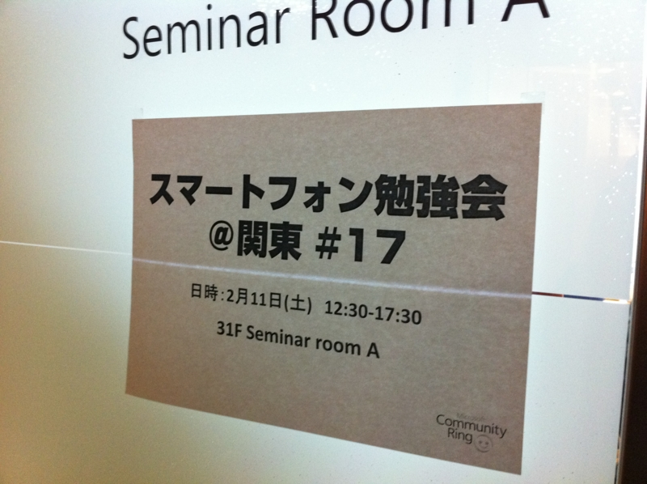
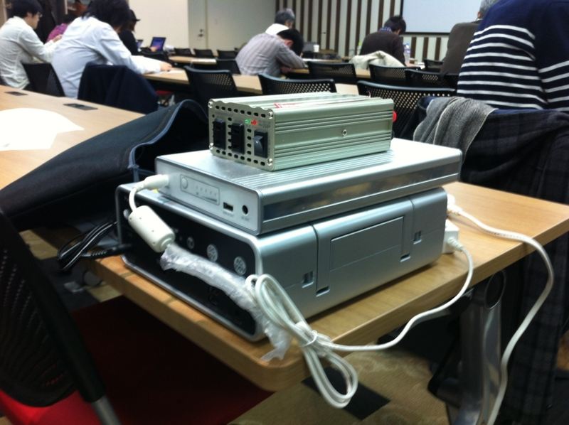
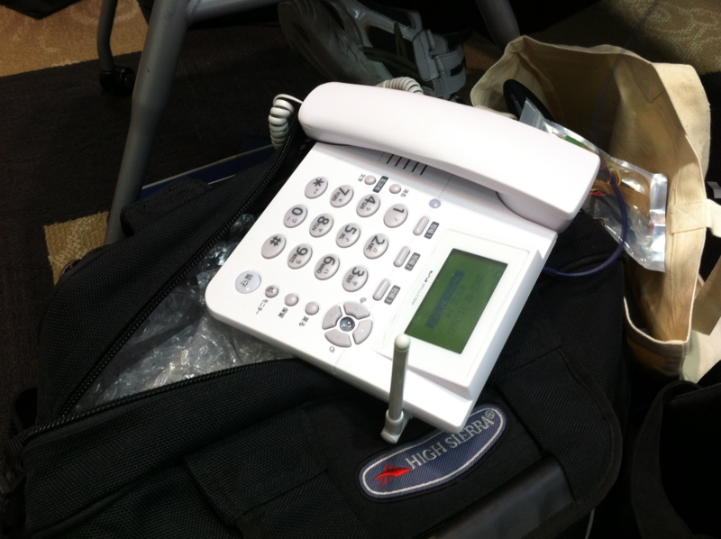

ぶっちゃけ、メインは「酢酸先生結婚おめでとうの会」でしたｗ

<a href="http://d.hatena.ne.jp/ch3cooh393/20120208/1328671752">&#x7D50;&#x5A5A;&#x3057;&#x3088;&#x3046;&#xFF01;&#x306B;@&#x3092;&#x8FD4;&#x3057;&#x305F;&#x3089;&#x7D50;&#x5A5A;&#x3059;&#x308B;&#x4E8B;&#x306B;&#x306A;&#x3063;&#x305F; - &#x9162;&#x308D;&#x3050;(ch3cooh.jp)</a>

僕はあまり面識ないのだけど（懇親会出たかったなぁ）、ひとことお祝いさせてください。<i>分子レベルまで爆発しろ！</i>おれも爆発したい＼(^o^)／

ノリはこういう勉強会では相変わらずで楽しい。ただ、平易なものとマニアックなものと、セッションの難易度の振れ幅が激しすぎたのと、比較的技術的話題が少なかったのは、ちょっとアレかな。スピーカーは自発的に名乗り出るのだろうし、なかなかそこら辺の調整は難しいのだろうけど。すまべんは開発者以外の参加も視野にいれているっぽいので、<a class="keyword" href="http://d.hatena.ne.jp/keyword/%A5%B9%A5%DE%A1%BC%A5%C8%A5%D5%A5%A9%A5%F3">スマートフォン</a>関連の話題に乗り遅れたくない！という人や、気楽に<s>エロい</s>エラいヒトたちとお近づきになりたい人にオススメなのかな。

今度ボクが参加する勉強会は、おそらく4月のプロ生になると思う。興味を持たれた方がいたら、是非一緒に参加しましょう！

<a href="http://pronama.wordpress.com/"> &#x30D7;&#x30ED;&#x30B0;&#x30E9;&#x30DF;&#x30F3;&#x30B0;&#x751F;&#x653E;&#x9001;</a>

