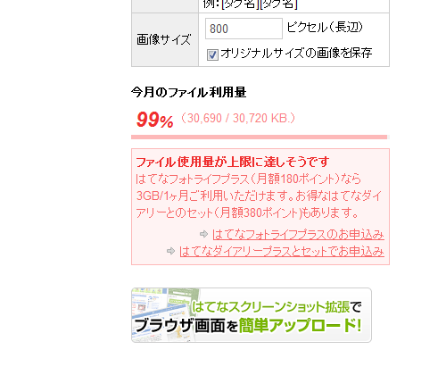

<a class="keyword" href="http://d.hatena.ne.jp/keyword/%A4%CF%A4%C6%A4%CA%A5%D6%A5%ED%A5%B0">はてなブログ</a>で、写真のアップロードが失敗する。アップロードの進捗が100％で止まってしまう。

どうやら、アップロードの上限まで使ってしまったらしい。<a class="keyword" href="http://d.hatena.ne.jp/keyword/Ajax">Ajax</a> のアップローダーは画面遷移がなく使い勝手イイけど、エラーをちゃんと吐くまでは作りこまれていないみたいで（ベータ版だしなぁ）、こういうときは少し困る。しょうもないところで躓いてしまった。

という訳で、月額180円払ってプレミアム会員になることにした。

あと、［選択した写真を貼り付け］ボタンを押すと記事が勝手に公開されてしまうんだけど、ウチだけだろうか（Windows 7/Google Chrome 18）。これも少し困る。

