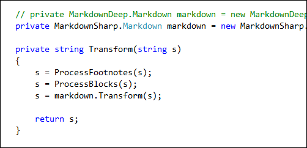
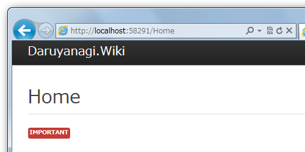
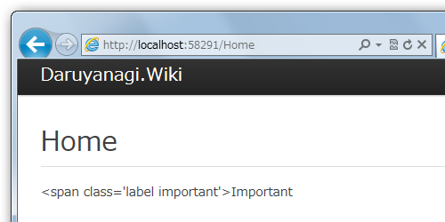

C# で Markdown エンジンを探すと、 MarkdownSharp と MarkdownDeep というのが見つかるけど、どっちがいいんだろうね。

<ol>
<li><a href="http://code.google.com/p/markdownsharp/">
markdownsharp -

C# Markdown processor - Google Project Hosting
</a></li>
<li><a href="http://www.toptensoftware.com/markdowndeep/">Topten Software</a> （MarkdownDeep）</li>
</ol>
どちらも NuGet からダウンロード可能。

基本的には MarkdownDeep の方が高速で、サンプルも充実している。（.Net版と<a class="keyword" href="http://d.hatena.ne.jp/keyword/JavaScript">JavaScript</a>版、そしてそれらを動かすサンプルを NuGet で取得できる）。ただ、使い込んでいくと、どうも一部HTMLタグの解釈に問題があるっぽい。

MarkdownSharp の場合は、 &lt;span class="label important"&gt;Important&lt;/span&gt; なんていう複数のクラスをもつタグでも正しく解釈できるが、

MarkdownDeep だと失敗してしまう。

今のところ MarkdownSharp の方がおすすめできるっぽい。

