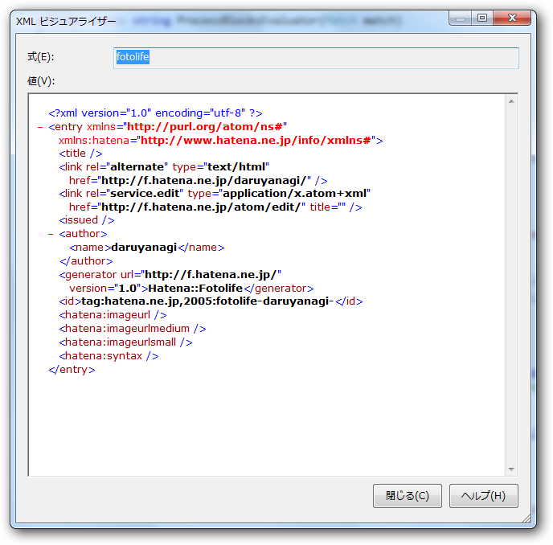

うちのコードがおかしいのかと思って調べてみたら、同じような不具合にであっている人が複数いたようだ。

<ul>
<li><a href="http://i.hatena.ne.jp/idea/25245">&#x306F;&#x3066;&#x306A;&#x30A2;&#x30A4;&#x30C7;&#x30A2; - AtomAPI&#x306B;&#x3066;EditURI&#x306B;&#x5BFE;&#x3057;&#x3066;GET&#x64CD;&#x4F5C;&#x3092;&#x884C;&#x3063;&#x305F;&#x6240;&#x3001;&#x7A7A;&#x306E;&#x60C5;&#x5831;&#x304C;&#x8FD4;&#x3063;&#x3066;&#x304F;&#x308B;&#x3002;HTTP&#x30D8;&#x30C3;&#x30C0;&#x306F;&#x300C;200 OK&#x300D;&#x306A;&#x306E;&#x3067;&#x3059;&#x304C;&#x3001;XML&#x5185;&#x306E;&#x5404;&#x8981;&#x7D20;&#x306F;&#x7A7A;&#x767D;&#x3067;&#x3059;&#x3002;</a></li>
<li><a href="http://d.hatena.ne.jp/aroooy/20090303/1236079234">&#x306F;&#x3066;&#x306A;&#x30D5;&#x30A9;&#x30C8;&#x30E9;&#x30A4;&#x30D5;AtomAPI&#x3001;EditURI&#x306B;&#x5BFE;&#x3057;&#x3066;GET&#x64CD;&#x4F5C;&#x3092;&#x884C;&#x3063;&#x305F;&#x6240;&#x3001;&#x7A7A;&#x306E;&#x60C5;&#x5831;&#x304C;&#x8FD4;&#x3063;&#x3066;&#x304F;&#x308B; - &#x822A;&#x661F;&#x65E5;&#x8A8C;&#x88DC;&#x8DB3;</a></li>
</ul>
もしかしたら2009年から放置されているのかな？ 
だったら、ちょっとヒドい '`,､('∀`) '`,､

とりあえず<a class="keyword" href="http://d.hatena.ne.jp/keyword/%A5%B9%A5%AF%A5%EC%A5%A4%A5%D4%A5%F3%A5%B0">スクレイピング</a>でもしようか。

