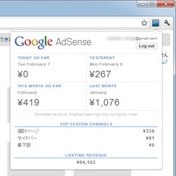
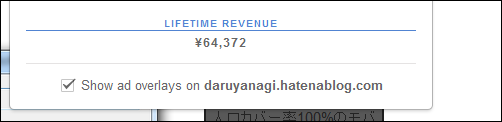
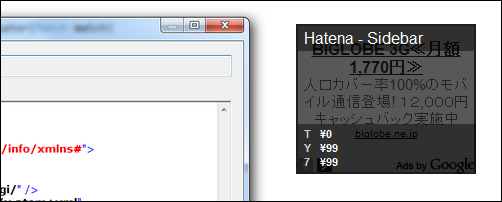

<blockquote cite="http://www.forest.impress.co.jp/docs/review/20120208_510310.html">

「<a class="keyword" href="http://d.hatena.ne.jp/keyword/AdSense">AdSense</a> Publisher Toolbar (by <a class="keyword" href="http://d.hatena.ne.jp/keyword/Google">Google</a>)」は、Webサイト向け広告配信サービス“<a class="keyword" href="http://d.hatena.ne.jp/keyword/Google">Google</a> <a class="keyword" href="http://d.hatena.ne.jp/keyword/AdSense">AdSense</a>”の収益状況を簡単にチェックできる<a class="keyword" href="http://d.hatena.ne.jp/keyword/Google">Google</a>公式の「<a class="keyword" href="http://d.hatena.ne.jp/keyword/Google">Google</a> <a class="keyword" href="http://d.hatena.ne.jp/keyword/Chrome">Chrome</a>」用<a class="keyword" href="http://d.hatena.ne.jp/keyword/%B3%C8%C4%A5%B5%A1%C7%BD">拡張機能</a>。

<cite><a href="http://www.forest.impress.co.jp/docs/review/20120208_510310.html">&#x7A93;&#x306E;&#x675C; - &#x3010;REVIEW&#x3011;Chrome&#x304B;&#x3089;AdSense&#x53CE;&#x76CA;&#x3092;&#x624B;&#x8EFD;&#x306B;&#x78BA;&#x8A8D;&#x3067;&#x304D;&#x308B;&#x516C;&#x5F0F;&#x62E1;&#x5F35;&#x300C;AdSense Publisher Toolbar&#x300D;</a></cite>
</blockquote>

最初使っているときは気付かなかったのだけれど、ちょっと面白い機能があったので補足。

<a class="keyword" href="http://d.hatena.ne.jp/keyword/AdSense">AdSense</a> を設置済みのWebサイトで<a class="keyword" href="http://d.hatena.ne.jp/keyword/%B3%C8%C4%A5%B5%A1%C7%BD">拡張機能</a>を使うと、当該ドメインでオーバーレイを表示するかどうかという<a class="keyword" href="http://d.hatena.ne.jp/keyword/%A5%C1%A5%A7%A5%C3%A5%AF%A5%DC%A5%C3%A5%AF%A5%B9">チェックボックス</a>が現れるので、ONにする。すると......

こんな感じに、実際にどれだけの収益があったのか、広告ごとに収益情報がオーバーレイ表示される。どこに置いた広告が効果的なのかがわかりやすくなっていい感じ！

