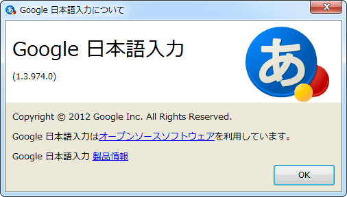
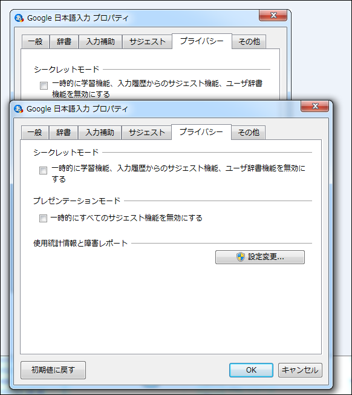
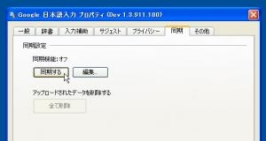

<a href="http://googledevjp.blogspot.com/2012/02/google-13974x.html">Google &#x65E5;&#x672C;&#x8A9E;&#x5165;&#x529B;&#x306E;&#x5B89;&#x5B9A;&#x7248;&#x3092;&#x30A2;&#x30C3;&#x30D7;&#x30C7;&#x30FC;&#x30C8;&#x3057;&#x307E;&#x3057;&#x305F;&#x3002;&#xFF08;1.3.974.x&#xFF09; - Google Japan Developer Relations Blog</a>

v1.3開発版の目玉機能は、ユーザー辞書と設定の同期、そしてプレゼンテーションモードだったのだけど......

後ろが v1.2（安定版） で手前が v1.3（安定版） なのだけど、どうもあるはずの［同期］タブが見当たらん。ダイアログは大きくなってるし、同期用のユーザー辞書は追加されているのに。

これが v1.3（開発版）のダイアログ（via <a href="http://caroccyblog.blog9.fc2.com/blog-entry-1107.html">&#x30AB;&#x30ED;&#x30B7;&#x30FC;&#x306E;&#x30D6;&#x30ED;&#x30B0;  Google&#x65E5;&#x672C;&#x8A9E;&#x5165;&#x529B;&#x958B;&#x767A;&#x7248;&#x304C;v1.3.911.100&#x306B;&#x30A2;&#x30C3;&#x30D7;&#x30C7;&#x30FC;&#x30C8;</a>）。ちゃんと［同期］タブがある。

なにか環境依存のバグでもあるんだろうか。とりあえず、うちの環境では少しおあずけ。

