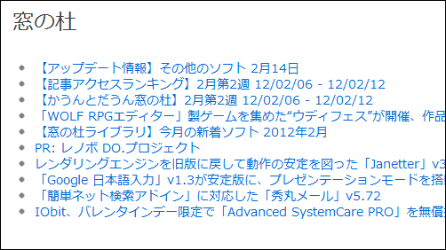

今日の10分プログラミングは、<a class="keyword" href="http://d.hatena.ne.jp/keyword/RSS">RSS</a>を取得してリストタグに変換しようの巻。

<pre class="code lang-cs" data-lang="cs">using System;
using System.Collections.Generic;
using System.Linq;
using System.Web;

using System.Web.<a class="keyword" href="http://d.hatena.ne.jp/keyword/Mvc">Mvc</a>;
using System.<a class="keyword" href="http://d.hatena.ne.jp/keyword/Xml">Xml</a>;
using System.ServiceModel.Syndication;

namespace Daruyanagi
{
public static class FeedHelper
{
public static string GetHtml(string url, int count = 10)
{
var div = new TagBuilder(&#34;div&#34;);
div.Attributes.Add(&#34;class&#34;, &#34;feed&#34;);

using (var reader = XmlReader.Create(url))
{
var feed = SyndicationFeed.Load(reader);

var h2 = new TagBuilder(&#34;h2&#34;);
h2.InnerHtml = feed.Title.Text;
div.InnerHtml += h2.ToString();

var ul = new TagBuilder(&#34;ul&#34;);
foreach (var i in feed.Items)
{
var a = new TagBuilder(&#34;a&#34;);
a.Attributes.Add(&#34;href&#34;, i.Links.Count &gt; 0
? i.Links[0].<a class="keyword" href="http://d.hatena.ne.jp/keyword/Uri">Uri</a>.ToString() : &#34;&#34;);
a.Attributes.Add(&#34;title&#34;, i.Title.Text);
a.InnerHtml = i.Title.Text;

var li = new TagBuilder(&#34;li&#34;);
li.InnerHtml = a.ToString();
ul.InnerHtml += li.ToString();

if (--count &lt; 1) break;
}
div.InnerHtml += ul.ToString();
}
return div.ToString();
}
}
}</pre>

<a href="http://www.atmarkit.co.jp/fdotnet/dotnettips/753rssfeed/rssfeed.html">RSS 2.0&#xFF0F;ATOM 1.0&#x30D5;&#x30A3;&#x30FC;&#x30C9;&#x3092;&#x51E6;&#x7406;&#x3059;&#x308B;&#x306B;&#x306F;&#xFF1F;&#xFF3B;3.5&#x3001;C#&#x3001;VB&#xFF3D; &minus; &#xFF20;IT</a> をそのままコピったようなものだけど。"<a href="http://rss.rssad.jp/rss/forest/rss.xml">http://rss.rssad.jp/rss/forest/rss.xml</a>"を指定すれば、<a class="keyword" href="http://d.hatena.ne.jp/keyword/%A5%B9%A5%AF%A5%EA%A1%BC%A5%F3%A5%B7%A5%E7%A5%C3%A5%C8">スクリーンショット</a>のような出力になると思う。

