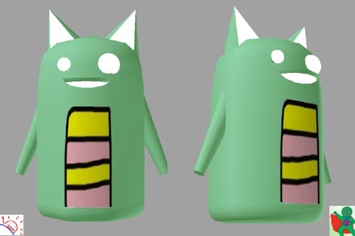
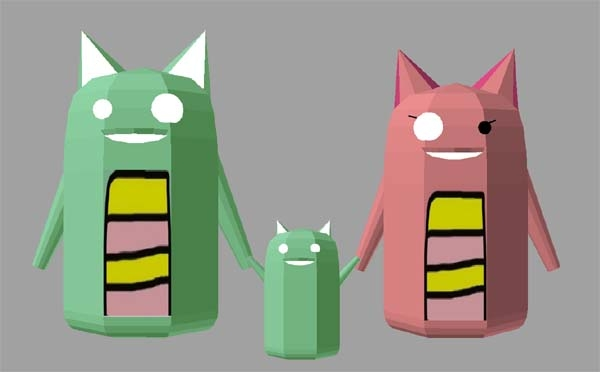

すごい、すごい！　うちの <a class="keyword" href="http://d.hatena.ne.jp/keyword/Twitter">Twitter</a> のアイコンが 3D になったよ！

昔、「<a class="keyword" href="http://d.hatena.ne.jp/keyword/%CF%BB%B3%D1%C2%E7%B2%A6">六角大王</a>」で挫折したので、こういうのはスゴい尊敬してしまう。ありがとう！

ただ、右下になぜウェブマトリクスマン（<a href="https://twitter.com/#!/webmatrixman">Twitter</a>）がいるのかは気にしないでおく。

<blockquote cite="https://twitter.com/#!/jboysoft/status/169792493133639680">

@daruyanagi @kirin_nico なんですか脚というのは飾りらしいです。それが<a class="keyword" href="http://d.hatena.ne.jp/keyword/%B0%CE%A4%A4%BF%CD%A4%CB%A4%CF">偉い人には</a>わからんらしいのです。 pic.<a class="keyword" href="http://d.hatena.ne.jp/keyword/twitter">twitter</a>.com/aUIgbxe1

<cite><a href="https://twitter.com/#!/jboysoft/status/169792493133639680">Twitter</a></cite>
</blockquote>

PS: なんか子供までできたし！

