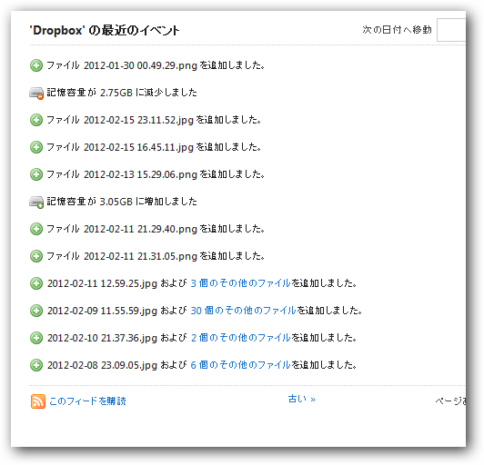

<blockquote cite="http://internet.watch.impress.co.jp/docs/news/20120206_509987.html">

オンラインストレージ大手米<a class="keyword" href="http://d.hatena.ne.jp/keyword/Dropbox">Dropbox</a>が、新機能の<a class="keyword" href="http://d.hatena.ne.jp/keyword/%A5%D9%A1%BC%A5%BF%A5%C6%A5%B9%A5%C8">ベータテスト</a>参加者に対して最大で5GBを無償提供すると発表した。<a class="keyword" href="http://d.hatena.ne.jp/keyword/Dropbox">Dropbox</a>では公式掲示板にこのキャンペーンに関する詳細FAQも掲載している。

<cite><a href="http://internet.watch.impress.co.jp/docs/news/20120206_509987.html">&#x7C73;Dropbox&#x304C;&#x65B0;&#x6A5F;&#x80FD;&#x30D9;&#x30FC;&#x30BF;&#x30C6;&#x30B9;&#x30BF;&#x30FC;&#x306B;&#x6700;&#x5927;5GB&#x3092;&#x7121;&#x6599;&#x63D0;&#x4F9B;&#x3059;&#x308B;&#x3068;&#x767A;&#x8868; -INTERNET Watch</a></cite>
</blockquote>

というわけで、最近は<a class="keyword" href="http://d.hatena.ne.jp/keyword/iPhone">iPhone</a>/<a class="keyword" href="http://d.hatena.ne.jp/keyword/Nikon">Nikon</a> <a class="keyword" href="http://d.hatena.ne.jp/keyword/D300s">D300s</a>でとった写真を開発版クライアントで <a class="keyword" href="http://d.hatena.ne.jp/keyword/Dropbox">Dropbox</a> へアップロードしていた。普通の使い方をしていたので、そんなに容量は増えていないけれど、それでも500MBのボーナスを貰って、3.0GBまで容量が増えていた。

しかし、今日画像をアップロードしたところ......

何故か減りました （＠＠；

まぁ、タダでもらってるものだし、別に構わないのだけど......最初は笑ってしまったｗ バルーン通知の<a class="keyword" href="http://d.hatena.ne.jp/keyword/%A5%B9%A5%AF%A5%EA%A1%BC%A5%F3%A5%B7%A5%E7%A5%C3%A5%C8">スクリーンショット</a>がとれなかったのは痛恨の極み。

