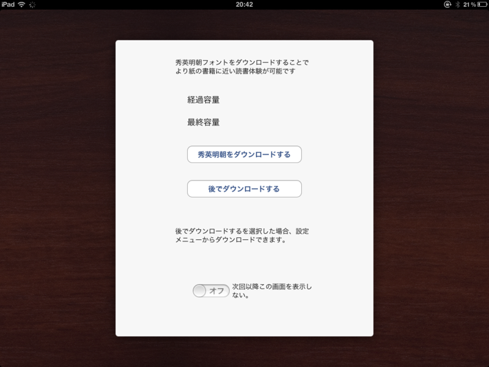
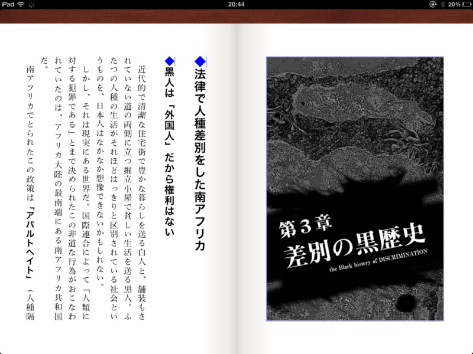
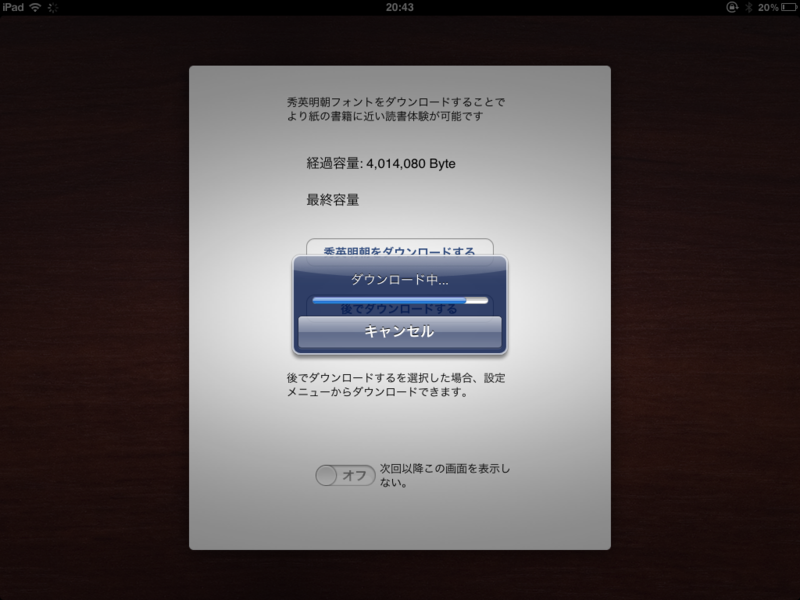

<a class="keyword" href="http://d.hatena.ne.jp/keyword/iPad">iPad</a> 版の Kinoppy にアップデートがきていたので、適用して広げると、なにやらダイアログボックスが現れた。なんか知らんけど、追加の<a class="keyword" href="http://d.hatena.ne.jp/keyword/%CC%C0%C4%AB%C2%CE">明朝体</a>フォントを入れませんかというお誘い。もちろん OK！

適用前。本文はゴシック体。

適用後。本文は<a class="keyword" href="http://d.hatena.ne.jp/keyword/%CC%C0%C4%AB%C2%CE">明朝体</a>。

<a class="keyword" href="http://d.hatena.ne.jp/keyword/%CC%C0%C4%AB%C2%CE">明朝体</a>のほうが、“本らしく”ってちょっと読みやすい気がする。ただ、僕個人としては、<a class="keyword" href="http://d.hatena.ne.jp/keyword/iPad">iPad</a> でテキストの<a class="keyword" href="http://d.hatena.ne.jp/keyword/%C5%C5%BB%D2%BD%F1%C0%D2">電子書籍</a>を読む気にはあまりなれないので......いや、素晴らしいアップデートだと思いますよ？

あと、ちょっとだけ感心したのは、フォントのダウンロードを故意に中断しても、レジュームできること。細かいところだけど、エラいなって思った。もっとも、iOS がそういう仕組みなのかもしれないけど。

