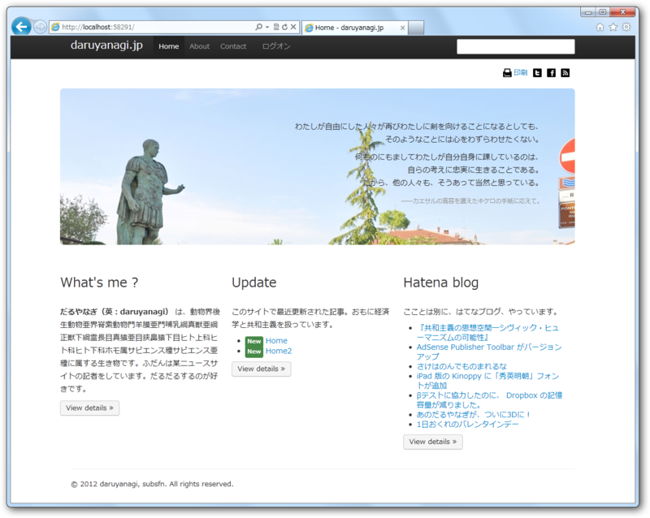
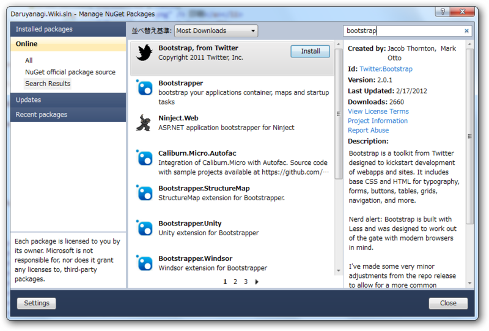
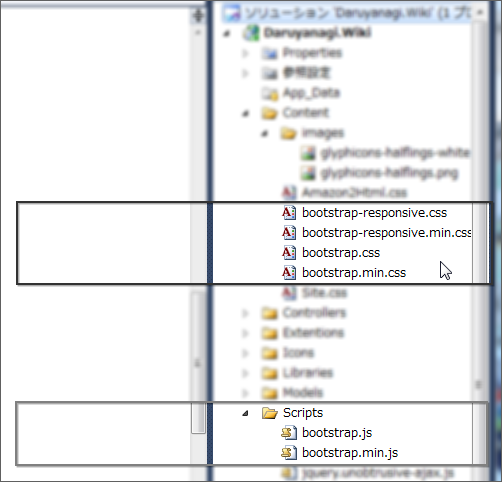

<blockquote cite="http://sourceforge.jp/magazine/12/02/02/1046215">

米<a class="keyword" href="http://d.hatena.ne.jp/keyword/Twitter">Twitter</a>は1月31日、<a class="keyword" href="http://d.hatena.ne.jp/keyword/CSS">CSS</a>/HTML<a class="keyword" href="http://d.hatena.ne.jp/keyword/%A5%D5%A5%EC%A1%BC%A5%E0%A5%EF%A1%BC%A5%AF">フレームワーク</a>「Bootstrap 2.0」をリリースしたと発表した。画面を格子状に分割して要素を配置する「グリッドレイアウト」を容易に実装できるほか、WebサイトやWebアプリケーション開発に向けたUI<a class="keyword" href="http://d.hatena.ne.jp/keyword/%A5%B3%A5%F3%A5%DD%A1%BC%A5%CD%A5%F3%A5%C8">コンポーネント</a>が多く含まれている。

<cite><a href="http://sourceforge.jp/magazine/12/02/02/1046215">&#x7C73;Twitter&#x3001;&#x540C;&#x793E;&#x767A;&#x306E;CSS/HTML&#x30D5;&#x30EC;&#x30FC;&#x30E0;&#x30EF;&#x30FC;&#x30AF;&#x300C;Bootstrap 2.0&#x300D;&#x3092;&#x516C;&#x958B; - SourceForge.JP Magazine : &#x30AA;&#x30FC;&#x30D7;&#x30F3;&#x30BD;&#x30FC;&#x30B9;&#x306E;&#x8A71;&#x984C;&#x6E80;&#x8F09;</a></cite>
</blockquote>

ちょっと様子見していたのだけど、サクっと乗り換えてみた。

ドロップダウンメニューやタブが動かなくなった ＼(^o^)／

結構色々変わっていて、<a class="keyword" href="http://d.hatena.ne.jp/keyword/%B8%E5%CA%FD%B8%DF%B4%B9">後方互換</a>性はないみたい。既存のビューを書き換えるのには、多少苦労した。

<blockquote>

Bootstrap 2.0では、ボタン、ボタングループ、ドロップダウン、タブなどの<a class="keyword" href="http://d.hatena.ne.jp/keyword/%A5%B3%A5%F3%A5%DD%A1%BC%A5%CD%A5%F3%A5%C8">コンポーネント</a>が書き直されている。また、<b>グリッドシステムではカラムの数が16から12カラムとなり</b>、画面の大きさなどに応じて柔軟に調整する<b>レスポンシブアプローチを導入</b>、<a class="keyword" href="http://d.hatena.ne.jp/keyword/%A5%B9%A5%DE%A1%BC%A5%C8%A5%D5%A5%A9%A5%F3">スマートフォン</a>、タブレットなどへの対応が強化された。

　フォームスタイルも一新され、<a class="keyword" href="http://d.hatena.ne.jp/keyword/jQuery">jQuery</a> UIなどのツールとの互換性を強化した新しいテーブルスタイルも用意された。<b>Collapse、Crousel、Typeaheadなどの<a class="keyword" href="http://d.hatena.ne.jp/keyword/JavaScript">JavaScript</a>プラグインも加わっている</b>。必要な機能を選んで利用するカスタマイズ版も新たに用意された。

</blockquote>

とくにカラム数の変更は......描き直しが面倒くさい。ドロップダウンメニューのデザインは新しいほうが格好いいな。しかし、@Html.EditorFor() ではHTMLタグの属性を指定できないんだなぁ。クラス名がないと、ちゃんとデザインしてくれないのでこまる。とりあえず、<a class="keyword" href="http://d.hatena.ne.jp/keyword/JavaScript">JavaScript</a> で後からチョコチョコッとクラスをつけておいた。

<pre class="code lang-js" data-lang="js" data-unlink>$(function () {
$(&#39;form&#39;).addClass(&#34;form-horizontal&#34;);
$(&#39;label&#39;).addClass(&#34;control-label&#34;);
$(&#39;input&#39;).addClass(&#34;input-xlarge&#34;);
$(&#39;textarea&#39;).addClass(&#34;input-xlarge&#34;);
});</pre>

なお、Twitter Bootstrap は、Visual Studio/WebMatrix ならば Nuget で簡単にインストールできる（プラグインは含まれていない）。ダウンロード＆配置の手間が少しだけ省けるので試すべし。

<ul>
<li><a href="http://daruyanagi.hatenablog.com/entry/2012/01/12/013836">Twitter Bootstrap &#x306F;&#x30AB;&#x30F3;&#x30BF;&#x30F3;&#x304B;&#x3064;&#x30AB;&#x30C3;&#x30B3;&#x30A4;&#x30A4; - &#x3060;&#x308B;&#x308D;&#x3050;</a></li>
</ul>