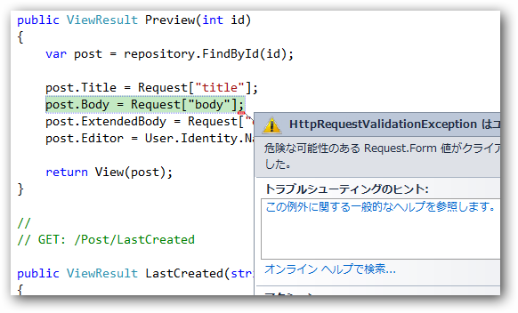

<a class="keyword" href="http://d.hatena.ne.jp/keyword/ASP.NET">ASP.NET</a> 規定の動作では、入力にHTMLタグが含まれていると、バリデーションでエラーを吐く（HttpRequestValidationException）。これはこれでありがたいのだけど、どうしてもHTMLタグを受け入れたい場合はある。

<h3>ページ単位でバリデーションを無効にする</h3>

web.config に設定を記述する。

<pre class="code lang-xml" data-lang="xml" data-unlink>&lt;configuration&gt;
&lt;system.web&gt;
&lt;httpRuntime requestValidationMode=&#34;2.0&#34; /&gt;
&lt;pages validateRequest=&#34;false&#34;&gt;
&lt;/pages&gt;
&lt;/system.web&gt;
&lt;/configuration&gt;</pre>

<h3>メソッド単位でバリデーションを無効にする。</h3>

POSTメソッドをまるごと。

<pre class="code lang-cs" data-lang="cs" data-unlink>[HttpPost]
[ValidateInput(false)]
public ViewResult Edit(FormCollection form)
{

}</pre>

<a href="http://stackoverflow.com/questions/4361907/asp-net-mvc-3-validaterequestfalse-not-working-with-formcollection">ASP.NET MVC 3 ValidateRequest(false) not working with FormCollection - Stack Overflow</a>

<h3>フォームデータ単位でバリデーションを無効にする。</h3>

Request クラスの拡張メソッド Unvalidated() を利用する。自分ではこれしか使わない。

コントローラーで使ってみる。

<pre class="code lang-cs" data-lang="cs" data-unlink>using System.Web.Helpers;

var hoge = Request.Unvalidated().Form[&#34;hoge&#34;];</pre>

ビューでも使えるんだね。

<pre class="code" data-unlink>@Request.Unvalidated(&#34;html&#34;)

&lt;form method=&#34;post&#34;&gt;
&lt;input type=&#34;text&#34; name=&#34;html&#34; /&gt;
&lt;input type=&#34;submit&#34; /&gt;
&lt;/form&gt;</pre>

<a href="http://d.hatena.ne.jp/shiba-yan/20110406/1302094656">System.Web.Helpers &#x3092;&#x6D3B;&#x7528;&#x3059;&#x308B; - &#x307E;&#x3081;&#x3057;&#x3070;&#x96D1;&#x8A18;</a>

<h3>補足</h3>

DB に HTML タグを突っ込みたい場合は AllowHtml 属性を付与してやる。

<pre class="code" data-unlink>[AllowHtml]
[DisplayName(&#34;本文&#34;)]
public string Body { get; set; }</pre>

HTML タグを含む文字列を生のまま出力したい場合は、@Html.Raw() が利用できる。

<pre class="code" data-unlink>@Html.Raw(hoge)</pre>

HTML タグを含む文字列を変数として保持したい場合は、 HtmlString/MvcHtmlString クラスを使う。MvcHtmlString は ASP.Net 3.5 MVC 2 から使えるが、 HtmlString は MVC 3 のみ。これからは HtmlString 使えばいいんじゃないかな。中身がどう違うのかはよく知らない。

<pre class="code" data-unlink>var hoge = new MvcHtmlString(&#34;&lt;b&gt;hoge&lt;/b&gt;&#34;);</pre>

HTML タグを安全に出力したい場合は HttpUtility.HtmlEncode() を使う。

<pre class="code" data-unlink>@HttpUtility.HtmlEncode(hoge)</pre>

※ 間違ってるところがあったら、ぜひ教えてほしいです......

