
ASP.net <a class="keyword" href="http://d.hatena.ne.jp/keyword/MVC">MVC</a> 3 の新規アプリケーション（認証つき）を、Visual Studio 2010 から Web配置 で ExpressWeb へ発行してみたのだけど、やたら手間取ったので、備忘録としてメモしておく。

<blockquote>

追記：データベースは <b><a class="keyword" href="http://d.hatena.ne.jp/keyword/SQL">SQL</a> Server 2008</b> を使いました。メイド好きなヒト（「メイド <a class="keyword" href="http://d.hatena.ne.jp/keyword/MVC">MVC</a>」でググれ）によると、<a class="keyword" href="http://d.hatena.ne.jp/keyword/SQL">SQL</a> CE の方がよっぽど簡単とのこと。でも、<a class="keyword" href="http://d.hatena.ne.jp/keyword/SQL">SQL</a> CE は格納できる文字数に制限があるのよねぇ......（4,000文字）

</blockquote>

<h3>とりあえずデプロイする</h3>

とりあえず何も考えずに、新規アプリケーションを ExpressWeb へ発行してみる。

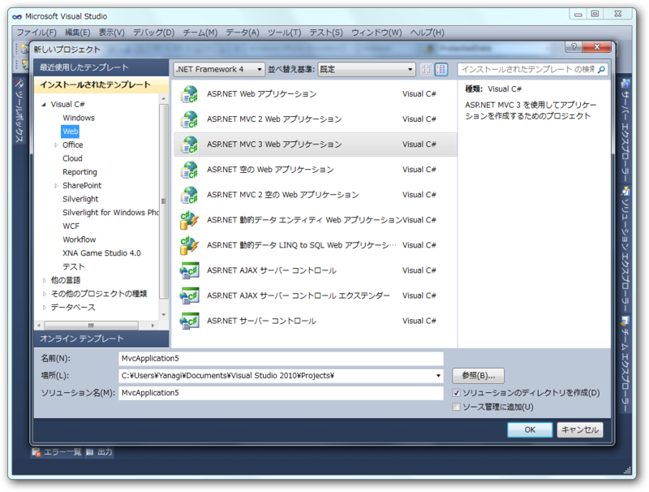

ASP.net <a class="keyword" href="http://d.hatena.ne.jp/keyword/MVC">MVC</a> 3 アプリケーションを作成。何の変哲もないタダのWebサイトが現れる。

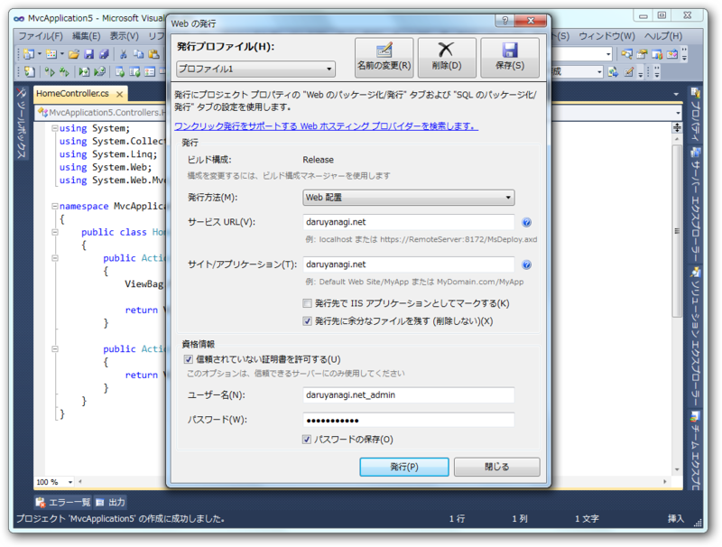

daruyanagi.net に発行するので、［サービス URL］［サイト/アプリケーション］欄に daruyanagi.net と記入。資格情報には、Webサイトのリモート管理のIDとパスを入力しておく。この時、［信頼しない証明書を許可する］にチェックを入れておくのを忘れずに。

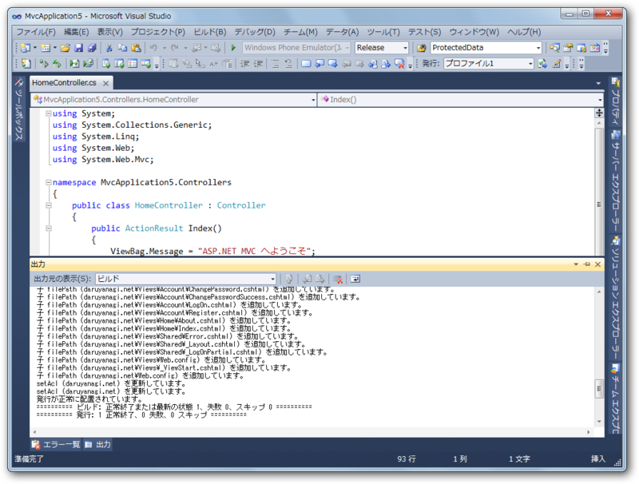

［発行］ボタンを押して暫し待つ。

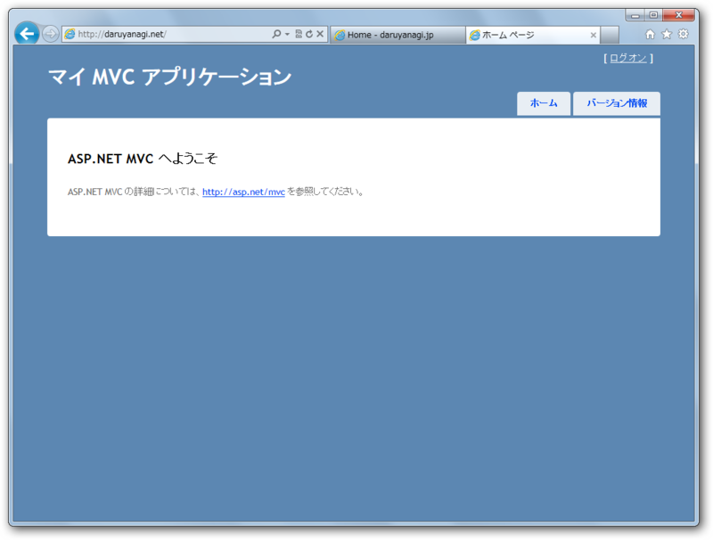

できた！

<h3>エラーの内容が表示されない</h3>

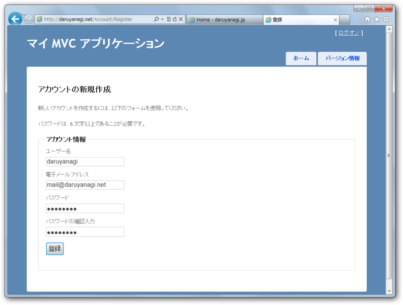

しかしこのままではログイン関係の機能が動かない。ユーザーの登録が行えない。

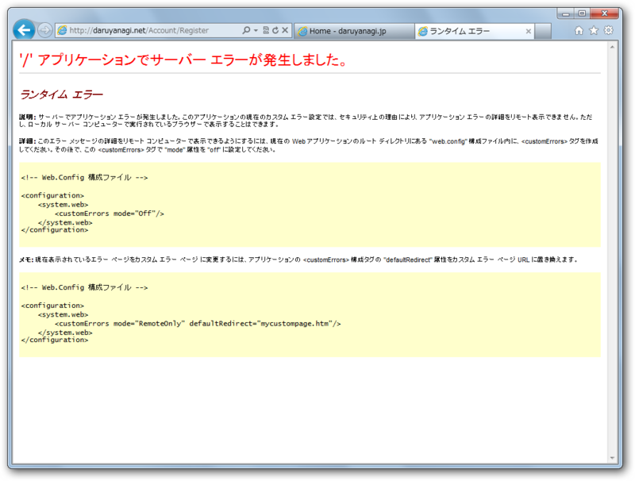

それどころか、エラーの内容が表示されない。

とりあえずエラーを特定しないことにはどうしようもないので、Web.confug にカスタムエラーを無効化する設定を記述。

<pre class="code lang-xml" data-lang="xml" data-unlink>：
&lt;system.web&gt;
&lt;customErrors mode=&#34;Off&#34;/&gt;
：</pre>

もう一度発行して、ユーザーの登録画面でリロード。

<h3>フォルダに書き込み権限がない</h3>

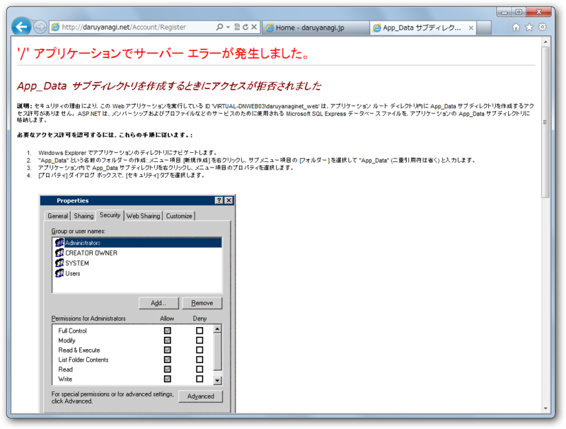

エラーの内容が表示された。

フォルダに書き込み権限がなかったため、App_Data フォルダが作成できなかったらしい。ファイルマネージャーで、/wwwroot いかに権限を与えて解決。

リロード。

<h3>データベースに接続できない</h3>

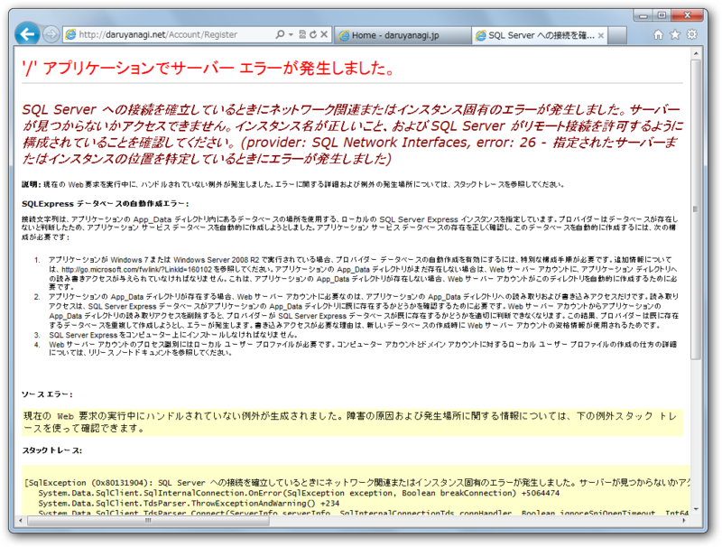

次はデータベースに接続できないようだ。

そりゃそうだ、ローカル用の設定だもの。 Web.confug.Release にリモート用の接続文字列を設定してやる。

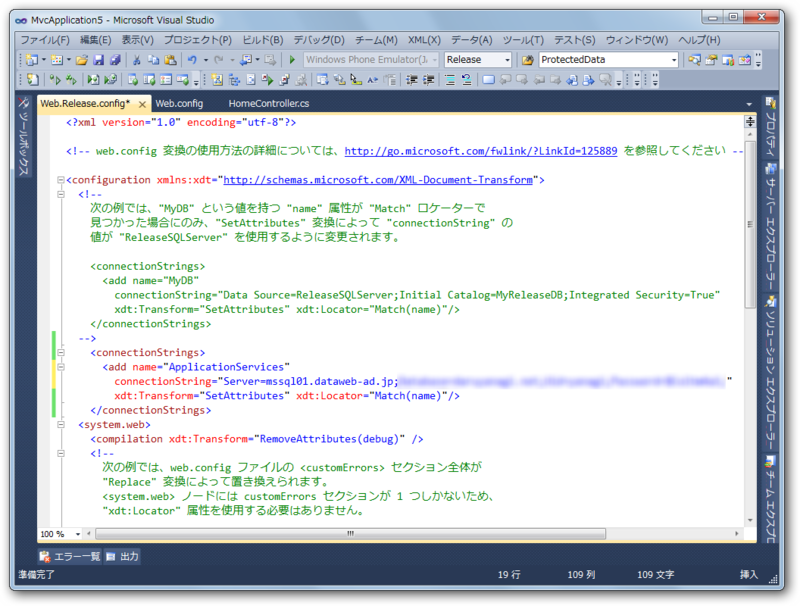

<pre class="code lang-xml" data-lang="xml" data-unlink>&lt;configuration xmlns:xdt=&#34;http://schemas.microsoft.com/XML-Document-Transform&#34;&gt;
&lt;connectionStrings&gt;
&lt;add name=&#34;ApplicationServices&#34;
connectionString=&#34;Server=mssql01.dataweb-ad.jp;***&#34;
xdt:Transform=&#34;SetAttributes&#34; xdt:Locator=&#34;Match(name)&#34;/&gt;
&lt;/connectionStrings&gt;
&lt;system.web&gt;
：</pre>

リロード。

<h3>資格情報を保存するデータベースに書き込みができない</h3>

<h4>スキーマがない</h4>

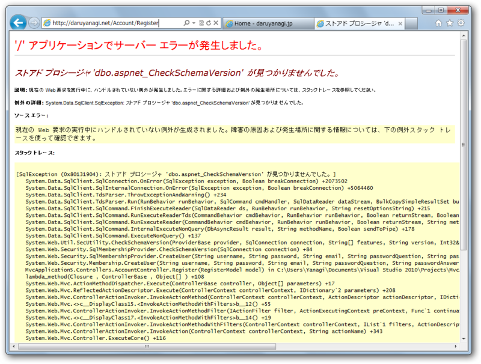

ストアドプロシージャがない！とな。

よくわからないので、リモートのデータベースの中身を見てみた。すっからかんだった！ どうにかしてデータを作成してあげないといけない。

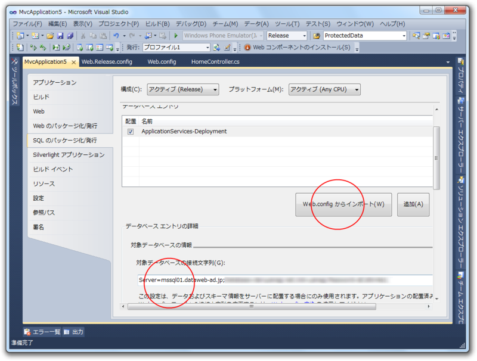

アプリケーションのプロパティ画面にある、［<a class="keyword" href="http://d.hatena.ne.jp/keyword/SQL">SQL</a> のパッケージ化/発行］タブを開いて、［Web.configからインポート］ボタンを押す。すると、でろでろっと補完されるはずなので、［対象データベースの接続文字］欄にリモートデータベースの接続文字列を入れる。

＼デップローイ！／ 

<h4>データがない</h4>

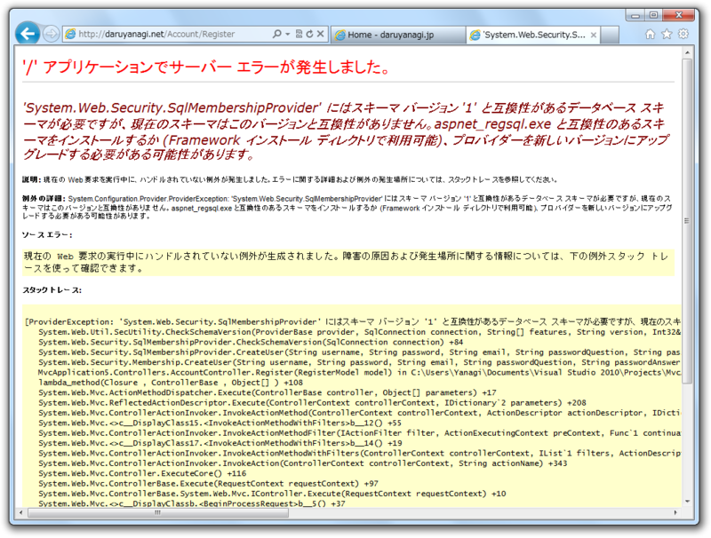

checkShemeVersion の値が1じゃないと言われる。色々解決策を教えてくれているけど、どれも正解ではない。

実はさきほど作ったのは<a class="keyword" href="http://d.hatena.ne.jp/keyword/%A5%B9%A5%AD%A1%BC%A5%DE">スキーマ</a>のみで、データが入っていないということだったらしい。データも入れてあげればよう。

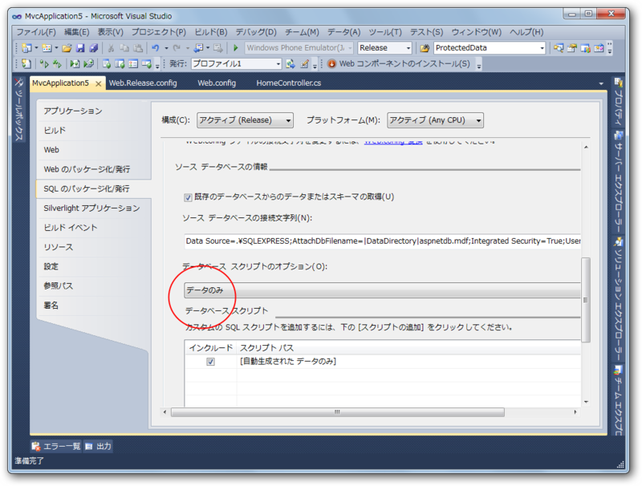

［データベーススクリプトのオプション］を［<a class="keyword" href="http://d.hatena.ne.jp/keyword/%A5%B9%A5%AD%A1%BC%A5%DE">スキーマ</a>のみ］から［データのみ］に変更。ここをはじめから［<a class="keyword" href="http://d.hatena.ne.jp/keyword/%A5%B9%A5%AD%A1%BC%A5%DE">スキーマ</a>とデータ］にしておけば、最後のエラーに悩まされずに済んだかもしれない。

（次回発行時には Web.config からインポートしたデータベースエントリの設定のチェックを外しておくこと。すでにある<a class="keyword" href="http://d.hatena.ne.jp/keyword/%A5%B9%A5%AD%A1%BC%A5%DE">スキーマ</a>を二十二作ろうとしてエラーが発生する）

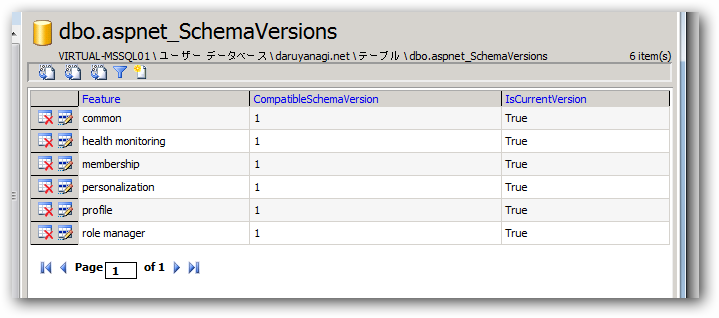

リモートでもちゃんとデータができてる！　無事にユーザーの作成にも成功しました。めでたしめでたし。

<h3>まとめ</h3>

新規 Asp.net <a class="keyword" href="http://d.hatena.ne.jp/keyword/MVC">MVC</a> 3 アプリケーションを ExpressWeb へ配置する際は、以下の点に気をつけよう。

<ul>
<li><s>Webサイトの［エクステンション］設定が <a class="keyword" href="http://d.hatena.ne.jp/keyword/APS">APS</a>.net 4.0（統合）モードになっているかチェックしよう。</s>（最近はデフォルト設定が修正されたので大丈夫なはず）</li>
<li>Webサイトのユーザーにフォルダの書き込み権限を与えておこう。（ファイルマネージャー）</li>
<li>リモートDBと接続できるように、正しい接続文字列を設定しよう。（Web.config.Release）</li>
<li>データベースの<a class="keyword" href="http://d.hatena.ne.jp/keyword/%A5%B9%A5%AD%A1%BC%A5%DE">スキーマ</a>とデータをリモートDBに書きこもう。（<a class="keyword" href="http://d.hatena.ne.jp/keyword/SQL">SQL</a> のパッケージ化/発行）</li>
</ul>

