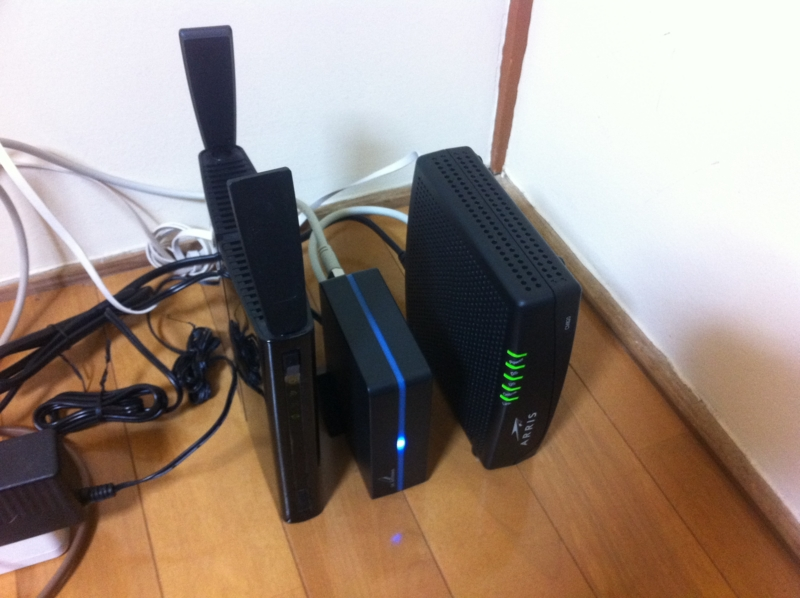

地元のケーブルテレビのインターネットサービスを契約してみた。まんなかの機器はブースターなんだそうな。説明聞いてもよくわからんかったけど。

スペックは下り160Mbps、上り10Mbps、5800円/月。

そんなに安くないし、どうしてもケーブルテレビの回線は上りが弱いね......回線速度の実測値は 8Mbps～12Mbps でだいぶ遅いけど（1割は出てほしいな。しかもたまに瞬断するし？）、これはバッファローのルーターをかましているせいかもしれない。今度、有線で測ってみるつもり。それでも遅かったら、ちょっと相談してみよう。

ただ、もともとこの家がケーブルテレビに入っていたこともあって、工事はものの5分程度で終わったのは Good 。光回線を4階に引くなら、こんな程度では済まなかっただろうからね......

