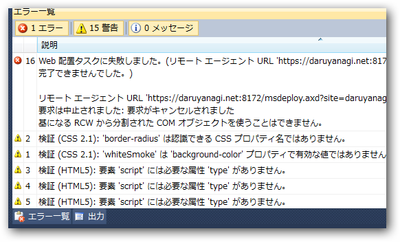

<blockquote>

エラー	16 
Web 配置タスクに失敗しました。(リモート エージェント URL '<a href="https://***:8172/msdeploy.axd?site=***'">https://***:8172/msdeploy.axd?site=***'</a> に対する要求を完了できませんでした。)

リモート エージェント URL '<a href="https://***:8172/msdeploy.axd?site=***'">https://***:8172/msdeploy.axd?site=***'</a> に対する要求を完了できませんでした。 
要求は中止されました: 要求がキャンセルされました 
基になる RCW から分割された COM オブジェクトを使うことはできません。

</blockquote>

なんだろう......（＠ｗ＠？

このエラーが起こった時、ビューと<a class="keyword" href="http://d.hatena.ne.jp/keyword/CSS">CSS</a>しか変更を加えてなかったし、こっちのロジックがおかしかったとも思えない。サーバーの再起動したけどならなかったので、プロバイダー側で何とかしてもらうしかないのかな。

とりあえず、今日のところは何も進展しなさそうだから寝よう。

<blockquote>

追記：Visual Studio を再起動したら治った。なんだったんだろう。

</blockquote>
