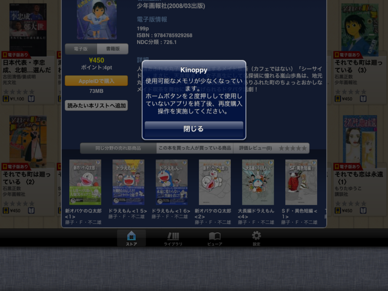

最近の Kinoppy は、メモリが足りなくなると警告が出るようになった。おかげで、不意に落ちることがなくなって、かなり快適に使えるようになっている。メモリが足りなくなった場合は、バックグラウンドのアプリを落とせと指示してくれるので、それに従えば大抵の場合は何とかなるみたい。

ただし、バックグラウンドアプリを全部切っても、ダメなときはある。そういう時は数回リトライすればエラーが表示されずに処理をすすめることができるのだけど、たいてい数分以内には何らかの操作でアプリが落ちる。ウチの <a class="keyword" href="http://d.hatena.ne.jp/keyword/iPad">iPad</a> は初代のヤツなのだけど、もう少しスペックの高い <a class="keyword" href="http://d.hatena.ne.jp/keyword/iPad">iPad</a> 2 だったら多少はマシなのかもしれない。

そんなこんなで、今度出るという <a class="keyword" href="http://d.hatena.ne.jp/keyword/iPad">iPad</a> 3 はぜひともほしいけれど、Windows 8 タブレットもほしいし、優先度的にはこちらのほうが高めなので、実際に買うのかどうかは微妙なところだ。

Windows 8 のコンシューマー向けプレビューは、来週にも公開される。

