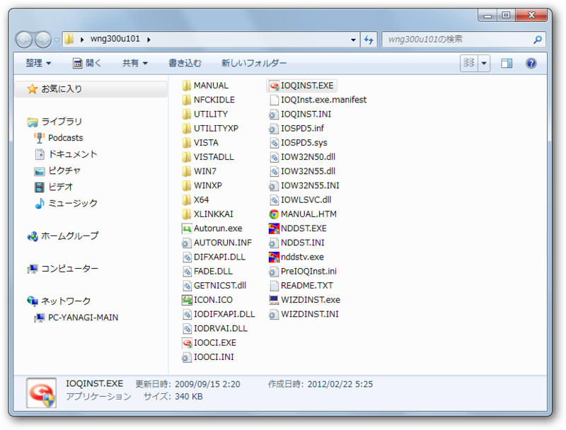
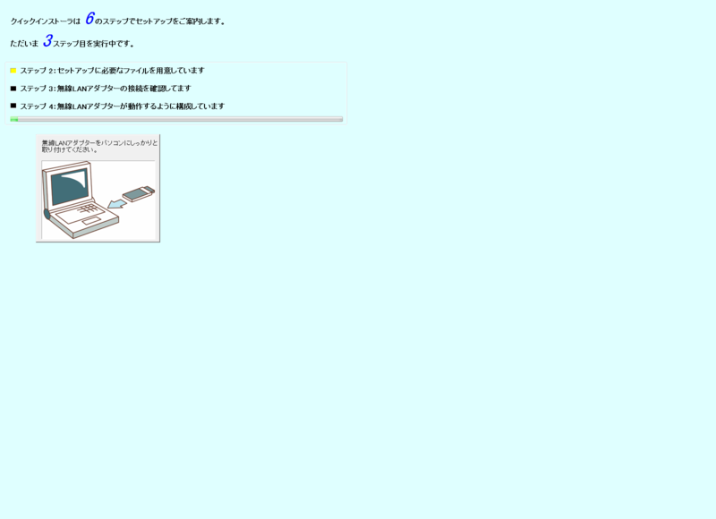

某社のUSBドングル型<a class="keyword" href="http://d.hatena.ne.jp/keyword/%CC%B5%C0%FELAN">無線LAN</a>アダプタのドライバをインストール。こいつは自己解凍型になっていて、実行すると<b>勝手に</b>デスクトップへフォルダを作り、ファイルを展開する。下の画像が、その内容だ。

見てくれ。これで3秒以内にどれを実行すべきか分かるなら、大したものだと思う。おそらく正解は「Autorun.exe」なのだろうけど、自分は「IOQINST.exe」を起動してしまい（だって、この中で唯一インストーラー臭いじゃない！？）、あとでデバイスマネージャーからドライバをインストールするハメになった（最初からそうすればよかった）。

それはともかく。「IOQINST.exe」のUIがこれまた (ﾉ∀`)ｱﾁｬｰ ってな感じで萎える。

全画面表示でこれが現れ、インストール中はほかの作業が行えない。色々大人の事情はあるのだろうけど……いろんなところがもう少しスマートになってくれれば、ブランドイメージも高まろうに、と思う。

<blockquote>

マニュアル読めよ＞自分

</blockquote>
