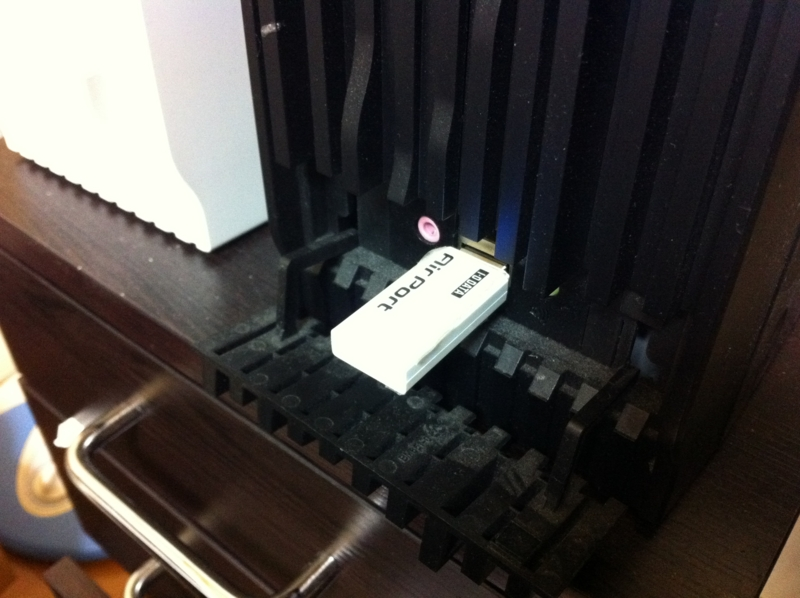
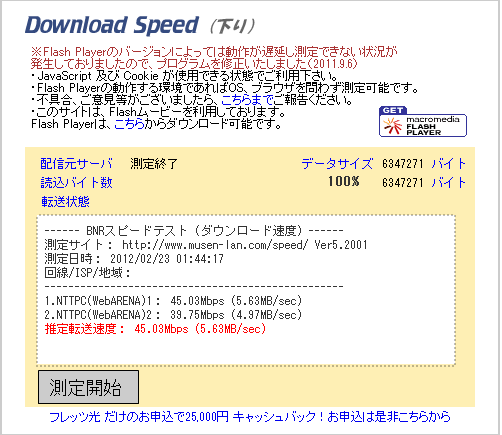

どうやらウチのインターネット回線のボトルネックは、<a class="keyword" href="http://d.hatena.ne.jp/keyword/%A5%AA%A5%F3%A5%DC%A1%BC%A5%C9">オンボード</a>の<a class="keyword" href="http://d.hatena.ne.jp/keyword/%CC%B5%C0%FELAN">無線LAN</a>アダプタだったみたい（アンテナがおかしいのかなぁ？）。代わりにUSBドングル型のアダプタを挿したら、転送速度がかなり改善した。回線が瞬断することもなくなった。よきかなよきかな。

安定して40Mbpsぐらい出ているので、公称値の1/4以上出ていることになる。ルーターを介さずに有線で繋げばもっと早くなりそうな気もするので、なかなか優秀なのかなって思う。ほかのところがどうなのかは知らんが。

<ul>
<li><a href="http://daruyanagi.hatenablog.com/entry/2012/02/20/231717">&#x30B1;&#x30FC;&#x30D6;&#x30EB;&#x30C6;&#x30EC;&#x30D3;&#x306E;&#x30CD;&#x30C3;&#x30C8;&#x5F15;&#x3044;&#x305F; - &#x3060;&#x308B;&#x308D;&#x3050;</a></li>
<li><a href="http://daruyanagi.hatenablog.com/entry/2012/02/22/062732">&#x8AAC;&#x660E;&#x66F8;&#x306A;&#x3069;&#x8AAD;&#x307E;&#x306A;&#x3044;&#x30D2;&#x30C8;&#x3067;&#x3059;&#x306E;&#x3067;&#x3002; - &#x3060;&#x308B;&#x308D;&#x3050;</a></li>
</ul>