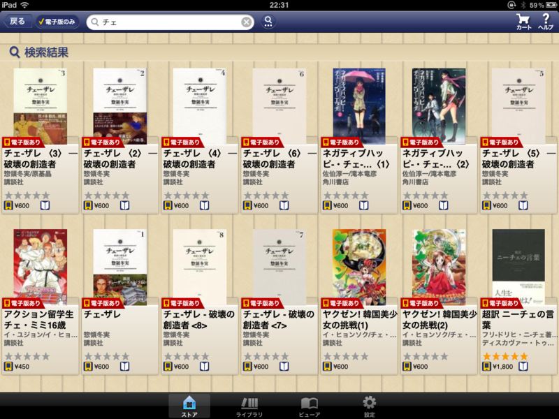
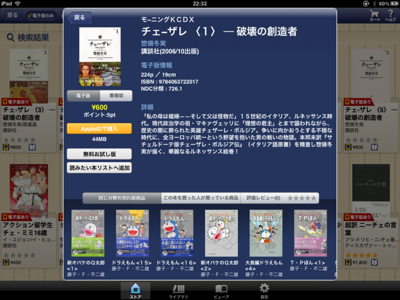

「チェーザレ」っていうのが面白そうだったので、全巻買おうと思ったのだけど、検索欄で「チェーザレ」って入力しても検索結果に取りこぼしがある。おかしいなぁ、と思ったら……タイトルが<i>「チェーザレ」</i>じゃなくて<i>「チェ-ザレ」</i>って入力されていた！　しかも、紹介文では<i>「チェザーレ」</i>って書いてある。

コツコツとバージョンアップを重ねていて、今のところとても好感度・満足度ともに高いので、ぜひこういう細かいところも直してほしいなぁ、と思う。

次のバージョン（1.1 for iOS）ではほかのデバイスと同期可能なしおり機能がつくみたい。個人的には、本棚の最上段に新しい本棚を追加する機能がほしいな。新刊を買うと本が最上段に追加されるので、新しい棚を作るときはココにできてくれると、整理が捗ると思う。

期待しています☆（ゝω・）vｷｬﾋﾟ

