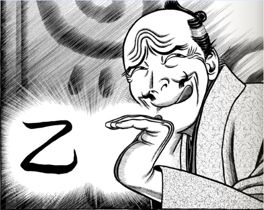

<a href="http://www.amazon.co.jp/exec/obidos/ASIN/4063724875/bestylesnet-22/">へうげもの（1） (モーニングKC (1487))</a>
<ul><li>作者: <a class="keyword" href="http://d.hatena.ne.jp/keyword/%BB%B3%C5%C4%CB%A7%CD%B5">山田芳裕</a></li><li>出版社/メーカー: 講談社</li><li>発売日: 2005/12/22</li><li>メディア: コミック</li><li>購入: 15人 クリック: 158回</li><li><a href="http://d.hatena.ne.jp/asin/4063724875/bestylesnet-22" target="_blank">この商品を含むブログ (384件) を見る</a></li></ul>

たぶん、「ひょうげもの」って読むんだと思う。

戦国時代が舞台のマンガだと、最近は『センゴク』なんかが思い浮かぶのだけど、こいつはそういうのとは一線を画している。だいたい、戦国時代なら当然描かれるはずの“武”がワキに追いやられて、“数寄”に主題が置かれているのがヘンテコ。

<blockquote cite="http://kotobank.jp/word/%E6%95%B0%E5%AF%84">

すき【数寄／数奇】	 
 
《「好き」と同語源。「数寄」「数奇」は当て字》風流・風雅に心を寄せること。また、茶の湯・生け花などの風流・風雅の道。「―者(しゃ)」

<cite><a href="http://kotobank.jp/word/%E6%95%B0%E5%AF%84">&#x6570;&#x5BC4; &#x3068;&#x306F; - &#x30B3;&#x30C8;&#x30D0;&#x30F3;&#x30AF; </a></cite>
</blockquote>

よくわからないけれど、数寄者は好き勝手に生きているのがいい。見てて気持ちいい。でも、それは茨の道でもあるらしい。数寄の世界にも<a class="keyword" href="http://d.hatena.ne.jp/keyword/%A5%D8%A5%B2%A5%E2%A5%CB%A1%BC">ヘゲモニー</a>というものがあり、それが俗世の権威・権力――出世、ひいては“武”――ともリンクしている。なので、自分の“好き”を貫くことは、出世の妨げになるどころか、時に死すら招く。

お世辞にもキレいな絵じゃないのだけど（これはわざとなんだろう）、線が濃く、やたらチカラがあり、構図が大胆で、読んでいるとグイグイ引っ張られるのを感じる。単色刷りなのに色鮮やかに感じるし、音すら聞こえそう。感触の表現に擬音語は欠かせないし、ハデな効果音もBGMもある。各話のサブタイトルは楽曲の題名をもじったモノ。ちょっと野蛮だったり湿っぽいところもあるけれど、「ひょうげて」（おちゃらけて）いて一笑まちがいなし……じゃないかな。

主人公の<a class="keyword" href="http://d.hatena.ne.jp/keyword/%B8%C5%C5%C4%BF%A5%C9%F4">古田織部</a>はマイナー武将だけど、<a class="keyword" href="http://d.hatena.ne.jp/keyword/%BB%CA%C7%CF%CE%CB%C2%C0%CF%BA">司馬遼太郎</a>の『割って、城を』でちょっと有名かもしれない。こっちも面白いのでオススメ。

<a href="http://www.amazon.co.jp/exec/obidos/ASIN/4061835696/bestylesnet-22/">軍師二人 (講談社文庫)</a>
<ul><li>作者: <a class="keyword" href="http://d.hatena.ne.jp/keyword/%BB%CA%C7%CF%CE%CB%C2%C0%CF%BA">司馬遼太郎</a></li><li>出版社/メーカー: 講談社</li><li>発売日: 1985/08</li><li>メディア: 文庫</li><li>購入: 1人 クリック: 5回</li><li><a href="http://d.hatena.ne.jp/asin/4061835696/bestylesnet-22" target="_blank">この商品を含むブログ (9件) を見る</a></li></ul>

僕が読んだのは13巻までで、これから徳川時代に移っていくのだけど、<a class="keyword" href="http://d.hatena.ne.jp/keyword/%B8%C5%C5%C4%BF%A5%C9%F4">古田織部</a>が“武”と“数寄”のあいだでどう立ち回り、人生に決着を付けるのか楽しみ。

