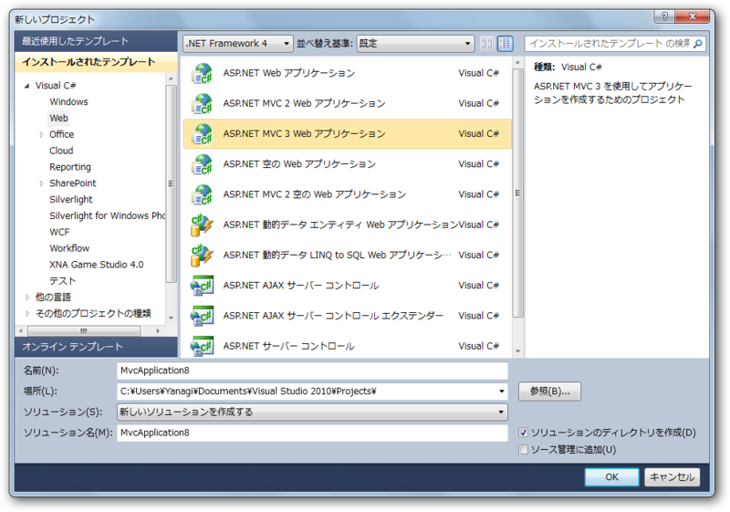
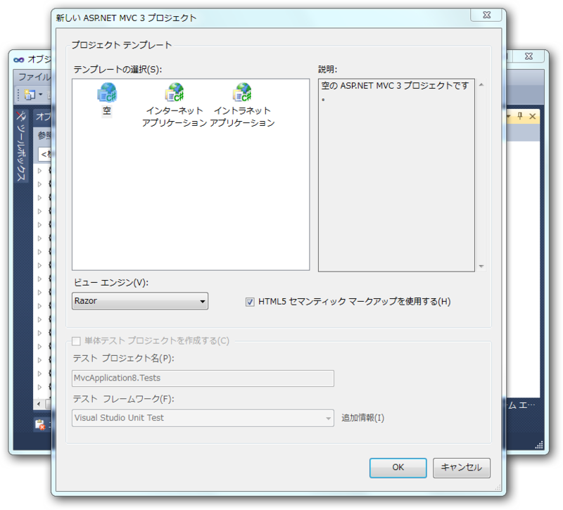
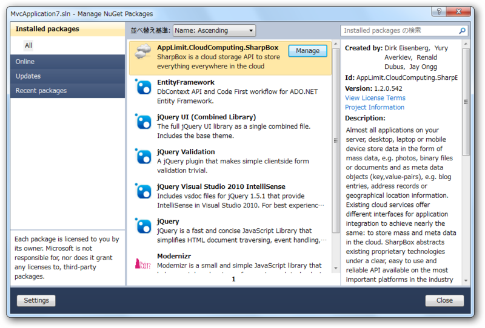
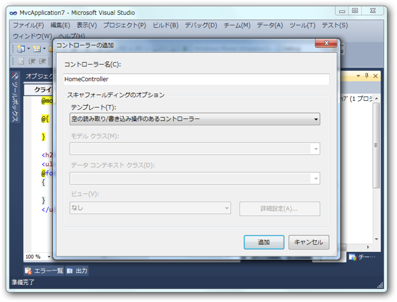
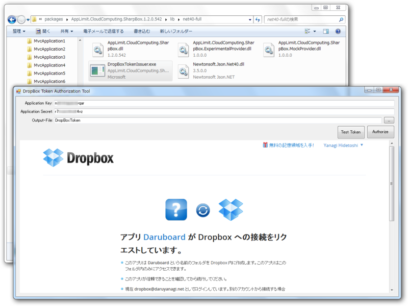
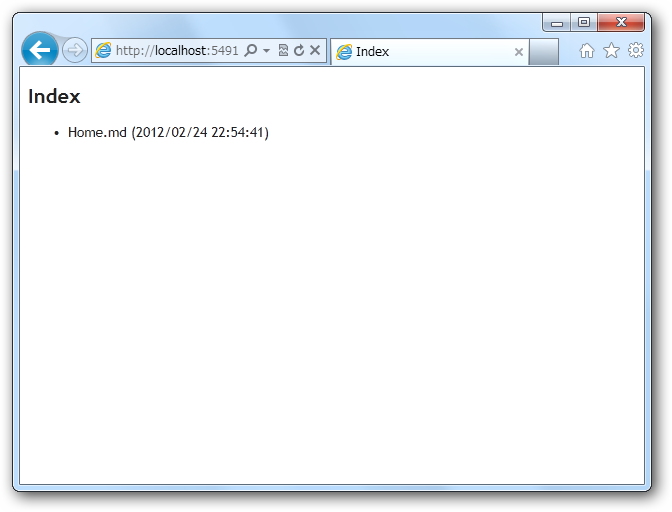
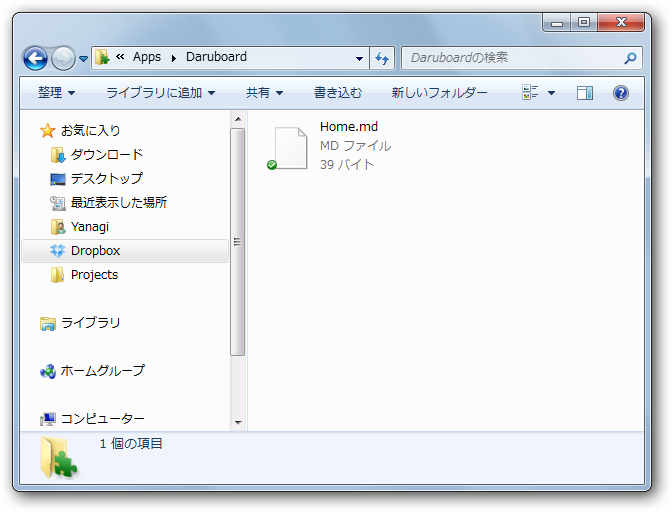

自家製の Wiki システムを ASP.net MVC 3 で作ってて、「リビジョン管理機能がほしいですなぁ」と思った。そこで試行錯誤したのだけど、だんだん面倒になってきた。そしたら思いついた。<i>「<a class="keyword" href="http://d.hatena.ne.jp/keyword/Dropbox">Dropbox</a> に記事を保存すれば勝手にリビジョン管理してくれるんだから、そっちにバックアップ取ればいいじゃん」</i><i>「そもそも <a class="keyword" href="http://d.hatena.ne.jp/keyword/Dropbox">Dropbox</a> をデータベースとして使えばよくね？」</i>というわけで、とりあえず <a class="keyword" href="http://d.hatena.ne.jp/keyword/Dropbox">Dropbox</a> を使うところから始めてみた。

<h3>準備</h3>

まず、アプリケーションの作成。

別に認証機能は要らないや。

今回は SharpBox (<a href="http://sharpbox.codeplex.com/">http://sharpbox.codeplex.com/</a>) を使って楽をすることにした。NuGetでさくっとインストール。

あと、<a href="https://www2.dropbox.com/developers/apps">https://www2.dropbox.com/developers/apps</a> でアプリの登録をしておくのも忘れずに。<a class="keyword" href="http://d.hatena.ne.jp/keyword/API">API</a>キーをここで取得しておく必要がある。

<h3>コード</h3>

<h4>コントローラー</h4>

まず、Homeコントローラーを作る。なぜ Home という名前なのかというと、Global.asax を書き換えるのが面倒くさいからですね。わかります。スキャフォールディングも使って楽をしましょう。

Index メソッドを書く。とりあえず動かしているだけなのでごちゃごちゃしているけど、接続→ルートの取得→（ファイルアップロード）→ファイルの列挙 という操作をしているだけ。あとでモデルへ追いだそう。

<pre class="code" data-unlink>public ActionResult Index()
{
var storage = new CloudStorage();
var config = CloudStorage.GetCloudConfigurationEasy(nSupportedCloudConfigurations.DropBox);

// load a valid security token from file
ICloudStorageAccessToken accessToken;
using (var fs = System.IO.File.Open(
Server.MapPath(&#34;~/App_Data/DropBoxToken&#34;),
System.IO.FileMode.Open,
System.IO.FileAccess.Read,
System.IO.FileShare.None))
{
accessToken = storage.DeserializeSecurityToken(fs);
}

// open the connection
var storageToken = storage.Open(config, accessToken);

// get the root entry of the cloud storage
ICloudDirectoryEntry root = storage.GetRoot();
if (root == null)
{
throw new Exception(&#34;ルートあらへん。&#34;);
}

// Upload file
if (root.Length == 0)
{
storage.UploadFile(Server.MapPath(&#34;~/App_Data/Home.md&#34;), root);
}

// Enum files
var model = new List&lt;ICloudFileSystemEntry&gt;();
foreach (ICloudFileSystemEntry entry in root)
{
// フィルタリングとか。あ、Linq使えばよかった
model.Add(entry);
}

// close the cloud storage connection
if (storage.IsOpened)
{
storage.Close();
}

return View(model);
}</pre>

<h4>トークンファイルの作成</h4>

言い忘れていたが、 /App_Data/DropBoxToken は、SharpBox に付属のツールで作成する。<i>（プロジェクトフォルダ）\packages\AppLimit.CloudComputing.SharpBox.1.2.0.542\lib\net40-full</i> にあるので探してみよう。これがわからなくてだいぶググった。じゃなくてビングった。SharpBox 1.2 から認証周りがだいぶ変わっていて、サンプル読んでいるとダマされるので注意。

できたファイルは App_Data に突っ込んでおいた。あまり自信はないけど、<a class="keyword" href="http://d.hatena.ne.jp/keyword/APS">APS</a>.net の作法ではこれでいい気がする。ついでにファイルが何もない場合にアップロードする初期ファイル（Home.md）も、ここに用意しておいた。

<h3>ビュー</h3>

Home/Index のビューを作成する。Index メソッドのコンテキストメニューから簡単に作成できる。

<pre class="code" data-unlink>@model List&lt;AppLimit.CloudComputing.SharpBox.ICloudFileSystemEntry&gt;

@{
ViewBag.Title = &#34;Index&#34;;
}

&lt;h2&gt;Index&lt;/h2&gt;
&lt;ul&gt;
@foreach (var i in Model)
{
&lt;li&gt;@i.Name (@i.Modified)&lt;/li&gt;
}
&lt;/ul&gt;</pre>

<h3>［F5］！</h3>

無事動いているみたい。

ローカルの <a class="keyword" href="http://d.hatena.ne.jp/keyword/Dropbox">Dropbox</a> にもアップロードしたファイルが現れた。

<h3>Thanks!</h3>

ほとんどここを参照したので、みんなも見てみればいいと思うよ。 → <a href="http://blog.jayway.com/2012/02/06/unboxing-dropbox-and-sharpbox-2/">Unboxing Dropbox and SharpBox | Jayway Team Blog - Sharing Experience</a>

