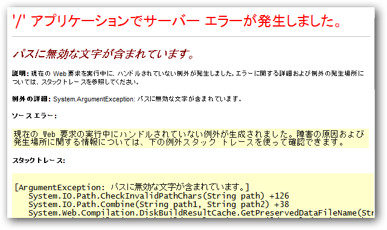

<h3>状況</h3>

コントローラーで View(model) を返す。model は string型 で、ローカルにあるテキストファイルを読み込んだ内容が格納されている。

ビュー側でこれを @Html.Raw(Model) すると、「パスに無効な文字が含まれています。」というエラーが表示される。

<pre class="code" data-unlink>## Controller
return View(content);

## View
@model string

@Html.Raw(Model)</pre>

<h3>解決</h3>

モデルを HtmlString型 に変更すると、エラーが表示されなくなった。

<pre class="code" data-unlink>## Controller
return View(new HtmlString(content));

## View
@model HtmlString

@Model</pre>

テキストがHTMLタグ（危険な文字列）を含んでいたので、ASP.net がエラーを吐いてくれたのかな？

<ul>
<li><a href="http://daruyanagi.hatenablog.com/entry/2012/02/19/022206"> &#x5371;&#x967A;&#x306A;&#x53EF;&#x80FD;&#x6027;&#x306E;&#x3042;&#x308B; Request.Form &#x5024;&#x304C;&#x30AF;&#x30E9;&#x30A4;&#x30A2;&#x30F3;&#x30C8;&#x304B;&#x3089;&#x691C;&#x51FA;&#x3055;&#x308C;&#x307E;&#x3057;&#x305F; - &#x3060;&#x308B;&#x308D;&#x3050;</a></li>
</ul>

