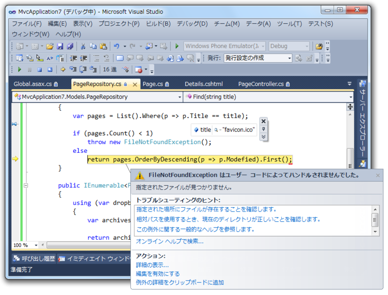

<i>エラー：データが見つからないぜ → <a class="keyword" href="http://d.hatena.ne.jp/keyword/favicon">favicon</a>.<a class="keyword" href="http://d.hatena.ne.jp/keyword/ico">ico</a> がルーティングに引っかかってました！</i> というのがめんどくさい時は、

<pre class="code" data-unlink>## Global.asax

public static void RegisterRoutes(RouteCollection routes)
{
routes.IgnoreRoute(&#34;{resource}.axd/{*pathInfo}&#34;);
routes.IgnoreRoute(&#34;favicon.ico&#34;);
:</pre>

と、favicon.ico を無視するルーティングを一行書き加えておくとイイ。

via <a href="http://stackoverflow.com/questions/6596715/favicon-icon-mvc3-asp-net">Favicon Icon-MVC3 ASP.NET - Stack Overflow</a>

