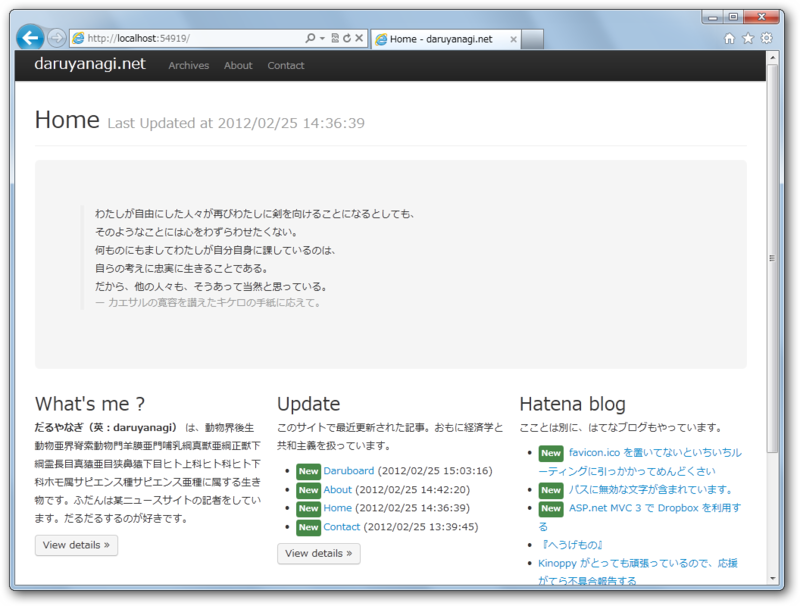

<a href="http://daruyanagi.net/Home">Home - daruyanagi.net</a>

若干動きが怪しい部分があるけれど、とりあえずできたのでデプロイしてみた。ローカルよりも ExpressWeb の方がサクサク動いているのはなんでなんだぜ？

<blockquote cite="http://daruyanagi.net/Daruboard">

Daruboard は、ASP.NET MVC 3 製の Wiki っぽいモノです。

<h4><a class="keyword" href="http://d.hatena.ne.jp/keyword/Dropbox">Dropbox</a> と連携</h4>

データベースは <a class="keyword" href="http://d.hatena.ne.jp/keyword/Dropbox">Dropbox</a>。<a class="keyword" href="http://d.hatena.ne.jp/keyword/Dropbox">Dropbox</a> のクライアントソフトを利用すれば、ローカル<a class="keyword" href="http://d.hatena.ne.jp/keyword/%A5%D5%A5%A1%A5%A4%A5%EB%A5%B7%A5%B9%A5%C6%A5%E0">ファイルシステム</a>からコンテンツを更新できます。リビジョン管理も <a class="keyword" href="http://d.hatena.ne.jp/keyword/Dropbox">Dropbox</a> 任せ。

<h4>Markdown 記法</h4>

コンテンツを Markdown でサクサク書けます。HTML（断片）を扱うことも可能。

<h4>独自拡張書式</h4>

リンクを二重の[]で囲むだけで、<a class="keyword" href="http://d.hatena.ne.jp/keyword/Twitter">Twitter</a>の引用、Amazon<a class="keyword" href="http://d.hatena.ne.jp/keyword/%A5%A2%A5%D5%A5%A3%A5%EA%A5%A8%A5%A4%A5%C8">アフィリエイト</a>タグの挿入、<a class="keyword" href="http://d.hatena.ne.jp/keyword/%A4%CF%A4%C6%A4%CA%A5%D5%A5%A9%A5%C8%A5%E9%A5%A4%A5%D5">はてなフォトライフ</a>画像の挿入などが可能。二重 () での脚注記法も搭載（Markdownより若干楽ちんな記法です）。これからも便利なものは追加していきます。

<h4><a class="keyword" href="http://d.hatena.ne.jp/keyword/Twitter">Twitter</a> Bootstrap</h4>

<a class="keyword" href="http://d.hatena.ne.jp/keyword/CSS">CSS</a> <a class="keyword" href="http://d.hatena.ne.jp/keyword/%A5%D5%A5%EC%A1%BC%A5%E0%A5%EF%A1%BC%A5%AF">フレームワーク</a>にBootstrap, from <a class="keyword" href="http://d.hatena.ne.jp/keyword/Twitter">Twitter</a> を採用。ちょっと見た目がお洒落で、カラムレイアウトにも対応します。

<cite><a href="http://daruyanagi.net/Daruboard">Daruboard - daruyanagi.net</a></cite>
</blockquote>

今んところ編集機能が無い（<a class="keyword" href="http://d.hatena.ne.jp/keyword/Dropbox">Dropbox</a>のクライアントで何とかするしかない）のでそれを追加したい。あと、画像のアップロード機能を付けたい。テスト版は作ってあるので、ちょろちょろ本体へマージしていく予定。<a class="keyword" href="http://d.hatena.ne.jp/keyword/%A4%CF%A4%C6%A4%CA%A5%D6%A5%ED%A5%B0">はてなブログ</a>みたいに、ドラッグ＆ドロップでアップロードできるようにしたいのだけど、ちょっと四苦八苦してる。

<ul>
<li><a href="http://daruyanagi.hatenablog.com/entry/2012/02/25/084211"> ASP.net MVC 3 &#x3067; Dropbox &#x3092;&#x5229;&#x7528;&#x3059;&#x308B; - &#x3060;&#x308B;&#x308D;&#x3050;</a></li>
</ul>