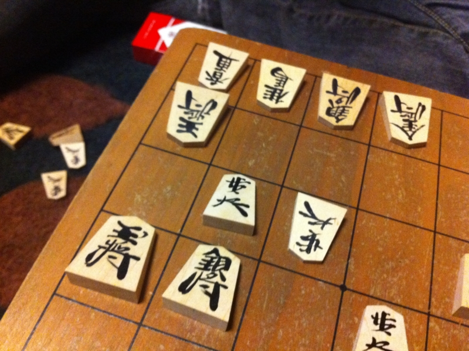

弟が最近将棋に目覚めたらしい。しょうがないので、週末にリサイクルショップ出やすい駒（2,800円）を買ってきて<a href="#f1" name="fn1" title="立派な盤はあるのに駒がなかった">*1</a>、何局か指した。何年ぶりだろう？　生身の人間と将棋を指すなんて。

<h3>昼の部</h3>

<ul>
<li>わし × - ○ <b>弟1号</b>（先手、以下前回負けたほうが先手）</li>
<li><b>わし</b> ○ - × 弟1号</li>
<li>わし × - ○ <b>弟1号</b></li>
<li>わし × - ○ <b>弟1号</b></li>
<li><b>わし</b> ○ - × 弟1号</li>
<li><b>わし</b> ○ - × 弟1号</li>
<li>わし × - ○ <b>弟1号</b></li>
</ul>
なんと、七番勝負で負け越してしまった ／(^o^)＼

見落としで逆転されたり、玉が頓死したりで踏んだり蹴ったりだった。写真の局面は、前か横に進めるコマがあればアレば積む場面だが、無駄な捨て駒をして詰まし損なった。無念……

<h3>夜の部</h3>

<ul>
<li><b>わし</b>（先手、以下前回負けたほうが先手） ○ - × 弟1号</li>
<li><b>わし</b> ○ - × 弟1号</li>
<li><b>わし</b> ○ - × 弟1号</li>
</ul>
完勝！　とくに第二戦で長い<a class="keyword" href="http://d.hatena.ne.jp/keyword/%B5%CD%BE%AD%B4%FD">詰将棋</a>を持ち駒使いきって詰ましたときはカ・イ・カ・ン♡

まぁ、でも、弟がもう少し定跡学んで筋を身につけたら、今みたいに勝てるかどうか怪しいところだ。

<a href="#fn1" name="f1" class="footnote-number">*1</a>:立派な盤はあるのに駒がなかった

