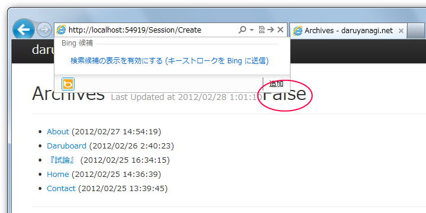
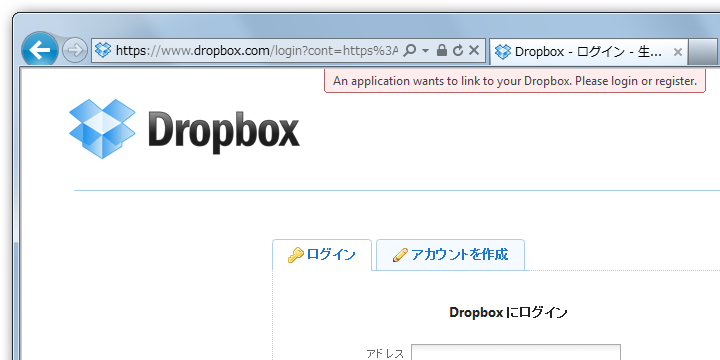
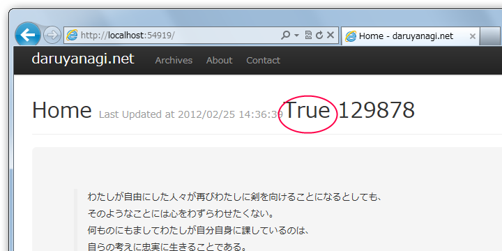

今回は Sharpbox を使って、Webサイトに <a class="keyword" href="http://d.hatena.ne.jp/keyword/Dropbox">Dropbox</a> を利用したログイン機能を追加します。まず、 SessionController というコントローラを作成して、Create()、AuthorizationCallBack()、Delete() の3つのメソッドを作成しました。/Session/Create が /LogOn に、/Session/Delete が /LogOff にあたります<a href="#f1" name="fn1" title="あとでルーティングを追加すればいいでしょう">*1</a>。

ビューへ適当に @Request.IsAuthenticated を埋め込んでいるのでわかりにくいですけど、今は False 、つまりログインしていない状態です。では、 Create() から。

<h3>/Session/Create</h3>

<pre class="code" data-unlink>//
// GET: /Session/Create -&gt; map route /LogOn

public ActionResult Create()
{
string app_key = &#34;***&#34;;
string app_secret = &#34;***&#34;;

// 0. load the config
DropBoxConfiguration config = DropBoxConfiguration
.GetStandardConfiguration();
config.AuthorizationCallBack = new Uri(
Request.Url, &#34;AuthorizationCallBack&#34;);

// 1. get the request token from dropbox
DropBoxRequestToken requestToken = DropBoxStorageProviderTools
.GetDropBoxRequestToken(config, app_key, app_secret);

// 2. build the authorization url based on request token
string url = DropBoxStorageProviderTools
.GetDropBoxAuthorizationUrl(config, requestToken);

// 3. Redirect to the authorization page on dropbox
return Redirect(url);

}</pre>

面倒くさい RequestToken の作成や Callback Url の生成は DropBoxStorageProviderTools がやってくれるので簡単。あとは 生成した Callback Url へリダイレクトしてやればいいです。

<h3>/Session/AuthorizationCallBack</h3>

<a class="keyword" href="http://d.hatena.ne.jp/keyword/Dropbox">Dropbox</a> の認証画面でのログインが完了すると、0. で設定した config.AuthorizationCallBack つまり AuthorizationCallBack() にリダイレクトがかかります。

<pre class="code" data-unlink>public ActionResult AuthorizationCallBack()
{
// 4. Get oauth token and uid from Request.Form[]
var oauth_token = Request[&#34;oauth_token&#34;];
var uid = Request[&#34;uid&#34;];

// 5. Set auth cookie
if (oauth_token != null &amp;&amp; uid != null)
{
FormsAuthentication.SetAuthCookie(uid, true);
}

return Redirect(&#34;/&#34;);
}</pre>

AuthorizationCallBack() では、まずリクエストに含まれる OAuth Token と UID を取り出します。ちゃんとこれらが取得できていれば、クッキーをセットしてログインが終了。今回はログインの成功・失敗に関わらず、"/" へリダイレクトしています。

@Request.IsAuthenticated が true に。これまたわかりにくいですが @User.Identity.Name には UID がセットされました。

<h3>/Session/Delete</h3>

<pre class="code" data-unlink>//
// GET: /Session/Delete -&gt; map route /LogOff

public ActionResult Delete()
{
FormsAuthentication.SignOut();

return Redirect(&#34;/&#34;);
}</pre>

ついでに Delete() も実装して、ログアウトできるようにしておきましょう。

こんな感じでいいのかな？

<ul>
<li><a href="http://daruyanagi.hatenablog.com/entry/2012/02/25/084211"> ASP.net MVC 3 &#x3067; Dropbox &#x3092;&#x5229;&#x7528;&#x3059;&#x308B; - &#x3060;&#x308B;&#x308D;&#x3050;</a></li>
</ul>

<a href="#fn1" name="f1" class="footnote-number">*1</a>:あとでルーティングを追加すればいいでしょう

