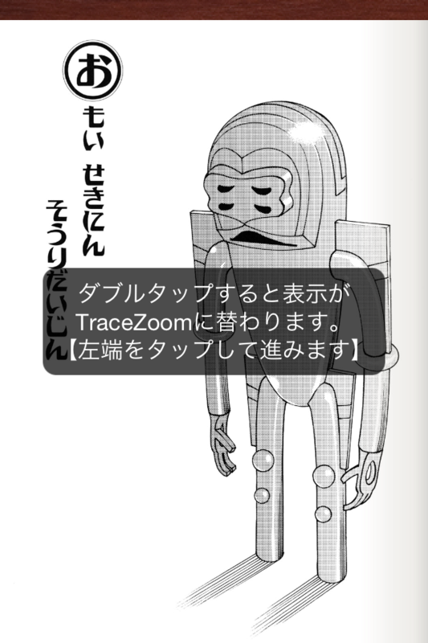

<b>TraceZoom 機能</b>を使えば、マンガの1コマを全画面に拡大表示し、タップ操作で次のコマへ送りながら閲覧するモード。

これまで <a class="keyword" href="http://d.hatena.ne.jp/keyword/iPad">iPad</a> ばかりで使っていたので、この機能の恩恵がいまいちわからなかった。<a class="keyword" href="http://d.hatena.ne.jp/keyword/iPad">iPad</a>だと画面がデカすぎて拡大画像の表示が汚い。でも、<a class="keyword" href="http://d.hatena.ne.jp/keyword/iPhone">iPhone</a>で使うと、この機能はなかなかいいんだな、と感心させられた。

通常表示。

TraceZoom 機能を使った表示（左上のコマを表示）。

<a class="keyword" href="http://d.hatena.ne.jp/keyword/%A5%A4%A5%F3%A5%D1%A5%AF">インパク</a>トがあってよろしい。

あと、コマ単位で送られるので、ヒトコマ、ヒトコマ、丁寧に読むようになる。斜め読みでは気付かない、流してしまうネタってあるのね。一巡目ではストーリーを楽しみ、二巡目では細かい描写を楽しむ。これは二度美味しいわ。

ほかの電子書籍ビューアでも同じような機能をみたことがある気がする（あまり良く覚えてない）けど、見せ方を工夫すればまだまだ面白いことができるのかもしれない。あと、端末のサイズによっても、コンテンツの見せ方にもっと工夫ができるかもしれない。リフローすれば OK ってわけじゃないのね。

<a href="http://www.amazon.co.jp/exec/obidos/ASIN/478592604X/bestylesnet-22/">それでも町は廻っている 1 (ヤングキングコミックス)</a>
<ul><li>作者: <a class="keyword" href="http://d.hatena.ne.jp/keyword/%C0%D0%B9%F5%C0%B5%BF%F4">石黒正数</a></li><li>出版社/メーカー: <a class="keyword" href="http://d.hatena.ne.jp/keyword/%BE%AF%C7%AF%B2%E8%CA%F3%BC%D2">少年画報社</a></li><li>発売日: 2006/01/27</li><li>メディア: コミック</li><li>購入: 19人 クリック: 341回</li><li><a href="http://d.hatena.ne.jp/asin/478592604X/bestylesnet-22" target="_blank">この商品を含むブログ (459件) を見る</a></li></ul>

<h3>おまけ</h3>

一冊だけ横幅が縮んでもうた ／(^o^)＼

<b>追記</b>

<blockquote class="twitter-tweet" data-in-reply-to="174468755227820032" lang="ja">
@<a href="https://twitter.com/daruyanagi">daruyanagi</a> いつもレビュー頂きありがとうございます。本棚の書籍が縮んじゃった件ですが、該当書籍をダブルタップして頂ければ元に戻ります。これ、実は背表紙表示機能として用意しているのですが、現状は背表紙画像を用意できないので表紙を圧縮しています。
&mdash; Kinoppy Dev-Teamさん (@Kinoppy_Dev) <a href="https://twitter.com/Kinoppy_Dev/status/174471243377020928" data-datetime="2012-02-28T12:29:20+00:00">2月 28, 2012</a></blockquote>

アレってほんとは背表紙表示なんだそうです。ダブルタップで元に戻るとのこと。

