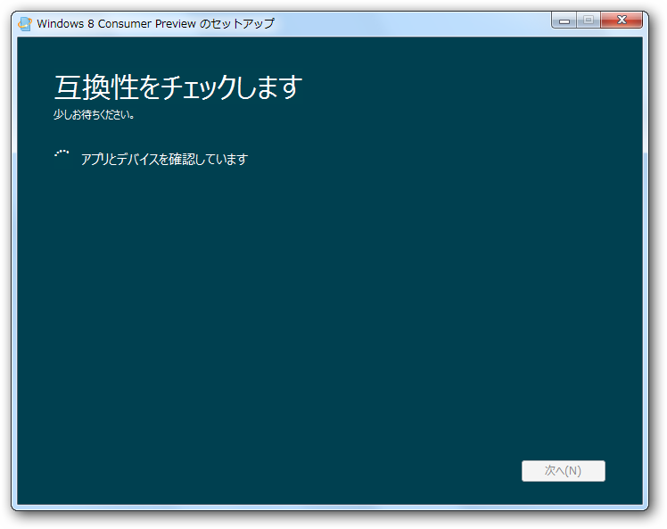
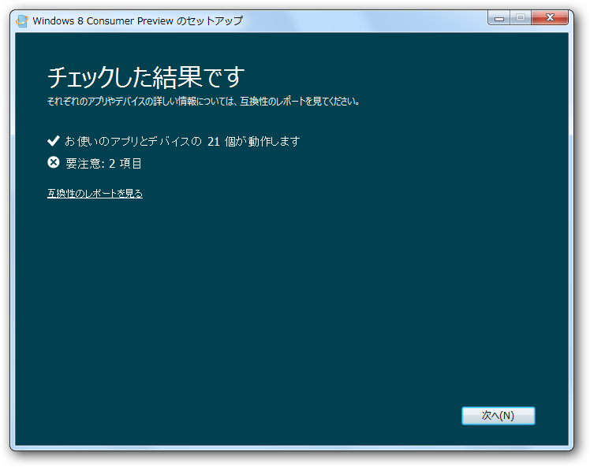
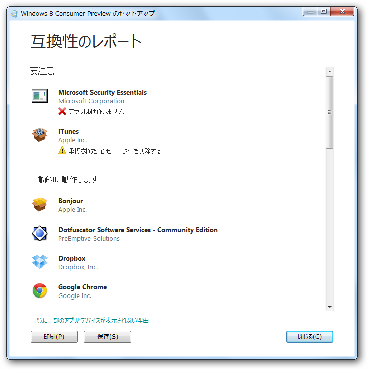
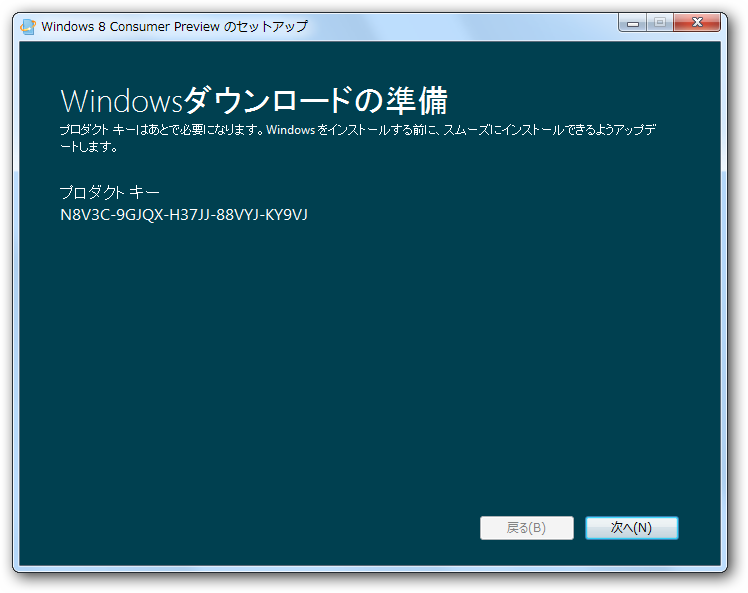
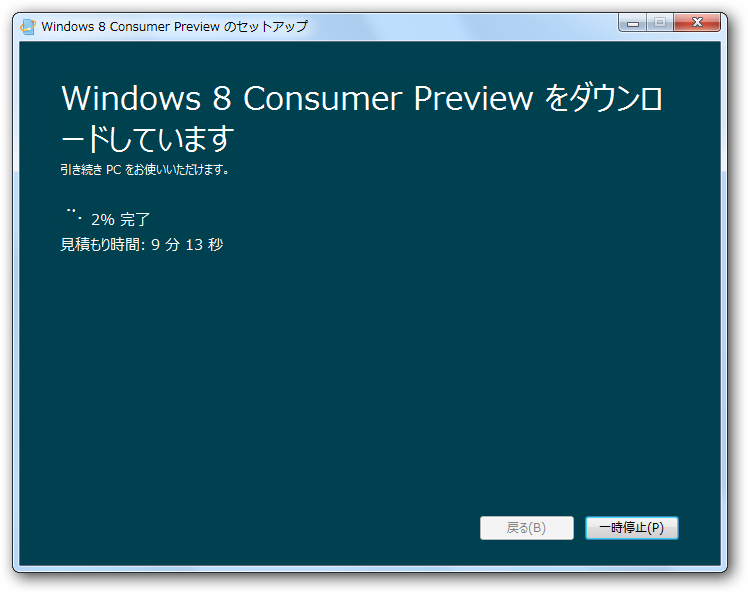
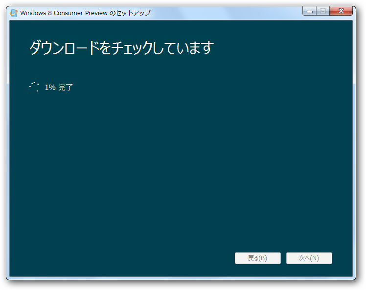
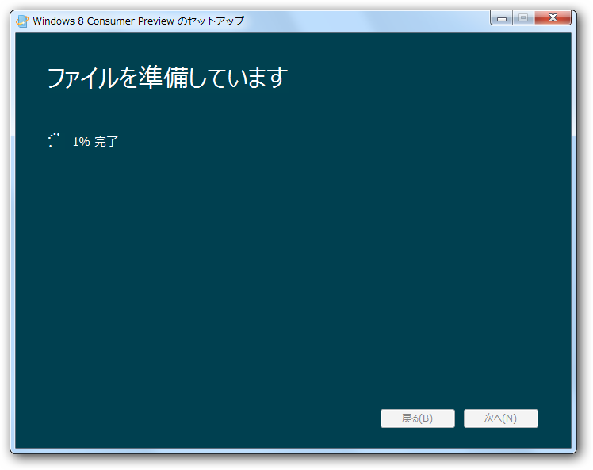
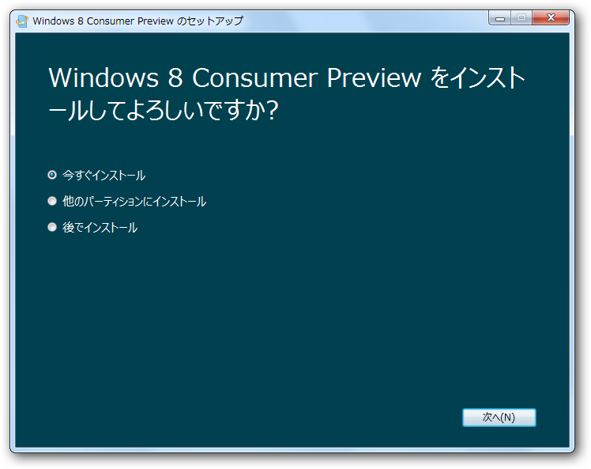

<blockquote cite="http://windows.microsoft.com/ja-JP/windows-8/consumer-preview">

Windows 8 は、Windows 7 の処理速度と信頼性を基に、刷新された Windows です。まったく新しいタッチ インターフェイスが搭載されました。新しいデバイス向けの新しい Windows です。新機能を最初に試すチャンスです。

<cite><a href="http://windows.microsoft.com/ja-JP/windows-8/consumer-preview">
Windows 8 Consumer Preview
</a></cite>
</blockquote>

日本語サイトまでしっかり用意されていて、<a class="keyword" href="http://d.hatena.ne.jp/keyword/%A5%DE%A5%A4%A5%AF%A5%ED%A5%BD%A5%D5%A5%C8">マイクロソフト</a>のやる気を感じさせますね！<a href="#f1" name="fn1" title="前回もそうだったっけ？　わすれた！">*1</a>　ISOも用意されているけれど、ここはまず正統的にインストーラーを使ってみました。

互換性のチェック。

チェックの結果。うちの環境では2つのアプリがひっかかった。

チェックの結果。Microdost Security Essential（MSE）が使えないのは痛い。ウイルス対策を無償で済ましたいのならば、「アバスト！」あたりを使うことになる。<a href="#f2" name="fn2" title="Windows Developer Preview への対応は明記されている">*2</a>

<a href="http://www.forest.impress.co.jp/docs/news/20120224_514402.html">&#x7A93;&#x306E;&#x675C; - &#x3010;NEWS&#x3011;&#x7121;&#x511F;&#x30A6;&#x30A4;&#x30EB;&#x30B9;&#x5BFE;&#x7B56;&#x30BD;&#x30D5;&#x30C8;&#x300C;&#x30A2;&#x30D0;&#x30B9;&#x30C8;! &#x7121;&#x6599;&#x30A2;&#x30F3;&#x30C1;&#x30A6;&#x30A4;&#x30EB;&#x30B9; 7&#x300D;&#x304C;&#x6B63;&#x5F0F;&#x516C;&#x958B;</a>

プロダクトキー。あとで必要になるのでコピっておくこと。Webサイトにも記載されていた気がする。

ファイルのダウンロード。

ダウンロードの検証。

ファイルの展開。

ここまでで約30分といったところか。回線速度によってはもっと時間がかかると思う。

ここまできて、ちょっと困った。既存の環境をぶっ壊しちゃうのかな？　とりあえず<a class="keyword" href="http://d.hatena.ne.jp/keyword/VHD">VHD</a>ブートを試してみる。

<a href="#fn1" name="f1" class="footnote-number">*1</a>:前回もそうだったっけ？　わすれた！

<a href="#fn2" name="f2" class="footnote-number">*2</a>:Windows Developer Preview への対応は明記されている

