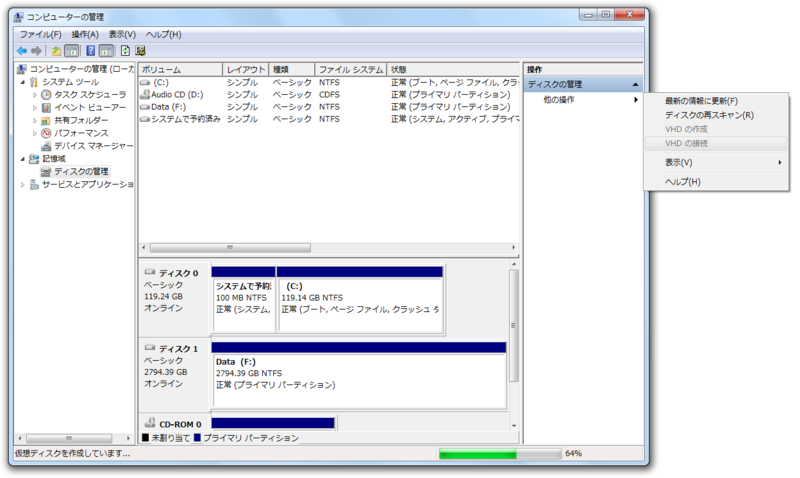

<a class="keyword" href="http://d.hatena.ne.jp/keyword/VHD">VHD</a> 作ってるあいだ暇なので、その間に Windows 8 Consumer Preview のシステム要件を再確認。

<blockquote cite="http://windows.microsoft.com/ja-JP/windows-8/iso">

Windows 8 Consumer Preview は、Windows Vista と Windows 7 が動作するのと同じハードウェアで問題なく動作します。

<cite><a href="http://windows.microsoft.com/ja-JP/windows-8/iso">
Windows 8 Consumer Preview &#x306E; ISO &#x5F62;&#x5F0F;
</a></cite>
</blockquote>

<h4>システム要件</h4>

<ul>
<li>プロセッサ: 1 GHz 以上</li>
<li>RAM: 1 GB (32 ビット) または 2 GB (64 ビット)</li>
<li>ハード ディスクの空き領域: 16 GB (32 ビット) または 20 GB (64 ビット)</li>
<li>グラフィック カード: Microsoft <a class="keyword" href="http://d.hatena.ne.jp/keyword/DirectX">DirectX</a> 9 以上のグラフィックス デバイス</li>
</ul>
ここらへんは現行のPCで何ら問題ない。Microsoft が重いOSを作って、<a class="keyword" href="http://d.hatena.ne.jp/keyword/Intel">Intel</a> が早いCPUを売る <b><a class="keyword" href="http://d.hatena.ne.jp/keyword/Wintel">Wintel</a></b> な関係<a href="#f1" name="fn1" title="自分で言うのもなんだが、死語だよね">*1</a>はもう終わったんだなぁ。

<h4>特定の機能を使用するための追加要件:</h4>

<ul>
<li>タッチを使う場合は、<a class="keyword" href="http://d.hatena.ne.jp/keyword/%A5%DE%A5%EB%A5%C1%A5%BF%A5%C3%A5%C1">マルチタッチ</a>に対応しているタブレットまたはモニター</li>
<li>Windows Store にアクセスし、アプリをダウンロードして実行する場合は、アクティブなインターネット接続と 1024 x 768 以上の画面解像度。</li>
<li>アプリをスナップする場合は、<b>1366 x 768 以上の画面解像度</b></li>
</ul>
問題は最後か。現行のPCにはなかなかこれを満たすタブレットがない。あと、16:9 が基本なんだね……個人的には4:3が好みなのだけど。追加要件には含まれていないけれど、もちろんセンサー系もバッチリ載っけといてほしい。

<a href="http://blogs.msdn.com/b/b8_ja/archive/2012/01/30/windows-8-supporting-sensors.aspx">
 
Windows 8 &#x306B;&#x304A;&#x3051;&#x308B;&#x30BB;&#x30F3;&#x30B5;&#x30FC;&#x306E;&#x30B5;&#x30DD;&#x30FC;&#x30C8; - Building Windows 8 - Site Home - MSDN Blogs
 
</a>

<a href="#fn1" name="f1" class="footnote-number">*1</a>:自分で言うのもなんだが、死語だよね

