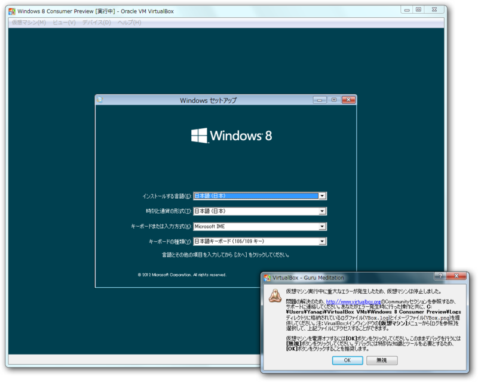

<blockquote>

00:00:32.464 PGM: Failed to procure handy pages; rc=VERR_NO_MEMORY rcAlloc=VINF_SUCCESS rcSeed=VINF_SUCCESS cHandyPages=0x10 
00:00:32.464      cAllPages=0x41f4b cPrivatePages=0x342da cSharedPages=0x0 cZeroPages=0xdc48 
00:00:32.464 GMM: Statistics: 
00:00:32.464      Allocated pages: 323e6 
00:00:32.464      Maximum   pages: 4009e 
00:00:32.464      Ballooned pages: 0 
00:00:32.467 VM: Raising runtime error 'HostMemoryLow' (fFlags=0x2)

</blockquote>

ぐぬぬ……メモリが足りなかった。そろそろPCの買い替えかな。

