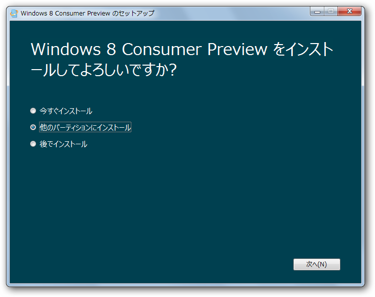
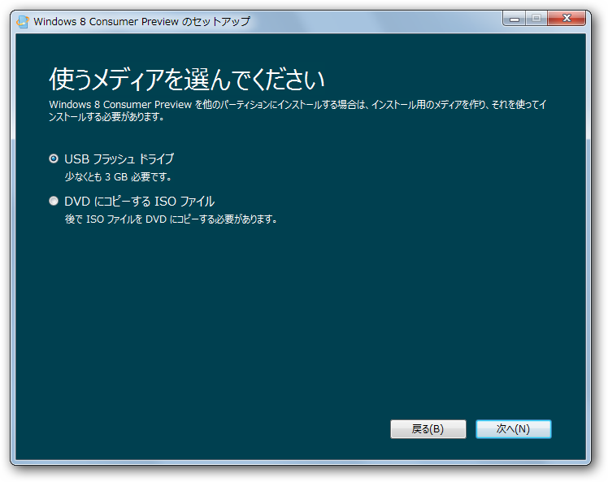
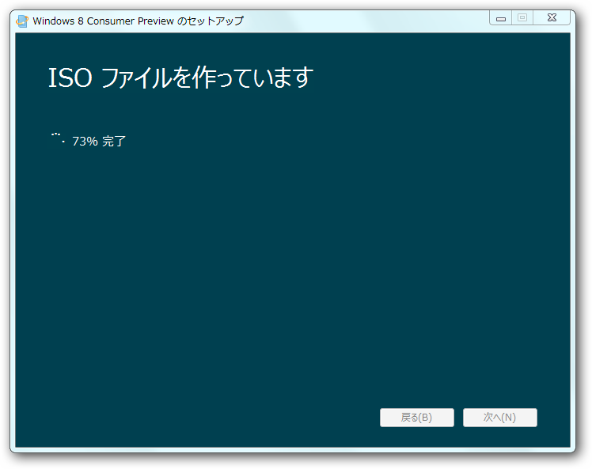
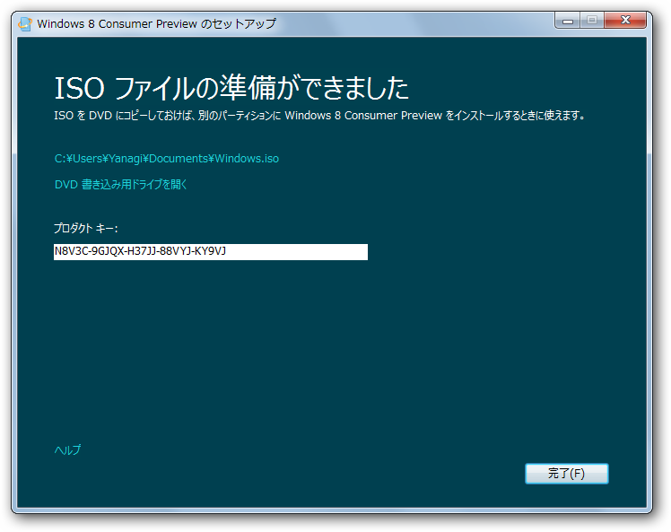
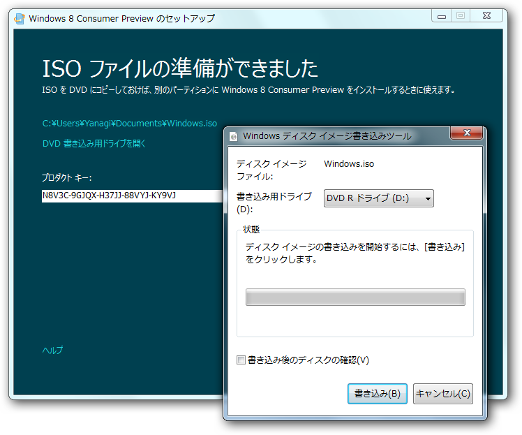
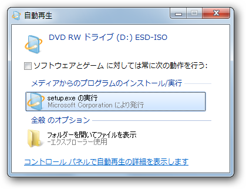
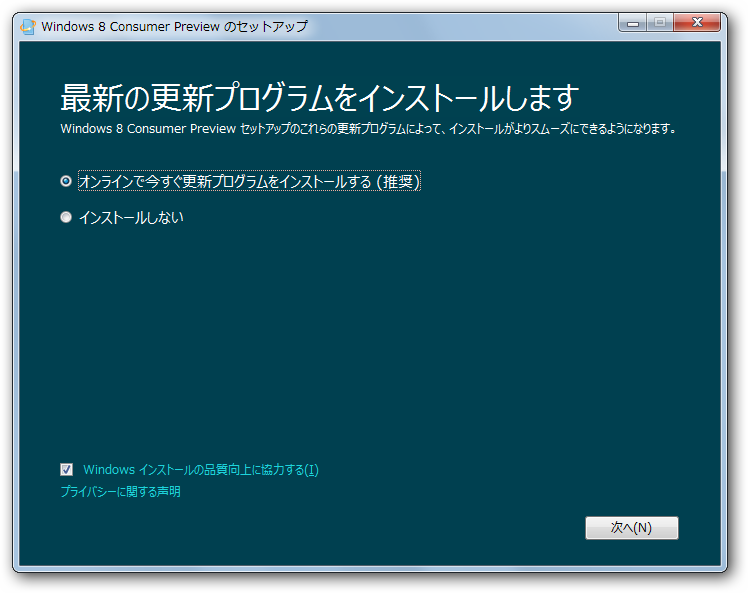
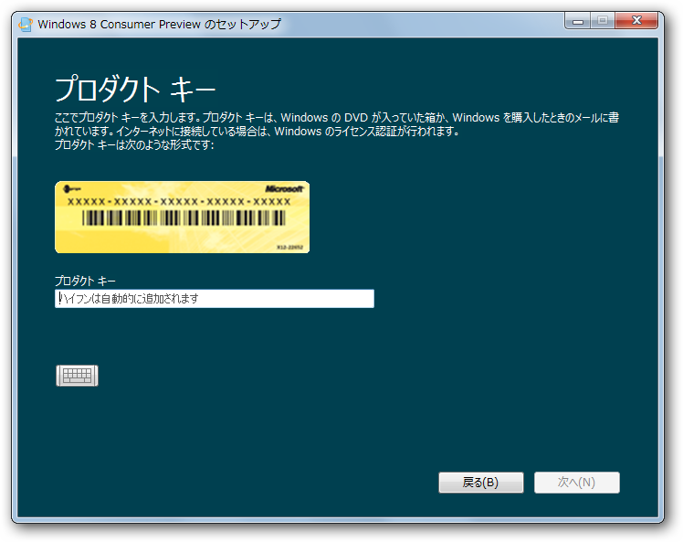
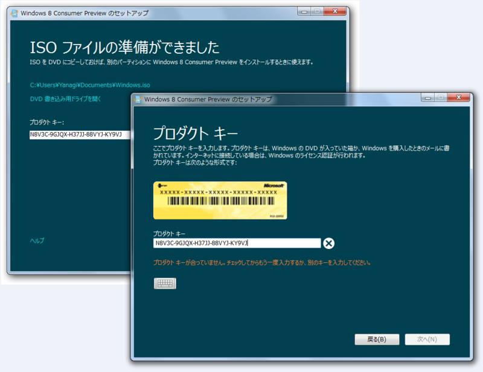
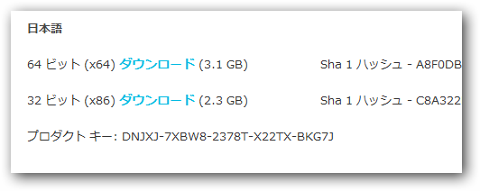

<a href="http://daruyanagi.hatenablog.com/entry/2012/03/01/053229">Windows 8 Consumer Preview &#xFF08;&#x9014;&#x4E2D;&#x307E;&#x3067;&#x30A4;&#x30F3;&#x30B9;&#x30C8;&#x30FC;&#x30EB;&#x3057;&#x305F;&#xFF09; - &#x3060;&#x308B;&#x308D;&#x3050;</a> の続き。既存の環境がぶっ壊されるかと心配した俺は、まったくのチキン野郎だった。

わざわざ<a class="keyword" href="http://d.hatena.ne.jp/keyword/VHD">VHD</a>を用意して［ほかのパーティションへインストール］を選択したけれど…

メディアを作成する画面に誘導された ／(^o^)＼

こういうとき、全作業の流れを表示する“目次”的なユーザーインターフェイスがあればいいのになって思う。

手元に USB メモリがなかったので、DVD-R の作成を選択。ISOイメージを保存する。サイズは2.5GBといったところ。

完了。プロダクトキーも発行された。

Windows 7 ならそのまま書き込みまでやれる。

書き込みが終わるとドライブからぶしゃーっとトレイが出てきたので、手でぐぬぬっ！と押しやる。インストールの開始！

なにやらスプラッシュウィンドウが出て……

更新プログラムのダウンロードが促される。

今回はおとなしくダウンロード。どうせ更新プログラムなんぞないだろうし。

プロダクトキーの入力を求められるので、それを入力する……

なぜかダメでした ／(^o^)＼ あれれ？　さっきコピーしたのをそのまま貼りつけたのにな……

<a href="http://windows.microsoft.com/ja-JP/windows-8/iso">
 
Windows 8 Consumer Preview &#x306E; ISO &#x5F62;&#x5F0F;
 
</a> に書いてあるキーでもダメだった。まぁ、<del>認証サーバーが混んでいたり、</del><a href="#f1" name="fn1" title="プロダクトキーのチェックはオフラインでも行える">*1</a>一時的なエラーなのかもしれない。

<h3>追記</h3>

ISO をダウンロードして、Webページに記載されているプロダクトキーを利用したところ、無事インストールできました。

<a href="#fn1" name="f1" class="footnote-number">*1</a>:プロダクトキーのチェックはオフラインでも行える

