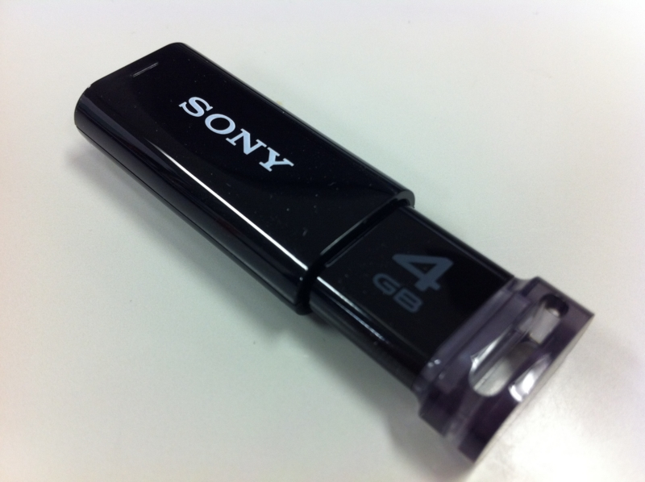
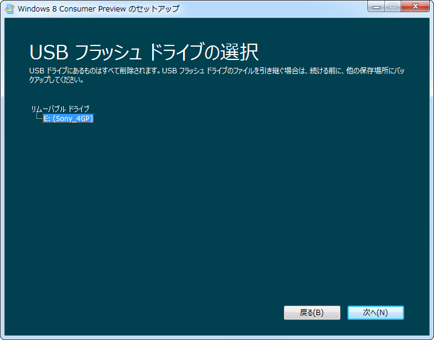
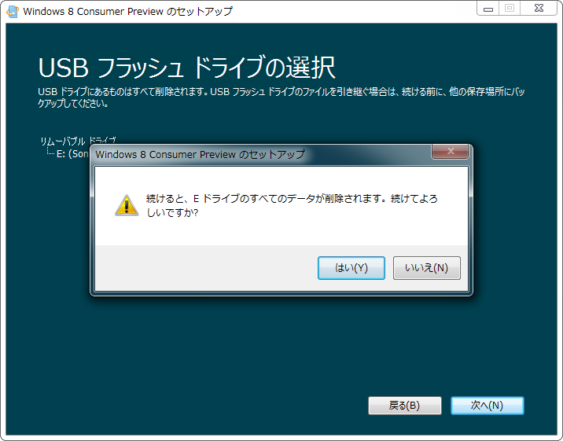
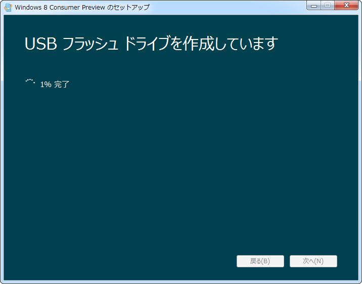
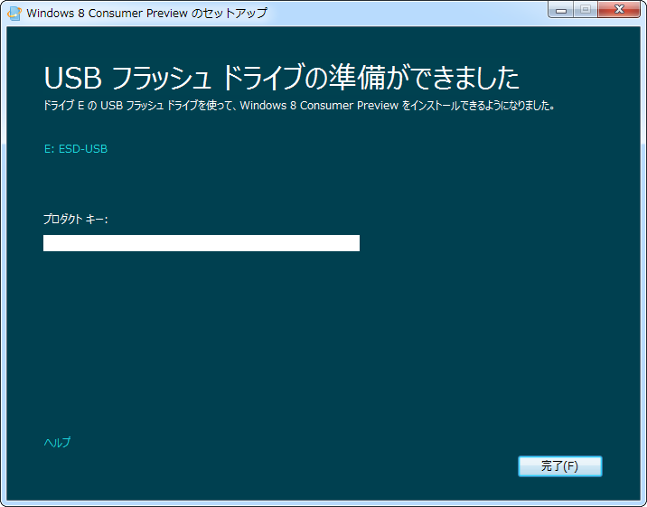

<ul>
<li><a href="http://daruyanagi.hatenablog.com/entry/2012/03/01/065626">Windows 8 Consumer Preview &#x3092; DVD-R &#x304B;&#x3089;&#x30A4;&#x30F3;&#x30B9;&#x30C8;&#x30FC;&#x30EB;&hellip;&hellip;&#x5931;&#x6557; - &#x3060;&#x308B;&#x308D;&#x3050;</a></li>
<li><a href="http://daruyanagi.hatenablog.com/entry/2012/03/01/053229">Windows 8 Consumer Preview &#xFF08;&#x9014;&#x4E2D;&#x307E;&#x3067;&#x30A4;&#x30F3;&#x30B9;&#x30C8;&#x30FC;&#x30EB;&#x3057;&#x305F;&#xFF09; - &#x3060;&#x308B;&#x308D;&#x3050;</a></li>
</ul>
昨日の続き。会社行く途中に、錦糸町のヨドバシに寄って<a class="keyword" href="http://d.hatena.ne.jp/keyword/USB%A5%E1%A5%E2%A5%EA">USBメモリ</a>を調達した。これで<a class="keyword" href="http://d.hatena.ne.jp/keyword/USB%A5%E1%A5%E2%A5%EA">USBメモリ</a>でインストールメディアが作れる！

<a href="http://www.amazon.co.jp/exec/obidos/ASIN/B0054S6944/hatena-hamazou-22/">SONY ノックスライド式USBメモリー ポケットビット 4GB ブラック キャップレス USM4GP B</a>
<ul><li>出版社/メーカー: ソニー</li><li>発売日: 2011/06/24</li><li>メディア: Personal Computers</li><li><a href="http://d.hatena.ne.jp/asin/B0054S6944" target="_blank">この商品を含むブログを見る</a></li></ul>

見えた見えた。ちなみに Windows 8 のファイルサイズは2～3GB程度ある<a href="#f1" name="fn1" title="32bitか64bitかで違う">*1</a>ので、<a class="keyword" href="http://d.hatena.ne.jp/keyword/USB%A5%E1%A5%E2%A5%EA">USBメモリ</a>は4GB以上のものを用意するとよさげ。

<a class="keyword" href="http://d.hatena.ne.jp/keyword/USB%A5%E1%A5%E2%A5%EA">USBメモリ</a>は一度フォーマットされる。

作成。

完了。プロダクトキーっていう欄はなんなんだろうネ。

あとは Windows 8 をお楽しみください。<a class="keyword" href="http://d.hatena.ne.jp/keyword/USB%A5%E1%A5%E2%A5%EA">USBメモリ</a>を作ったところで満足してしまって、実際にインストールできるかまでは試していない。

<a href="#fn1" name="f1" class="footnote-number">*1</a>:32bitか64bitかで違う

