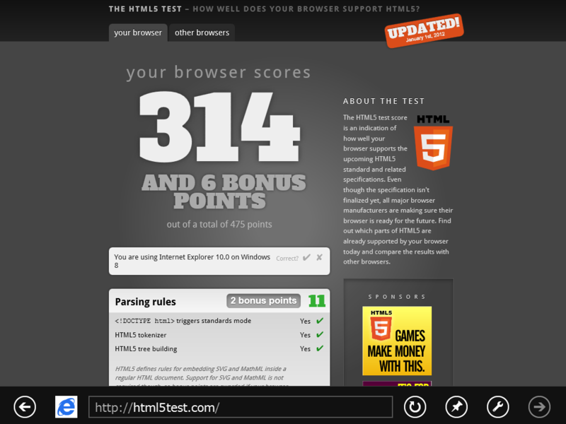
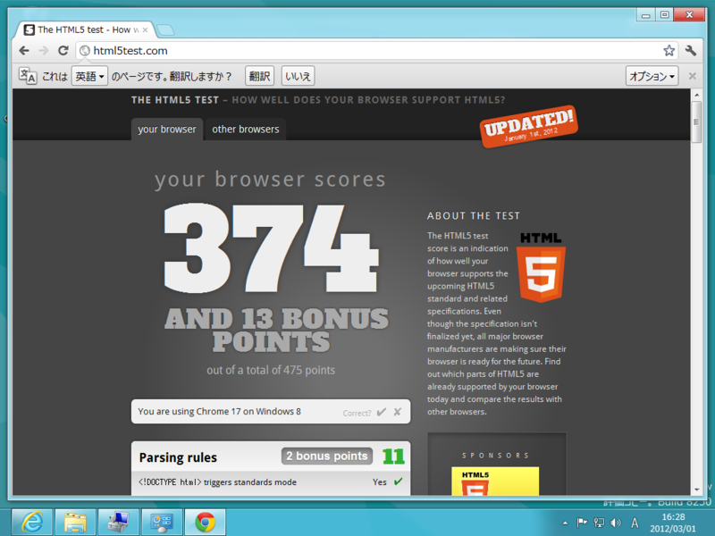
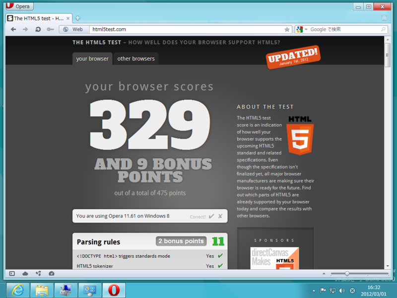
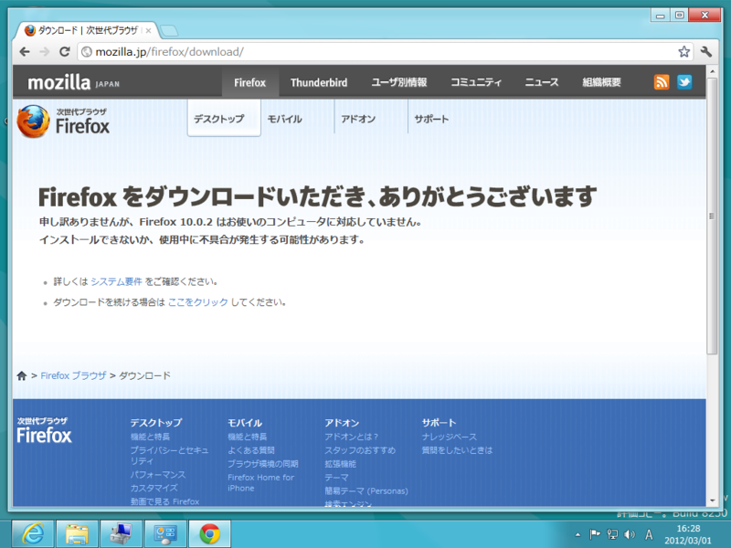

<a class="keyword" href="http://d.hatena.ne.jp/keyword/HTML5">HTML5</a>への対応状況を点数化する <a href="http://html5test.com/">The HTML5 test - How well does your browser support HTML5?</a> を使って、Webブラウザーの<a class="keyword" href="http://d.hatena.ne.jp/keyword/HTML5">HTML5</a>対応度を比べてみた。IE10 以外は3月1日現在における最新安定版を利用。

<h3>IE10 PP5</h3>

314点。点数は若干控えめだけど、<a class="keyword" href="http://d.hatena.ne.jp/keyword/%A5%EC%A5%F3%A5%C0%A5%EA%A5%F3%A5%B0">レンダリング</a>がスゴく速いという印象を受けた。

<h3>Google Chrome</h3>

374点。あいかわらず圧倒的なハイスコア。

<h3><a class="keyword" href="http://d.hatena.ne.jp/keyword/Opera">Opera</a></h3>

329点。<a class="keyword" href="http://d.hatena.ne.jp/keyword/Opera">Opera</a> の魅力はその圧倒的なカリスマにあるので、このぐらいの点数でも問題がないのだ。

<h3>まとめにならないまとめ</h3>

残念ながら、IE10 の<a class="keyword" href="http://d.hatena.ne.jp/keyword/HTML5">HTML5</a>対応はまだまだ Google Chrome に追いついていない。でも、かなり肉薄しているし（<a class="keyword" href="http://d.hatena.ne.jp/keyword/Opera">Opera</a>とはほぼ同等）、とくに不便は感じない。また、 <a href="http://html5labs.interoperabilitybridges.com/">HTML5Labs - Home</a> で実験中のものをバンバン追加すれば、点数だけならいくらでも稼げそう。なので、対応状況が追いついていないと言うよりも、必要性と安定性を考慮して「保守的」に対応していると評価してもいいんじゃないかな。企業用途も多い IE なので、なんでもかんでもバンバン対応するというのも得策じゃないんだろう。

さて、ひとつ忘れているブラウザがあるね。そう、<a class="keyword" href="http://d.hatena.ne.jp/keyword/Firefox">Firefox</a> だ。

<h3><a class="keyword" href="http://d.hatena.ne.jp/keyword/Firefox">Firefox</a></h3>

まぁ、別にいいや。点数は <a class="keyword" href="http://d.hatena.ne.jp/keyword/Opera">Opera</a> とどっこいどっこいか少し上なあたりだろう。

