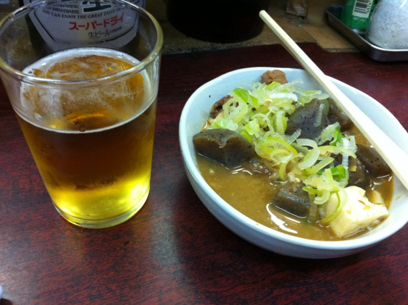
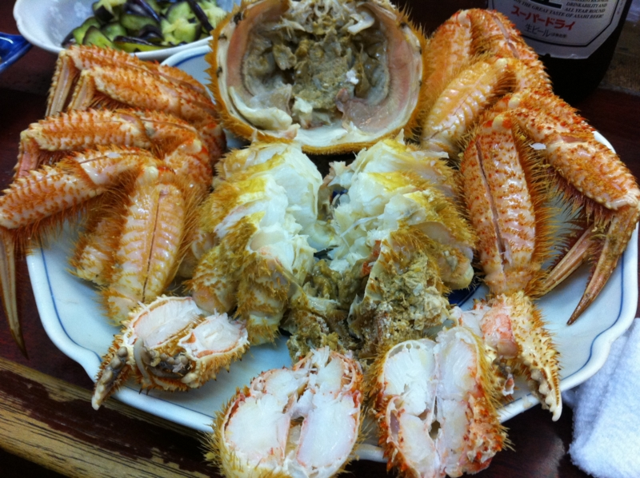
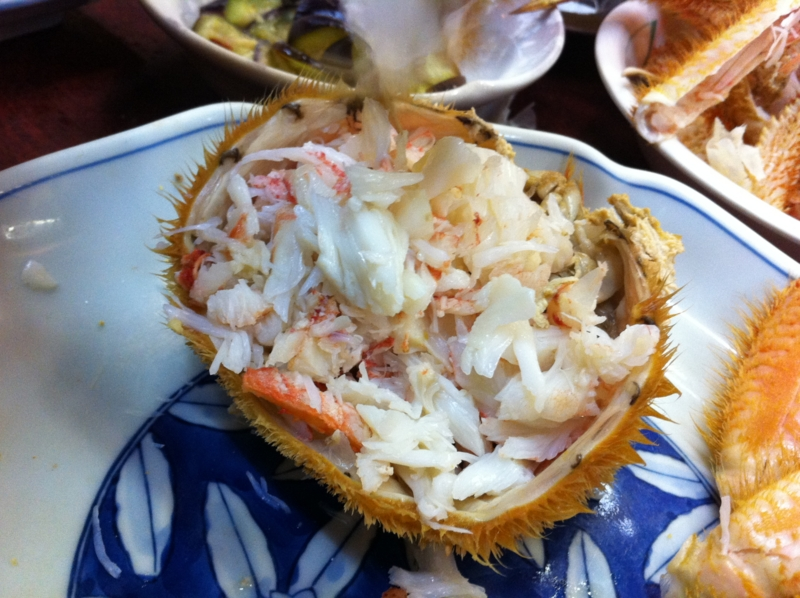
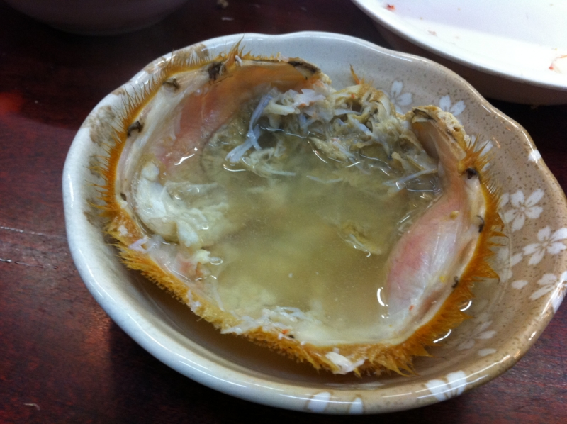

昨日は仕事を頑張ったので、 <a href="https://ja.foursquare.com/v/%E9%85%92%E5%87%A6-%E3%81%8F%E3%82%8B%E3%81%BE/4ba8b4f5f964a5209ae839e3">foursquare :: &#x9152;&#x51E6; &#x304F;&#x308B;&#x307E; :: &#x6771;&#x4EAC;, &#x65E5;&#x672C;</a> に寄って独りで酒呑んでた。そしたら、大将が「ケガニがあるんだけどなー、今だったら安くしてしまいそうだなー」と聞こえるように独り言を言う。

いい加減面倒くさいので（！）、少し値切って隣の人と分けて食うことにした。

なんでかしらんけど、カニの肉はぜんぶ隣の人にほじってもらった。自分でほじるのもいいけど、こうやるとガブッとカニの肉をほうばれて、これはこれでイイ。

最後は甲羅で熱燗のんだ。なんか邪道な飲み方のような気もするけど、存外不味くはなかった。あとで甲羅を炙って飲むと、二度美味しいんだそうだ。そうやって人間はダメになるんだと思う。

小岩はダメな人が多いので、自分もダメでいいんだと思え、肩の力を抜いて、のんびりできる。それがイイと思った。

帰りは <a href="https://ja.foursquare.com/v/%E3%81%A4%E3%81%91%E3%82%81%E3%82%93%E3%82%89%E3%83%BC%E3%82%81%E3%82%93-%E3%81%A4%E3%81%A8%E3%82%93/4e1d71b71838f4ab743e078f">foursquare :: &#x3064;&#x3051;&#x3081;&#x3093;&#x30FB;&#x3089;&#x30FC;&#x3081;&#x3093; &#x3064;&#xFF5E;&#x3068;&#x3093; :: &#x6C5F;&#x6238;&#x5DDD;&#x533A;, &#x6771;&#x4EAC;&#x90FD;</a> に寄ってつけ麺食べた。つけ麺も美味しいけれど、マスターとおしゃべりするが楽しい。何の話をしたのかはすっかり忘れてしまったのだけど、楽しかった。

