
<a class="keyword" href="http://d.hatena.ne.jp/keyword/VHD">VHD</a>（Virtual Hard Disk：仮想ハードディスク）の作成。Windows 8は<a class="keyword" href="http://d.hatena.ne.jp/keyword/VHD">VHD</a>にインストールしてブートできるので、これからお世話になることが多くなると思う。

<h3><a class="keyword" href="http://d.hatena.ne.jp/keyword/VHD">VHD</a> ファイルを作成する</h3>

スタートメニューにある［コンピュータ］のコンテクストメニューで［管理］を選択。

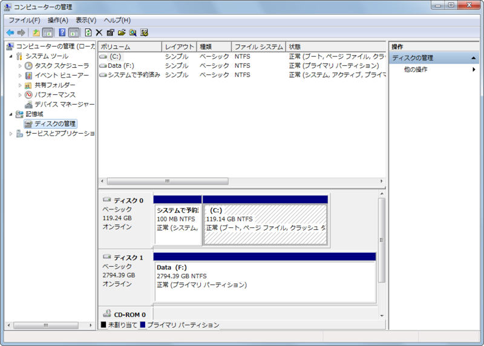

［ディスクの管理］を選択。

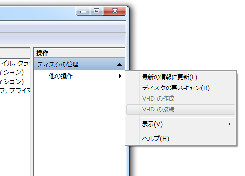

右ペインにある［ディスクの管理］－［他の操作］から［<a class="keyword" href="http://d.hatena.ne.jp/keyword/VHD">VHD</a>の作成］を選択。

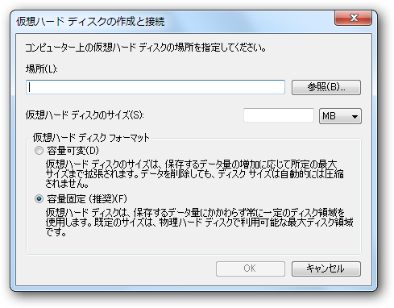

設定。普通は容量固定のほうがいいみたい。

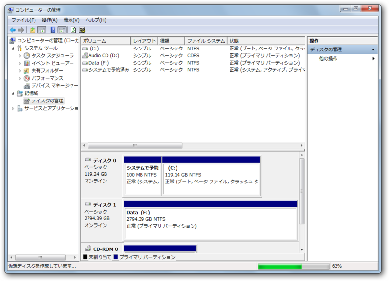

作成が始まる。進捗情報はステータスバーに現れる。案外時間がかかるっぽい。OS をインストールするなら、これ以降の作業は必要がないが、一般のドライブとして利用するには、接続と初期化が必要になる。

<h3><a class="keyword" href="http://d.hatena.ne.jp/keyword/VHD">VHD</a> ファイルの接続</h3>

<a class="keyword" href="http://d.hatena.ne.jp/keyword/VHD">VHD</a> ファイルを接続すると、自動でドライバがインストールされ、<a class="keyword" href="http://d.hatena.ne.jp/keyword/%A5%D5%A5%A1%A5%A4%A5%EB%A5%B7%A5%B9%A5%C6%A5%E0">ファイルシステム</a>にマウントして利用することができる。

［ディスクの管理］－［他の操作］から［<a class="keyword" href="http://d.hatena.ne.jp/keyword/VHD">VHD</a>の接続］を選択。

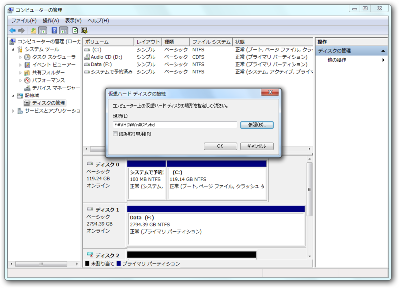

<a class="keyword" href="http://d.hatena.ne.jp/keyword/VHD">VHD</a>ファイルを選択。これでディスクマネージャーに<a class="keyword" href="http://d.hatena.ne.jp/keyword/VHD">VHD</a>ボリュームが現れる。

<h3><a class="keyword" href="http://d.hatena.ne.jp/keyword/VHD">VHD</a> の初期化</h3>

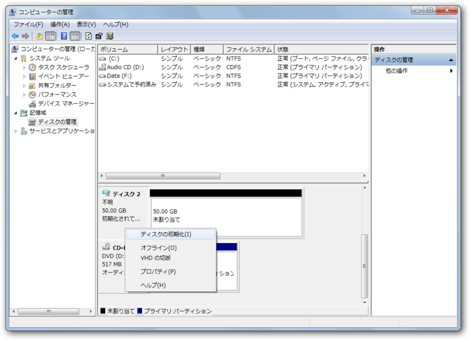

ディスクの初期化。

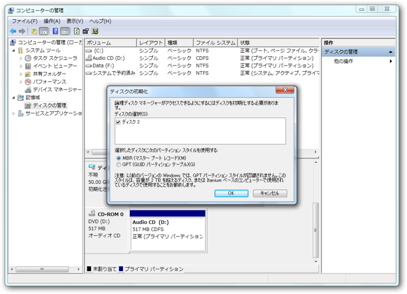

<a class="keyword" href="http://d.hatena.ne.jp/keyword/MBR">MBR</a> と GTP はどちらを選んだらいいのだろう。普通は <a class="keyword" href="http://d.hatena.ne.jp/keyword/MBR">MBR</a> でイイと思う。

<h3>パーティションの作成</h3>

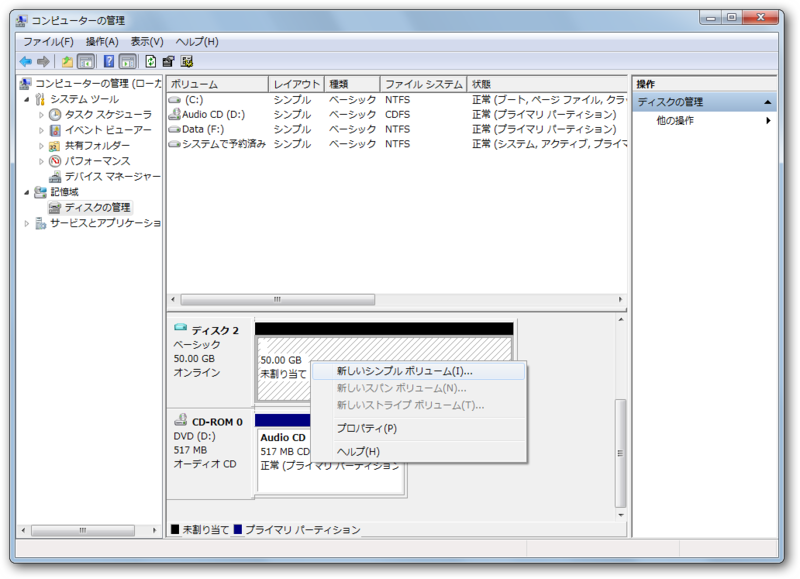

［新しいシンプルボリューム］を選択すると……

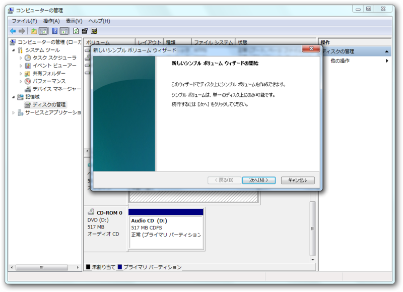

パーティションの作成ウィザードが現れる。

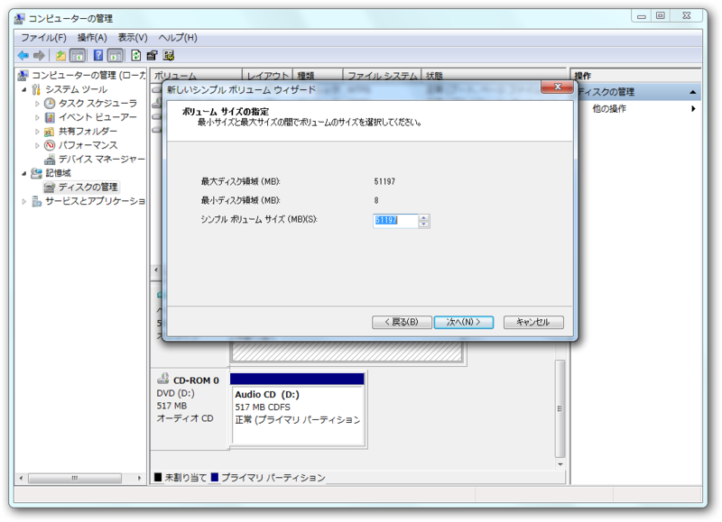

パーティションサイズの指定。

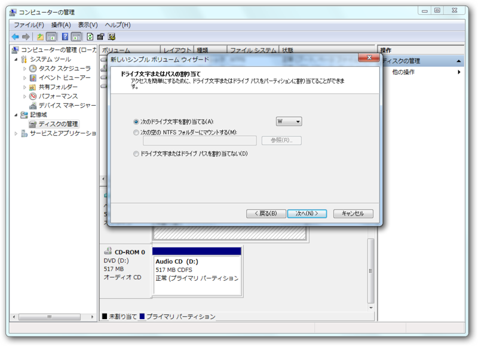

ドライブレターの割り当て。

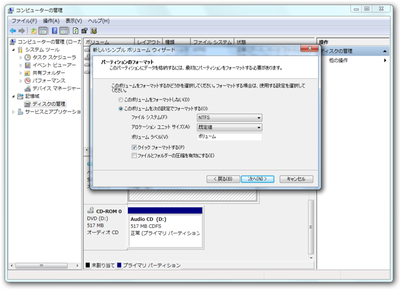

フォーマット方法を指定。多分、初期値のままでOK。

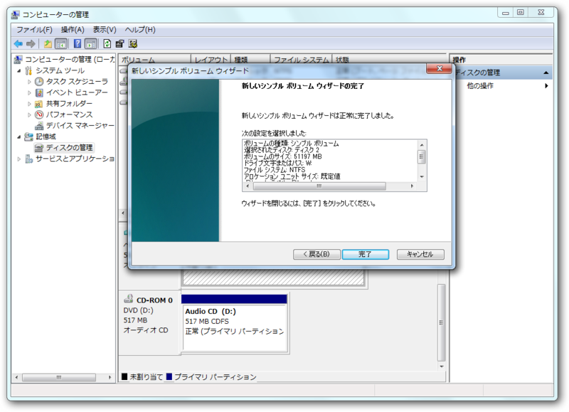

あとは待つのみ。

