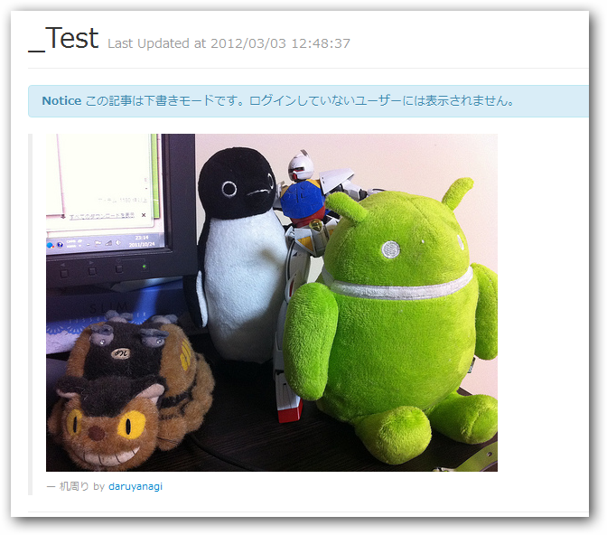

<blockquote cite="http://d.hatena.ne.jp/lyokato/20080815/1218767965">

eEmbedというのは、あるリソースのURL(例えば<a class="keyword" href="http://d.hatena.ne.jp/keyword/Flickr">Flickr</a>の特定の写真のページのURL)を 
<a class="keyword" href="http://d.hatena.ne.jp/keyword/%A5%B5%A1%BC%A5%C9%A5%D1%A1%BC%A5%C6%A5%A3">サードパーティ</a>上で、写真自体の埋め込みに変換したいときに、 
埋め込みに必要なパラメータを取得するためのプロトコルみたいです。

<cite><a href="http://d.hatena.ne.jp/lyokato/20080815/1218767965"> URL&#x3092;&#x57CB;&#x3081;&#x8FBC;&#x307F;&#x30B3;&#x30F3;&#x30C6;&#x30F3;&#x30C4;&#x306B;&#x5909;&#x63DB;&#x3059;&#x308B;oEmbed&#x306E;&#x4ED5;&#x69D8; - Codin&rsquo; In The Free World</a></cite>
</blockquote>

前にやったときは <a class="keyword" href="http://d.hatena.ne.jp/keyword/API">API</a> を使って実装したのだけど、こっちだと <a class="keyword" href="http://d.hatena.ne.jp/keyword/API">API</a> キーや秘密鍵を取得しないで同じことができそう。

<pre class="code" data-unlink>using System;
using System.Collections.Generic;
using System.Linq;
using System.Web;

using Codeplex.Data;
using System.Net;

public static class FlickrHelper
{
private static readonly string Endpoint =
@&#34;http://www.flickr.com/services/oembed&#34;;
public static string FORMAT_URL =
@&#34;{0}?url={1}&amp;maxwidth={2}&amp;maxheight={3}&amp;format={4}&#34;;
public static string FORMAT_HTML_TAG = @&#34;
&lt;blockquote&gt;
&lt;p&gt;&lt;img src=&#39;{0}&#39; alt=&#39;{1}&#39; /&gt;&lt;p&gt;
&lt;p&gt;&lt;small&gt;{1} by &lt;a href=&#39;{3}&#39;&gt;{2}&lt;/a&gt;&lt;/small&gt;&lt;p&gt;
&lt;/blockquote&gt;
&#34;;
public static string FORMAT_ERROR =
@&#34;&lt;p class=&#39;error&#39;&gt;{0}&lt;/p&gt;&#34;;

public static string GetHtml(string url,
string max_width = &#34;500&#34;, string max_height = &#34;500&#34;)
{
try
{
return GetHtml(url,
int.Parse(max_width), int.Parse(max_height));
}
catch (Exception e)
{
return string.Format(FORMAT_ERROR, e.Message);
}
}

public static string GetHtml(
string url, int max_width, int max_height)
{
var format = &#34;json&#34;;

var address = string.Format(FORMAT_URL,
Endpoint, url, max_width, max_height, format);

using (var client = new WebClient())
{
try
{
var response = client.DownloadString(address);
var info = DynamicJson.Parse(response);

return string.Format(FORMAT_HTML_TAG,
info.url, info.title,
info.author_name, info.author_url);
}
catch (Exception e)
{
return string.Format(FORMAT_ERROR, e.Message);
}
}
}
}</pre>

 

できた。けど、これだと短縮URL（flic.kr）は使えないみたい。自分で Base58 のデコード処理<a href="#f1" name="fn1" title="短縮URLはPhoto IDをBase58でエンコードしてある">*1</a>なり、URLを展開する処理なりを追加する必要がある。 Base58 のデコード処理では Photo ID しか取得できず、結局 API が必要になるので、今回は汎用の短縮URL展開処理を使った。

<pre class="code" data-unlink>public static Uri ExpandUrl(this Uri input)
{
var req = (HttpWebRequest)WebRequest.Create(input);
WebResponse res = req.GetResponse();
return res.ResponseUri;
}</pre>

みたいな拡張メソッドを用意して、

<pre class="code" data-unlink>if (url.StartsWith(&#34;http://flic.kr/p/&#34;))
{
url = new Uri(url).ExpandUrl().ToString();
}</pre>

短縮URLを展開してあげる。

<a href="#fn1" name="f1" class="footnote-number">*1</a>:短縮URLはPhoto IDをBase58でエンコードしてある

