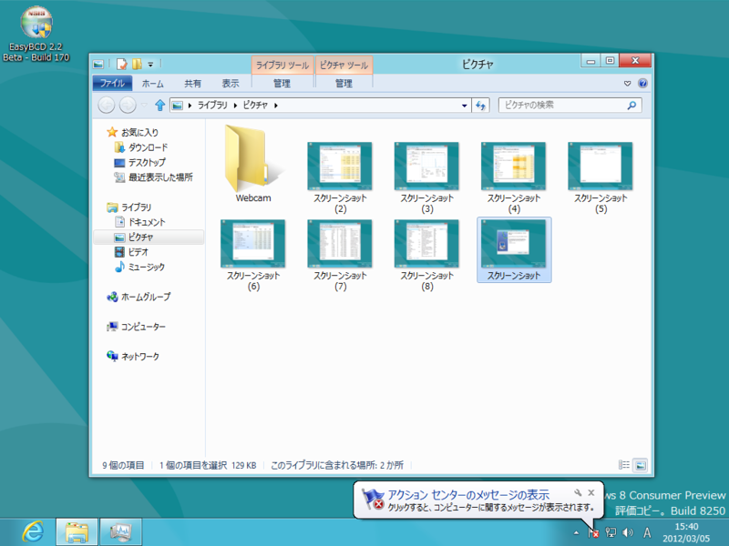

これは結構便利。デスクトップの<a class="keyword" href="http://d.hatena.ne.jp/keyword/%A5%B9%A5%AF%A5%EA%A1%BC%A5%F3%A5%B7%A5%E7%A5%C3%A5%C8">スクリーンショット</a>を、自動で連番をつけてファイルとして保存していける<a href="#f1" name="fn1" title="確かPNG形式だったはず">*1</a>。ただ、

<ul>
<li>保存先は「ピクチャー」フォルダ決め打ち（ピクチャーフォルダがカオスになる）</li>
<li>ファイル名は「<a class="keyword" href="http://d.hatena.ne.jp/keyword/%A5%B9%A5%AF%A5%EA%A1%BC%A5%F3%A5%B7%A5%E7%A5%C3%A5%C8">スクリーンショット</a>（連番）」決め打ち（タイムスタンプを名前に、などはできない）</li>
<li>プライマリモニターしか撮影できない（あれ！）</li>
</ul>
など、イマイチなところもあるので、<a class="keyword" href="http://d.hatena.ne.jp/keyword/%A5%B9%A5%AF%A5%EA%A1%BC%A5%F3%A5%B7%A5%E7%A5%C3%A5%C8">スクリーンショット</a>系の<a class="keyword" href="http://d.hatena.ne.jp/keyword/%A5%B5%A1%BC%A5%C9%A5%D1%A1%BC%A5%C6%A5%A3">サードパーティ</a>アプリが不要になるわけではないみたい。

これまでも［PrintScreen］キーなどで<a class="keyword" href="http://d.hatena.ne.jp/keyword/%A5%B9%A5%AF%A5%EA%A1%BC%A5%F3%A5%B7%A5%E7%A5%C3%A5%C8">スクリーンショット</a>を撮影して<a class="keyword" href="http://d.hatena.ne.jp/keyword/%A5%AF%A5%EA%A5%C3%A5%D7%A5%DC%A1%BC%A5%C9">クリップボード</a>へ転送することはできたが、ファイルとして保存するのは少し面倒だった<a href="#f2" name="fn2" title="画像ファイルを作成 → 「ペイント」などで開く→クリップボードから画像データを貼り付け→保存">*2</a>。

<ul>
<li><a href="http://www.forest.impress.co.jp/docs/review/20120301_514085.html">&#x7A93;&#x306E;&#x675C; - &#x3010;REVIEW&#x3011;&#x30AF;&#x30EA;&#x30C3;&#x30D7;&#x30DC;&#x30FC;&#x30C9;&#x306E;&#x753B;&#x50CF;&#x30C7;&#x30FC;&#x30BF;&#x3092;&#x624B;&#x8EFD;&#x306B;&#x30D5;&#x30A1;&#x30A4;&#x30EB;&#x3068;&#x3057;&#x3066;&#x4FDD;&#x5B58;&#x300C;Screenshot2Disk&#x300D;</a></li>
<li><a href="http://www.clicktoapp.com/">click.to - One click to your favorite app</a></li>
</ul>
なんかのアプリを使うと多少楽にはなるのだけど。

<a href="#fn1" name="f1" class="footnote-number">*1</a>:確かPNG形式だったはず

<a href="#fn2" name="f2" class="footnote-number">*2</a>:画像ファイルを作成 → 「ペイント」などで開く→<a class="keyword" href="http://d.hatena.ne.jp/keyword/%A5%AF%A5%EA%A5%C3%A5%D7%A5%DC%A1%BC%A5%C9">クリップボード</a>から画像データを貼り付け→保存

