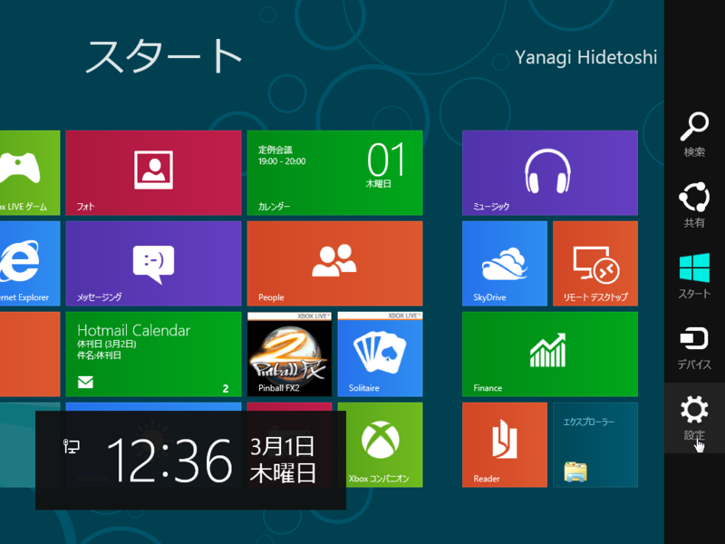

Windows 8は悪くないと思ったけれど、今のデザインでは若干マウスの移動量が多いように感じる。なので、ショートカットを積極的に覚えておくとよさげ。Windows 7とは若干変更になったコンビネーションもあるようだ。

<table>
<tr>
<th>キーコンビネーション</th>
<th>効果</th>
</tr>
<tr>
<td>［Windows］	</td>
<td>メトロデスクトップ ⇔ クラシックデスクトップの切り替え</td>
</tr>
<tr>
<td>［Windows］＋［O］	</td>
<td>デバイスの向きを固定</td>
</tr>
<tr>
<td>［Windows］＋［PrintScreen］	</td>
<td>カレントスクリーンの<a class="keyword" href="http://d.hatena.ne.jp/keyword/%A5%B9%A5%AF%A5%EA%A1%BC%A5%F3%A5%B7%A5%E7%A5%C3%A5%C8">スクリーンショット</a>を撮ってピクチャーフォルダに保存</td>
</tr>
<tr>
<td>［Windows］＋［,］	</td>
<td>デスクトップを一時的に表示（AeroPeekに相当）</td>
</tr>
<tr>
<td>［Windows］＋［V］	</td>
<td>通知トーストを順に切り替え</td>
</tr>
<tr>
<td>［Windows］＋［Shift］＋［V］	</td>
<td>［Windows］＋［V］キーの逆順</td>
</tr>
<tr>
<td>［Windows］＋［Enter］	</td>
<td>ナレーターの起動</td>
</tr>
<tr>
<td>［Windows］＋［PgUp］	</td>
<td>メトロデスクトップを表示するデスクトップの切り替え</td>
</tr>
<tr>
<td>［Windows］＋［PgDown］	</td>
<td>メトロデスクトップを表示するデスクトップの切り替え</td>
</tr>
<tr>
<td>［Windows］＋［.］	</td>
<td>メトロスタイルアプリケーションをデスクトップ右端にスナップ</td>
</tr>
<tr>
<td>［Windows］＋［Shift］＋［.］	</td>
<td>アプリケーションをデスクトップ左端にスナップ</td>
</tr>
<tr>
<td>［Windows］＋［C］	</td>
<td>チャームバーの表示</td>
</tr>
<tr>
<td>［Windows］＋［I］	</td>
<td>［設定］チャームを表示</td>
</tr>
<tr>
<td>［Windows］＋［K］	</td>
<td>［デバイス］チャームの表示</td>
</tr>
<tr>
<td>［Windows］＋［H］	</td>
<td>［共有］チャームの表示</td>
</tr>
<tr>
<td>［Windows］＋［P］	</td>
<td>モニター設定の表示</td>
</tr>
<tr>
<td>［Windows］＋［Q］	</td>
<td>アプリの検索</td>
</tr>
<tr>
<td>［Windows］＋［W］	</td>
<td>システム設定の検索</td>
</tr>
<tr>
<td>［Windows］＋［F］	</td>
<td><a class="keyword" href="http://d.hatena.ne.jp/keyword/%A5%D5%A5%A1%A5%A4%A5%EB%A5%B7%A5%B9%A5%C6%A5%E0">ファイルシステム</a>の検索</td>
</tr>
<tr>
<td>［Windows］＋［Tab］	</td>
<td>スイッチリストを表示してアプリを切り替え</td>
</tr>
<tr>
<td>［Windows］＋［Shift］＋［Tab］	</td>
<td>［Windows］＋［Tab］キーの逆順</td>
</tr>
<tr>
<td>［Windows］＋［Ctrl］＋［Tab］	</td>
<td>スナップの内容をアプリ切り替えに含める</td>
</tr>
<tr>
<td>［Windows］＋［Z］	</td>
<td>アプリバーの表示</td>
</tr>
<tr>
<td>［Windows］＋［D］	</td>
<td>デスクトップを表示</td>
</tr>
<tr>
<td>［Windows］＋［M］	</td>
<td>すべてのアプリケーションを最小化</td>
</tr>
<tr>
<td>［Windows］＋［Space］	</td>
<td>入力言語とキーボードレイアウトの切り替え</td>
</tr>
<tr>
<td>［Windows］＋［/］	</td>
<td><a class="keyword" href="http://d.hatena.ne.jp/keyword/IME">IME</a>で再変換</td>
</tr>
<tr>
<td>［Windows］＋［T］	</td>
<td>タスクバーで開いているウィンドウをプレビュー</td>
</tr>
<tr>
<td>［Windows］＋［E］	</td>
<td>エクスプローラーを表示</td>
</tr>
<tr>
<td>［Windows］＋［Psuse］	</td>
<td>プロパティの表示</td>
</tr>
<tr>
<td>［Windows］＋［J］	</td>
<td>フォーカスのあるアプリとスナップしたアプリを取り替え</td>
</tr>
<tr>
<td>［Windows］＋［L］	</td>
<td>スクリーンをロック</td>
</tr>
<tr>
<td>［Windows］＋［X］	</td>
<td>クイックランチメニューの表示</td>
</tr>
</table>
Windows 8のすべてをまだ把握しきれていない上、検証もまだなので、一部誤りがあると思う。適宜修正するつもり。

