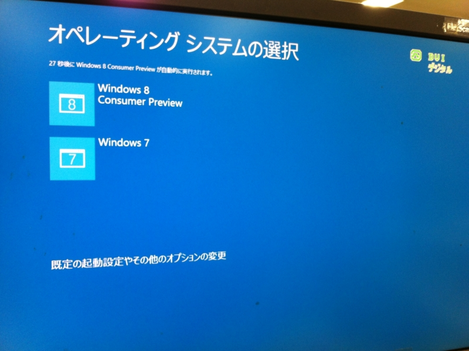
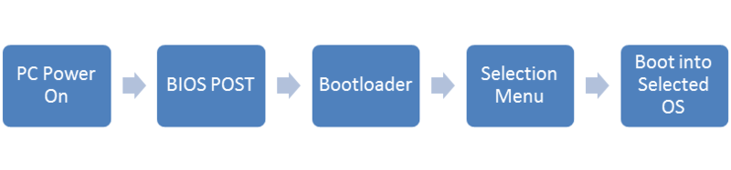
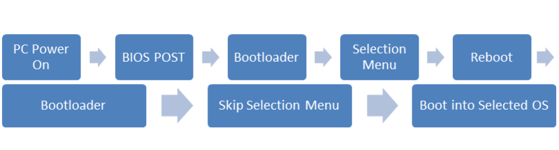

Windows 8 Consumer Preview では、マルチブート環境における OS のブートプロセスに変更があるようだ。

<h3>これまでのブートプロセス</h3>

<i>電源投入 → <a class="keyword" href="http://d.hatena.ne.jp/keyword/BIOS">BIOS</a> → OSの選択 → 選択したOSの起動</i>という手順だった。

<h3>Windows 8のブートプロセス</h3>

新しいブートプロセスでは、OSを起動するまでに一度再起動が行われる。<i>電源投入 → <a class="keyword" href="http://d.hatena.ne.jp/keyword/BIOS">BIOS</a> → OSの選択 → 再起動 → （OS選択をスキップ） → 選択したOSの起動</i>

<blockquote cite="http://neosmart.net/blog/2011/the-new-windows-8-bootloader/">

Basically, it seems that the new boot menu interface has become it’s own mini-OS, and is possibly running in protected mode (vs the traditional real-mode bootloader), and as such, needs to <a class="keyword" href="http://d.hatena.ne.jp/keyword/reboot">reboot</a> to bring the system back into a real-mode that the Windows 8 kernel can initialize from and bring the system from real to protected mode itself. In short: the new boot menu is more of an OS and less of a boot menu than ever before.

（ざっくり訳すと――新しいブートメニューはそれ自身がミニOSとして振る舞い、保護モードで実行される。Windows 8カーネルを初期化するためにはリアルモードで実行されている必要があるので、保護モードからリアルモードに切り替えるために再起動が必要になる……ような気がする。）

<cite><a href="http://neosmart.net/blog/2011/the-new-windows-8-bootloader/">The New Windows 8 Bootmenu/Bootloader | The NeoSmart Files</a></cite>
</blockquote>

よくわかんないけど <a href="http://blogs.msdn.com/b/b8_ja/archive/2011/09/27/uefi-os.aspx">
 
UEFI &#x3067; OS &#x8D77;&#x52D5;&#x524D;&#x306E;&#x74B0;&#x5883;&#x3092;&#x4FDD;&#x8B77;&#x3059;&#x308B; - Building Windows 8 - Site Home - MSDN Blogs
 
</a> あたりが関係あるのかな。セキュアブート機能は<a class="keyword" href="http://d.hatena.ne.jp/keyword/%A5%B5%A1%BC%A5%C9%A5%D1%A1%BC%A5%C6%A5%A3">サードパーティ</a>製の<a class="keyword" href="http://d.hatena.ne.jp/keyword/%A5%D6%A1%BC%A5%C8%A5%ED%A1%BC%A5%C0">ブートローダ</a>ーを締め出す、<a class="keyword" href="http://d.hatena.ne.jp/keyword/Linux">Linux</a> を脅かすという文脈でばかり話題になるけど（<a href="http://gihyo.jp/admin/clip/01/linux_dt/201111/02">2011&#x5E74;11&#x6708;2&#x65E5;&#x3000;Windows 8&#x306E;&#x30BB;&#x30AD;&#x30E5;&#x30A2;&#x30D6;&#x30FC;&#x30C8;&#x306F;Linux&#x5916;&#x3057;!? Red Hat&#x3068;Canonical&#x304C;&#x5171;&#x540C;&#x58F0;&#x660E;&#xFF5C;gihyo.jp &hellip; &#x6280;&#x8853;&#x8A55;&#x8AD6;&#x793E;</a>）、ちょっと興味が湧いてきた。ELAM（Early-Load Antimalware Driver）という仕組みも気になる（「アバスト！ 7」で対応しているとのこと <a href="http://www.forest.impress.co.jp/docs/news/20120224_514402.html">&#x7A93;&#x306E;&#x675C; - &#x3010;NEWS&#x3011;&#x7121;&#x511F;&#x30A6;&#x30A4;&#x30EB;&#x30B9;&#x5BFE;&#x7B56;&#x30BD;&#x30D5;&#x30C8;&#x300C;&#x30A2;&#x30D0;&#x30B9;&#x30C8;! &#x7121;&#x6599;&#x30A2;&#x30F3;&#x30C1;&#x30A6;&#x30A4;&#x30EB;&#x30B9; 7&#x300D;&#x304C;&#x6B63;&#x5F0F;&#x516C;&#x958B;</a>）。折を見て勉強したい。

<ul>
<li><a href="http://daruyanagi.hatenablog.com/entry/2012/03/03/205815">VHD &#x306B; Windows 8 Consumer Preview &#x3092;&#x30A4;&#x30F3;&#x30B9;&#x30C8;&#x30FC;&#x30EB;&#x3057;&#x3066;&#x30C7;&#x30E5;&#x30A2;&#x30EB;&#x30D6;&#x30FC;&#x30C8;&#x3057;&#x3066;&#x307F;&#x308B; - &#x3060;&#x308B;&#x308D;&#x3050;</a></li>
<li><a href="http://www.forest.impress.co.jp/docs/news/20120305_516609.html">&#x7A93;&#x306E;&#x675C; - &#x3010;NEWS&#x3011;&#x30D6;&#x30FC;&#x30C8;&#x30ED;&#x30FC;&#x30C0;&#x30FC;&#x30AB;&#x30B9;&#x30BF;&#x30DE;&#x30A4;&#x30BA;&#x30C4;&#x30FC;&#x30EB;&#x300C;EasyBCD&#x300D;&#x30D9;&#x30FC;&#x30BF;&#x7248;&#x304C;&#x300C;Windows 8 CP&#x300D;&#x306B;&#x5BFE;&#x5FDC;</a></li>
</ul>

