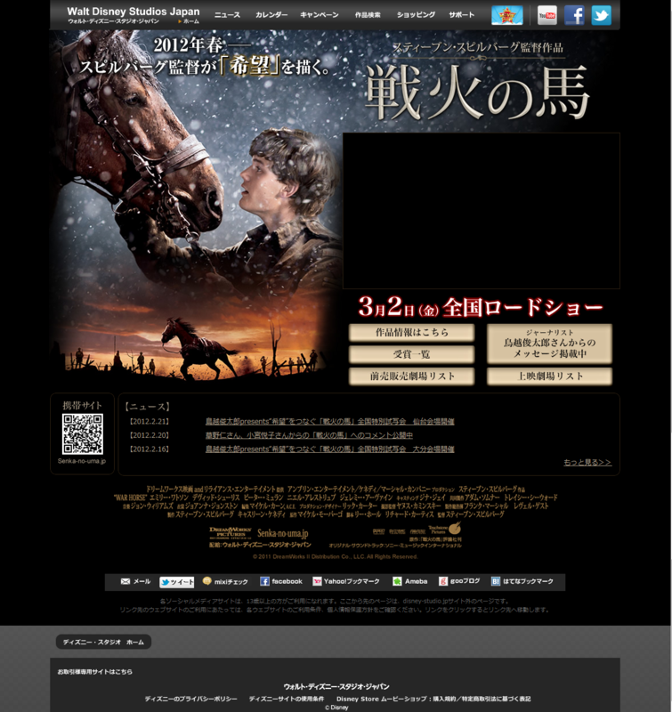
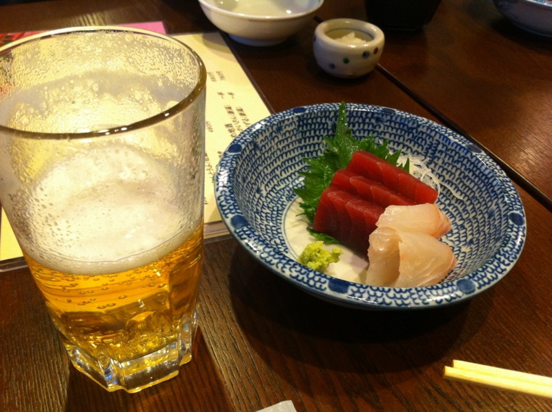
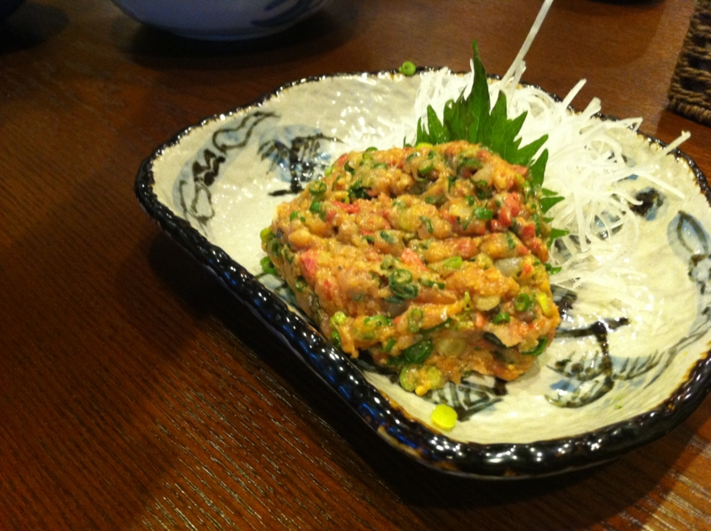
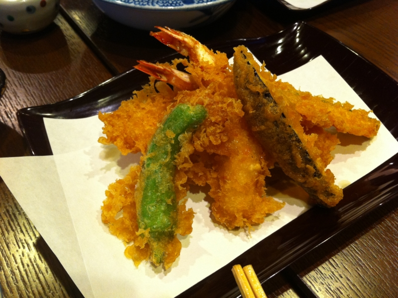

日曜日に @subsfn と有楽町で <a href="http://disney-studio.jp/movies/warhorse/">&#x3010;&#x6620;&#x753B;&#x3011;&#x6226;&#x706B;&#x306E;&#x99AC;&#xFF5C;&#x516C;&#x5F0F;&#x30B5;&#x30A4;&#x30C8;</a> を観てきた。

期待通りの出来で、とても面白かった。逆に言えば、期待を裏切って驚かされるところもあまりなくて、予想の範囲内って感じだった。

それにしても、予告編がとても長い上、クネクネしたキモいビデオ男の絵を見せられるのが相変わらず不快。もう、本編が始まるまで外でブラブラしてようかなぁ。暗い中を席移動したら、白い目で見られそうだけど。

お昼はアキバで天ぷら食べた。

<a href="http://akiba-pc.watch.impress.co.jp/hotline/20110618/etc_comic1.html">&#x3061;&#x3087;&#x3073;&#xFF06;&#x59C9;&#x3061;&#x3083;&#x3093;&#x306E;&#x300E;&#x30A2;&#x30AD;&#x30D0;&#x3067;&#x3054;&#x306F;&#x3093;&#x98DF;&#x3079;&#x305F;&#x3044;&#x306A;&#x3002;&#x300F; &#x301C;&#x300C;&#x3066;&#x3093;&#x3077;&#x3089; &#x5929;&#x82B3;&#x300D;&#x7DE8;&#x301C;</a>

天ぷらもイイけど、あんがいお魚が美味しくて、夜飲みに来たほうが楽しそうだなぁ、と思った。天ぷら定食は最後に大きなかき揚げが追加。ご飯のおかわりもタダなので、もちろんお昼のランチとしても。アキバってホントご飯食べるところが増えて、毎回いろんな所にイケるようになってうれしい。

