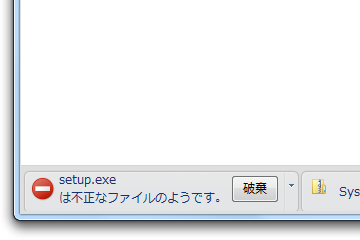

アプリを作ってアップロードした。念のため、ファイルが正常にダウンロードできるかテストしたところ……

不正なファイルって言われた ＼(^o^)／

最近の <a class="keyword" href="http://d.hatena.ne.jp/keyword/Google">Google</a> Chrome はセーフブラウジングと呼ばれるセキュリティ機能が拡張され、レピュテーションベースのファイルフィルタリングが可能になっている。「みんなが使っているモノは安全」。しかし、逆に言えば、こういうケースには弱いということだ。

しかし、これは困った問題でもある。

このファイルが不正でないことをどのように証明すればいいのだろうか<a href="#f1" name="fn1" title="天下の Google さまが危ないって言ってるんだぜ？">*1</a>。とりあえず、ボクは悪意を持ってこのアプリを作ったわけではない。個人情報を収集することも一切ない。けれど、だれがボクのいうことを信頼する？　セキュリティソフトがテキトーに「危険です」というのを鵜呑みにし、作者に食って掛かるユーザーをどう宥めればいい？<a href="#f2" name="fn2" title="実際いるんだよ！">*2</a>　そこで発生した余計な手間と心労は誰が穴埋めしてくれる？<a href="#f3" name="fn3" title="そういったことを嫌って開発をやめたヒトもいる">*3</a>

これはかなり困った問題だ。

おのおのがその首の上に載せているものを有効活用し、冷静に正しく判断してくれることを願うしかない。それか、App Store や Windows Marketplace のように、アプリの「正しさ」を検査してくれる機関が必要になるのだろうか。例えそうだとしても、その検査料は作者が払うわけで、無償ソフトはますますなくなっていくというわけだ。

<a href="#fn1" name="f1" class="footnote-number">*1</a>:天下の <a class="keyword" href="http://d.hatena.ne.jp/keyword/Google">Google</a> さまが危ないって言ってるんだぜ？

<a href="#fn2" name="f2" class="footnote-number">*2</a>:実際いるんだよ！

<a href="#fn3" name="f3" class="footnote-number">*3</a>:そういったことを嫌って開発をやめたヒトもいる

